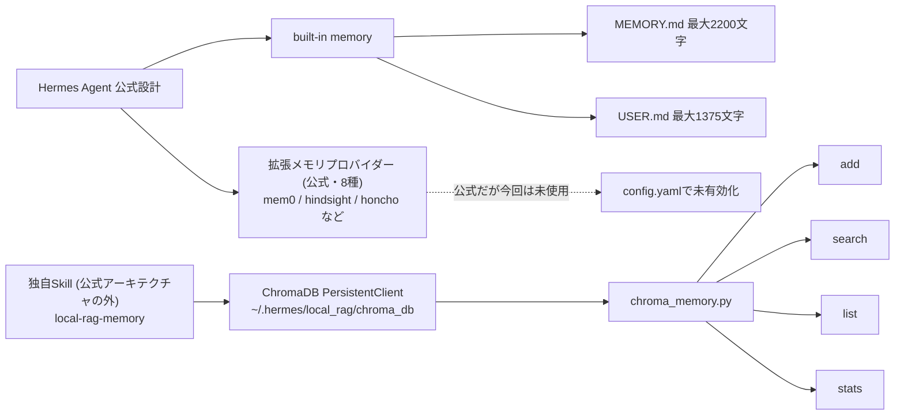
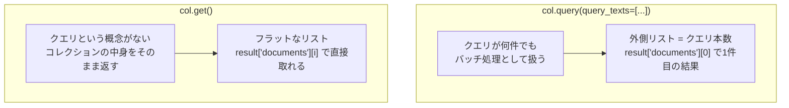

こんにちは 人材育成室 育成メンバーチームで 研修中の はすと です。

前回、Mac mini に Hermes Agent をセットアップした記事を書きました。運用しているうちに、以前のセッションでエージェント自身が `~/.hermes/scripts/chroma_memory.py` という ChromaDB を使ったメモリ拡張スクリプトを作っていたことに気づきました。動いてはいたのですが、正直なところ中身をあまり理解していませんでした。ChromaDB にどう保存されて、どう検索されているのか、AIに任せきりのままです。

これでは自分の記憶基盤なのに何かあったときに手が出せないなと思い、自分の手を動かして検証してみることにしました。検証を始める前に、そもそも Hermes Agent の公式ドキュメントではメモリがどう設計されているのかも確認しています。

本記事では、Hermes Agent 公式のメモリ設計を踏まえた上で、ChromaDB の `query()` と `get()` の挙動を実際に検証し、その過程で自分の Hermes Agent のメモリツールに実際に起きていたバグの原因を突き止めた結果をまとめます。

## Hermes Agentのメモリ構成

[公式ドキュメント](https://hermes-agent.nousresearch.com/docs/user-guide/features/memory)を確認すると、Hermes Agent のメモリは次のように設計されていました。

- **built-in memory**: `MEMORY.md`（2,200文字）/ `USER.md`（1,375文字）。セッション開始時にシステムプロンプトへ凍結スナップショットとして注入され、`memory` ツール（add/replace/remove）でエージェント自身が管理する
- **セッション検索**: 過去の会話全体を SQLite に全文検索インデックス付きで保存し、built-in memory に載らなかったやり取りも参照できる
- **拡張メモリプロバイダー**: Honcho / OpenViking / Mem0 / Hindsight / Holographic / RetainDB / ByteRover / Supermemory の8種類が公式にプラグインとして用意されている。公式ドキュメントには "External providers run alongside built-in memory (never replacing it)" とあり、built-in memory を置き換えるのではなく、知識グラフやセマンティック検索などを追加する立場として位置づけられています

自分の `~/.hermes/config.yaml` を確認したところ、有効化されているのは built-in memory（`memory` トークンセット）だけで、8種類の公式プラグインはどれも有効化されていませんでした。

つまり `~/.hermes/scripts/chroma_memory.py` は、この8種類の公式プラグインのどれでもありません。以前のセッションでエージェントが Skill（`~/.hermes/skills/mlops/local-rag-memory/`）として独自に書いた、Hermes Agent の公式なメモリアーキテクチャの外側にあるスクリプトでした。

全体像は以下のような構成になっています。



## ChromaDBとは

[ChromaDB](https://docs.trychroma.com/) はローカルで完結するベクトルデータベースです。テキストを渡すと内部で埋め込みベクトルに変換して保存し、類似度検索ができます。`PersistentClient` を使えばファイルベースで永続化され、外部サーバーを立てる必要もありません。

```python
import chromadb

client = chromadb.PersistentClient(path="./chroma_db")
col = client.create_collection(name="memories")
col.add(documents=["犬は人懐っこいペットです"], ids=["id1"])
```

ここまでは公式ドキュメント通りで迷うところはありません。問題は検索結果の受け取り方でした。

## 自分の環境で確認してみた：query()の返り値

犬・猫・馬の3件をコレクションに入れて、`query()` で検索してみました。

```python
col.add(
    documents=["犬はとても人懐っこいペットです", "猫は自由気ままな性格です", "馬は草原を走る動物です"],
    metadatas=[{"tag": "dog"}, {"tag": "cat"}, {"tag": "horse"}],
    ids=["id1", "id2", "id3"],
)

result = col.query(query_texts=["man's best friend"], n_results=3)
print(result["ids"])
print(result["documents"])
```

`query_texts` に1件しか渡していないので、`result["documents"]` はそのまま文書のリストが返ってくるはずだと考えると思います。

実際には、`ids` / `documents` / `metadatas` / `distances` の**すべてが二重のリスト**で返ってきます。

実行結果です。

```
--- documents ---
型: list, 要素数(外側): 1
中身: [["犬はとても人懐っこいペットです", "馬は草原を走る動物です", "猫は自由気ままな性格です"]]
result['documents'][0] の型: list
```

`result["documents"][0]` として、ようやく文書のリストが取れます。

なぜ二重になっているのか、`query_texts` を2件に増やして確かめてみました。

```python
r = col.query(query_texts=["犬について", "馬について"], n_results=2)
print(len(r["ids"]), r["ids"])
```

実行結果です。

```
ids の外側要素数: 2  (= クエリの本数)
クエリ0の結果: ['id1', 'id3']
クエリ1の結果: ['id3', 'id2']
```

外側のリストの要素数は、渡した `query_texts` の本数と一致していました。`query()` は複数クエリをまとめて投げられるバッチAPIとして設計されていて、外側のリストは「何番目のクエリの結果か」を表す次元だったわけです。クエリを1件しか渡さなくても、この次元は省略されません。

## get()ではどうか

一覧取得に使う `get()` も試してみました。

```python
r = col.get(include=["documents", "metadatas"])
print(r["ids"])
print(r["documents"][0])
```

実行結果です。

```
--- documents ---
型: list, 要素数: 3
中身: ["犬はとても人懐っこいペットです", "猫は自由気ままな性格です", "馬は草原を走る動物です"]
result['documents'][0] の型: str
```

`get()` は最初からフラットなリストでした。`get()` には「クエリ」という概念自体がなく、単にコレクションの中身を取り出すだけなので、`query()` にあったバッチ次元がそもそも存在しません。

- `query()` → 常に二重リスト（外側 = クエリ本数）
- `get()` → 常にフラットなリスト

同じライブラリの中でメソッドによって形が違う、というのが実際の挙動でした。図にすると次のような違いです。



## 実際のメモリツールで起きていたこと

この違いを踏まえて `~/.hermes/scripts/chroma_memory.py` を読み返すと、`do_list` 関数が `get()` の結果を `query()` と同じ二重リストのつもりで扱っていました。

```python
def do_list(client, lim=20):
    col = client.get_collection(COL)
    r = col.get(include=["documents", "metadatas"], limit=lim)
    print(f"\n=== list ({len(r['ids'])} / {lim}) ===")
    for i in range(len(r["ids"])):
        print(f"  {i}: tag=[{r['metadatas'][0][i]['tags']}] {r['documents'][0][i][:80]}...")
```

実際に自分の Hermes Agent のメモリに対して `list` コマンドを実行してみました。

```bash
python3 ~/.hermes/scripts/chroma_memory.py list --limit 10
```

実行結果です。

```
=== list (6 / 10) ===
Traceback (most recent call last):
  File "chroma_memory.py", line 162, in <module>
    main()
  File "chroma_memory.py", line 145, in main
    do_list(cl, args.limit)
  File "chroma_memory.py", line 70, in do_list
    print(f"  {i}: tag=[{r['metadatas'][0][i]['tags']}] {r['documents'][0][i][:80]}...")
                         ~~~~~~~~~~~~~~~~~^^^
KeyError: 0
```

`r['metadatas']` はフラットな辞書のリストなので、`r['metadatas'][0]` は1件目のメタデータ（`{'tags': ...}` のような辞書）です。そこにさらに `[i]` で数値インデックスを当てようとして `KeyError: 0` になっていました。同じファイルの中の `do_stats` は `get()` の結果を正しくフラットなまま扱えていたので、余計に見つけにくいバグでした。

原因が分かったので、`~/.hermes/scripts/chroma_memory.py` 自体をバックアップした上で直しました。

```python
# 修正前（query()と同じ二重インデックスのつもりで書かれていた）
print(f"  {i}: tag=[{r['metadatas'][0][i]['tags']}] {r['documents'][0][i][:80]}...")

# 修正後（get()はフラットなので、そのままインデックスする）
print(f"  {i}: tag=[{r['metadatas'][i]['tags']}] {r['documents'][i][:80]}...")
```

`[0]` を1回外すだけの修正です。実際に自分の Hermes Agent のメモリ（6件のエントリが入っています）に対して、直した後のコマンドを実行してみました。

```bash
python3 ~/.hermes/scripts/chroma_memory.py list --limit 10
```

実行結果です。

```
=== list (6 / 10) ===
  0: tag=[test,chromadb] TEST_A: v2 pipeline search...
  1: tag=[single,tag,pipeline] Single Collection tag-filter OK....
  2: tag=[hermes,overflow,design] Hermes overflow memory architecture design....
  3: tag=[test,chroma] ChromaDBテスト...
  4: tag=[test,chroma] ChromaDB test...
  5: tag=[test,chroma,mem] Hermes memory test entry...
```

`KeyError: 0` は解消され、`list` コマンドが本来の目的通りに使えるようになりました。`stats` や `search` は元々 `get()` / `query()` をそれぞれ正しく扱えていたので影響はなく、直したのは `do_list` の1行だけです。

## ドキュメント自体も食い違っていた

このツールと一緒に置かれていた自分用のスキルドキュメントを読み返すと、ChromaDB v1.x の挙動について2つのファイルで違うことが書かれていました。

- `SKILL.md`: 「`documents` / `metadatas` は単一クエリならフラットで返る」
- `references/chromadb-v1-api-notes.md`: 「全フィールドが二重リストで返る」

どちらも以前のセッションでAIエージェントが書いたものです。実際に検証した結果は後者が正しく、`do_list` のバグはおそらく前者側の誤った理解に引っ張られて生まれたのだろうと思います。ドキュメント同士が矛盾していても、どちらも自信ありげに書かれていると気づきにくいものだと感じました。

## 埋め込みモデルについても確認した

`SKILL.md` には「SentenceTransformer の `all-MiniLM-L6-v2` を使い、Apple Silicon では MPS で高速化する」と書かれていました。実際に使われている埋め込み関数を確認してみます。

```python
col = client.get_collection("test")
print(col._embedding_function)
```

実行結果です。

```
<chromadb.api.types.DefaultEmbeddingFunction object at 0x1047da910>
```

`chroma_memory.py` に `sentence_transformers` や `torch` の import はなく、ChromaDB 標準の `DefaultEmbeddingFunction`（同じ MiniLM 系列を ONNX 化したモデル）がそのまま使われているだけでした。ドキュメントが説明していた MPS 高速化やモデルの明示的な差し替えは、実際のコードには存在していません。系列は同じでも、実行されている実装は別物でした。

## 検索精度も見ておく

`DefaultEmbeddingFunction` の精度についても、英語クエリと日本語クエリで比べてみました。

```
✓ 入力: "man's best friend"        → 1位: dog   (distance: 0.9238) [期待: dog]
✗ 入力: "farm animal with a mane"  → 1位: dog   (distance: 0.7810) [期待: horse]
✓ 入力: "犬のように人懐っこい動物"    → 1位: dog   (distance: 0.1702) [期待: dog]
✓ 入力: "たてがみを持つ草原の動物"    → 1位: horse (distance: 0.3865) [期待: horse]
```

英語クエリでは distance がどれも 0.9 台に固まっていて、正解した1件目も僅差でした。2件目は馬を期待していたのに犬が1位になっています。一方、日本語クエリでは distance の差がはっきり開き、2件とも正解しました。Hermes Agent のメモリは日本語で読み書きすることがほとんどなので実用上は大きな問題になりにくそうですが、英語クエリを投げると精度が不安定になる、という素朴な弱点は覚えておこうと思います。

## まとめ

- Hermes Agent は公式に built-in memory（`MEMORY.md` / `USER.md`）と、8種類の拡張メモリプロバイダー（mem0 / hindsight / honcho など）をプラグインとして持つ設計になっている。今回の ChromaDB スクリプトはそのどちらでもなく、以前のセッションでエージェントが独自に書いた Skill だった
- `query()` は常に二重リストで返る。外側のリストは「クエリの本数」を表す次元で、クエリが1件でも省略されない
- `get()` にはクエリという概念がないため、常にフラットなリストで返る
- 自分の Hermes Agent のメモリツールには、この違いを取り違えた `KeyError: 0` の実バグが実際に存在しており、`[0]` を1箇所外すことで修正できた
- 一緒に置かれていたAI生成のドキュメント同士でも、この挙動について矛盾した記述があった
- 埋め込みモデルについても、ドキュメントに書かれた構成（SentenceTransformer + MPS）と実際のコードの実装（ChromaDB標準の DefaultEmbeddingFunction）が食い違っていた

AIエージェントに構築を任せたインフラほど、動いているからと安心せず自分の手で検証する価値があると実感しました。特に今回は、Hermes Agent 自体が公式に用意している拡張メモリプロバイダーを使わず、ゼロから ChromaDB スクリプトを書いていたという点が一番の気づきでした。公式ドキュメントを読まずにAIの実装をそのまま受け入れていたら、気づけなかったと思います。私と同じように ChromaDB をエージェントの外部メモリとして使っている方の参考になれば嬉しいです。

## 参考

- [Hermes Agent Memory - 公式ドキュメント](https://hermes-agent.nousresearch.com/docs/user-guide/features/memory)
- [Chroma Docs](https://docs.trychroma.com/)
- [chromadb - PyPI](https://pypi.org/project/chromadb/)
- [Hermes Agent - GitHub (NousResearch)](https://github.com/NousResearch/hermes-agent)
