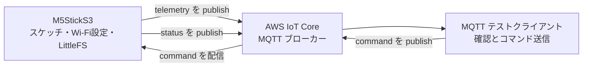

こんにちは。人材育成室 育成メンバーチームで研修中の はすと です。

AWS IoT Core を学んでいくうちに、実際のデバイスも使いたくなり、M5StickS3 を購入してみました。

なので今回は、[Node.jsを仮想デバイスとしてAWS IoT Coreにつないでみた](https://dev.classmethod.jp/articles/aws-iot-nodejs-virtual-device/) で試した構成を使い、M5StickS3 と AWS IoT Core の疎通テストをしてみます。スケッチ、Wi-Fi 設定、証明書ファイルの保存先と、起動時の動きも確認していきます。

## 今回の構成

M5StickS3 は ESP32-S3 を搭載し、Wi-Fi でネットワークへ接続でき、AWS IoT Core へは MQTTS で接続します。

ESP32-S3 は、M5StickS3 の中でスケッチを実行し、Wi-Fi、LCD 画面、ボタン、IMU などを制御するチップです。



M5StickS3 は 10 秒ごとに Wi-Fi の受信信号強度と連番を送信し、コンソールから届いた任意のメッセージは画面へ表示したうえで、`status` トピックにも返します。

このように送信と受信を分けると、片方向だけでなく双方向の MQTT 通信を確認できます。

## AWS IoT Core 側の準備

モノ（Thing）、デバイス証明書、IoT ポリシーを作る手順と、データエンドポイントを確認する手順は、[前回の記事](https://dev.classmethod.jp/articles/aws-iot-nodejs-virtual-device/)を参照してください。

今回は、Node.js 用とは別に `m5sticks3-iot-demo` というモノを作ります。デバイス証明書と接続キットも、このモノ用に新しく作成します。

### M5StickS3 用の IoT ポリシー

前回の記事のポリシー例では、`nodejs-thing-demo` を MQTT クライアント ID とトピック名に使いましたが、今回はその文字列を `m5sticks3-iot-demo` に置き換えて、３つのトピックを用意します。

| トピック | 向き | 内容 |
| --- | --- | --- |
| `m5sticks3-iot-demo/telemetry` | M5StickS3 → AWS IoT Core | 連番と Wi-Fi の受信信号強度 |
| `m5sticks3-iot-demo/command` | テストクライアント → M5StickS3 | 画面に表示するメッセージ |
| `m5sticks3-iot-demo/status` | M5StickS3 → AWS IoT Core | コマンドを受信した結果 |

### デバイス証明書へポリシーを関連付ける

モノと証明書を作成した後、次の手順で状態とポリシーを確認します。

1. AWS IoT Core コンソールの「管理」→「すべてのデバイス」→「モノ」を開き、今回作成したモノを選択します。
2. 「証明書」タブを開き、今回作成したデバイス証明書を選択します。ステータスが `アクティブ` であることを確認します。`非アクティブ` の場合は、「アクション」から有効化します。


3. 証明書の詳細画面で「ポリシー」タブを開き、作成済みの IoT ポリシーが表示されることを確認します。表示されない場合は、「ポリシーをアタッチ」から関連付けます。


モノと証明書を関連付けるだけでは、MQTT 接続の権限は付与されないため、証明書へ IoT ポリシーを関連付ける必要があります。

## M5StickS3 で動かすもの

M5StickS3 には Wi-Fi、LCD、IMU、マイク、ボタンなどの機能がありますが、今回は Wi-Fi で AWS IoT Core へ接続し、LCD に接続状況と受信メッセージを表示します。この動きを Arduino のスケッチとして実装します。
`.ino` ファイルは C++ で書く Arduino のプログラムで、Arduino IDE がコンパイルした実行用プログラムを M5StickS3 本体のフラッシュへ書き込むため、USB を外した後も単体で実行できます。

デバイスでは、用途の異なる 3 種類の保存領域を使います。

| 保存先 | 保持するもの | 今回の用途 |
| --- | --- | --- |
| プログラム領域 | コンパイル済みのスケッチ | MQTT 接続、画面表示、送受信処理 |
| NVS | 電源を切っても残る小さな設定 | Wi-Fi の SSID とパスワード |
| LittleFS | フラッシュ内のファイル領域 | 接続先、CA 証明書、デバイス証明書、秘密鍵 |

:::details LittleFS とは
LittleFS は、M5StickS3 本体のフラッシュメモリの一部を、ファイル置き場として使う仕組みです。PC のフォルダのように、ファイル名を指定して読み書きできます。

今回のスケッチ本体はプログラム領域にあり、Wi-Fi の設定は NVS にあります。LittleFS には、スケッチが起動時に読む接続先と証明書ファイルだけを置きます。

通常の電源オフや再起動では LittleFS のファイルは残ります。ただし再アップロード時にはファイル領域全体が更新されるため、証明書を差し替えるときは必要な 4 ファイルをそろえます。
:::

### 開発環境

M5Stack のボードパッケージを導入すると、Arduino IDE のボード一覧から `M5StickS3` を選び、M5StickS3 向けにコンパイルして書き込めるようになります。

Arduino IDE の「Arduino IDE」→「Preferences」を開きます。[M5Stack 公式のボード管理手順](https://docs.m5stack.com/en/arduino/arduino_board)に従い、「Additional Boards Manager URLs」に次の URL を追加します。

```text
https://static-cdn.m5stack.com/resource/arduino/package_m5stack_index.json
```

次に、サイドバーの「Boards Manager」を開き、`M5Stack` を検索して導入します。私の環境では 3.3.9 を導入しました。ボード一覧に `M5StickS3` が含まれることを確認できます。


次に「Library Manager」で `M5Unified` と `PubSubClient` を検索して導入します。`M5Unified` の導入時に `M5GFX` の導入を確認できたら、「INSTALL ALL」を選びます。私の環境では、M5Unified 0.2.20、M5GFX 0.2.28、PubSubClient 2.8.0 を導入しました。

続いて、M5Stack の公式手順では、書き込みモードに入るため、側面のリセットボタンを約2秒押して緑の LED が点滅したら離します。USB で接続してから、上部のボード選択で `M5StickS3` と表示された USB ポートを選びます。ポート名は Mac ごとに異なります。


実機用のスケッチは、専用の Private リポジトリで管理します。証明書や秘密鍵はリポジトリへコミットせず、Git 管理外の `data/aws-iot/` へ置きます。

```text
m5sticks3-iot-demo/
├── m5sticks3-iot-demo.ino
├── data/aws-iot/       # Git 管理外の接続ファイル
├── tools/upload-littlefs.sh
└── README.md
```

### Wi-Fi 設定を NVS へ保存する

Wi-Fi の設定は IoT 用スケッチから分け、`m5sticks3-device-config` という設定専用スケッチで一度だけ M5StickS3 の NVS へ保存します。
設定用スケッチは、次のように配置します。

```text
m5sticks3-device-config/
├── m5sticks3-device-config.ino
├── wifi_secrets.example.h
└── wifi_secrets.h             # Git 管理外
```

`wifi_secrets.example.h` をコピーして `wifi_secrets.h` を作成し、2.4 GHz の Wi-Fi の SSID とパスワードを設定します。

```cpp
#pragma once

#define WIFI_SSID "YOUR_2_4_GHZ_WIFI_SSID"
#define WIFI_PASSWORD "YOUR_WIFI_PASSWORD"
```

Arduino IDE で `m5sticks3-device-config.ino` を開き、`M5StickS3` と USB ポートを選んで書き込みます。画面に `Wi-Fi saved to NVS` と IP アドレスが表示されたら完了です。
接続先を変更するときだけ `wifi_secrets.h` を更新して、設定用スケッチを再度書き込みます。

### AWS IoT Core の接続ファイルを LittleFS へ配置する

証明書の内容をソースコードへコピーする代わりに、次の4ファイルを `data/aws-iot/` へ置きます。

| ファイル名 | 内容 |
| --- | --- |
| `endpoint.txt` | 「接続」→「ドメイン設定」で確認したデータエンドポイント |
| `amazon-root-ca.pem` | Amazon Root CA 1 |
| `device-certificate.pem` | 接続キットのデバイス証明書 |
| `private-key.pem` | 接続キットの秘密鍵 |

Arduino IDE の「Upload」はスケッチだけを書き込みます。`data/aws-iot/` の接続ファイルは、`tools/upload-littlefs.sh` で LittleFS へまとめて書き込みます。
[tools/upload-littlefs.sh](https://github.com/HasutoSasaki/m5sticks3-iot-demo/blob/main/tools/upload-littlefs.sh)

スケッチは起動時に LittleFS から3つの PEM ファイルを読み込み、`WiFiClientSecure` へ設定します。

```cpp
tlsClient.loadCACert(caFile, caFile.size());
tlsClient.loadCertificate(certificateFile, certificateFile.size());
tlsClient.loadPrivateKey(privateKeyFile, privateKeyFile.size());

mqttClient.setServer(awsIoTEndpoint.c_str(), 8883);
mqttClient.setCallback(onMessage);
```

デバイス証明書、秘密鍵、Amazon Root CA 1 の3つを TLS クライアントへ設定します。TLS サーバー証明書の有効期間を確認できるよう、スケッチは MQTT 接続前に NTP で時刻も同期します。LittleFS の書き込みはファイル領域全体を更新するため、証明書を変更したときは4ファイルをそろえて再実行します。

### スケッチが起動してからすること

スケッチは、次の順に動きます。

1. `M5.begin()` で画面などの M5StickS3 機能を初期化する
2. `WiFi.begin()` で NVS に保存済みの Wi-Fi へ接続する
3. NTP で時刻を同期する
4. LittleFS から接続先と3つの PEM ファイルを読み込む
5. TLS で AWS IoT Core の 8883 番ポートへ MQTT 接続する
6. `command` を購読し、10 秒ごとに `telemetry` を送信する

`loop()` では受信処理と定期送信を続け、`command` を受けると画面へメッセージを表示して `status` を返します。
実装全体は、[m5sticks3-iot-demo.ino](https://github.com/HasutoSasaki/m5sticks3-iot-demo/blob/main/m5sticks3-iot-demo.ino) を参照してください。

### Apple Silicon の Mac でコンパイルできない場合

私の Apple Silicon Mac では、最初のコンパイルで `ctags: bad CPU type in executable` が表示されました。Arduino IDE 本体が Apple Silicon 版でも、補助ツールには Intel 向けのものがあるため、Rosetta が必要な場合があります。
同様のエラーが出た場合は、Arduino の公式案内に従い、Rosetta を導入してから再度コンパイルしてみてください。

## MQTT テストクライアントで実機の送受信を見る

前回と同じ MQTT テストクライアントを使い、実機の送受信を確認していきます。

1. AWS IoT Core の「MQTT テストクライアント」を開き、「トピックをサブスクライブする」で次を購読します。

   ```text
   m5sticks3-iot-demo/#
   ```

   `#` は配下のトピックをまとめて受信するワイルドカードなので、M5StickS3 を起動する前に購読しておくと、最初の `telemetry` から確認できます。

2. M5StickS3 を起動します。Wi-Fi、時刻同期、TLS 接続が完了すると、10 秒ごとに `m5sticks3-iot-demo/telemetry` へ受信信号強度と連番を送ります。テストクライアントに `telemetry` が表示されれば、M5StickS3 から AWS IoT Core への送信成功です。

   

3. 「トピックに公開する」で、次のコマンドを送ります。

   | 項目 | 値 |
   | --- | --- |
   | トピック | `m5sticks3-iot-demo/command` |
   | メッセージ | `{"message":"hello"}` |

4. M5StickS3 の画面に `hello` が表示されることを確認します。続けてテストクライアントへ `m5sticks3-iot-demo/status` が届けば、コンソールからのコマンド受信とデバイスの応答成功です。

## 接続できないときに確認すること

`connected` が表示されない場合は、以下を順に確認してみてください。

- `m5sticks3-device-config` で Wi-Fi 設定を保存済みであること
- AWS IoT Core のデータエンドポイントとリージョン
- デバイス証明書と秘密鍵の組み合わせ
- 証明書が `ACTIVE` であること
- 証明書へ IoT ポリシーが関連付けられていること
- MQTT クライアント ID とポリシーの `iot:Connect` の値
- 8883 番ポートがネットワークで遮断されていないこと

ポリシーを保存した直後は、反映まで少し時間がかかることがあります。

## まとめ

M5StickS3 と AWS IoT Core の双方向通信を確認できたことで、M5StickS3 が取得したデータをクラウドへ送る土台ができました。IMU の値やボタンの操作などを MQTT で送れば、クラウド側で保存・分析ができるようになりました。

次は、M5StickS3 で取得したデータを蓄積して分析するパイプラインを作ってみたいと思います。

## 参考

- [StickS3 Arduino Program Compilation & Upload - M5Stack Documentation](https://docs.m5stack.com/en/arduino/m5sticks3/program)
- [M5StickS3 IMU - M5Stack Documentation](https://docs.m5stack.com/ja/arduino/m5sticks3/imu)
- [MQTT test client - AWS IoT Core](https://docs.aws.amazon.com/iot/latest/developerguide/view-mqtt-messages.html)
- [Device communication protocols - AWS IoT Core](https://docs.aws.amazon.com/iot/latest/developerguide/protocols.html)
- [Publish/subscribe policy examples - AWS IoT Core](https://docs.aws.amazon.com/iot/latest/developerguide/pub-sub-policy.html)
- [X.509 client certificates - AWS IoT Core](https://docs.aws.amazon.com/iot/latest/developerguide/x509-client-certs.html)
