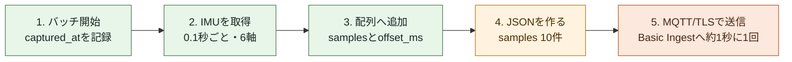
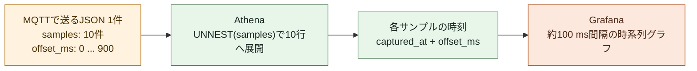

# M5StickS3のIMUデータをBasic IngestからGrafanaで可視化してみた

こんにちは、クラスメソッド製造ビジネステクノロジー部のはすとです。

前回の記事では、M5StickS3とIoT Coreを接続し、疎通確認までを行いました。次にやりたいのは、デバイスで取得したデータの可視化です。
最終的にやりたいことは、筋トレ中のデータを可視化して、フォームの改善に役立てたり、運動量の可視化ができると面白そうだなと考えています。

そこで今回は、M5StickS3のIMUデータを IoT Core、Firehose、S3、Athena を経由して、ローカルのGrafanaで可視化してみようと思います。

## 今回の全体構成

この実装では、BMI270のIMUデータをアプリケーション側で10 Hzに設定して取得します。10件ずつJSONにまとめ、AWS IoT CoreへMQTT/TLSで送信します。


この構成では、FirehoseがS3へファイルを書き出してからGrafanaに見えるまで、最大約60秒の待ち時間がありますが、デバイスにリアルタイムで載せたいわけではなく、あくまで分析データとして貯めておくのを目的としています。
また、どのリソースも従量課金なので低コストで運用することができます。

各リソースの役割は次のとおりです。

| 要素 | 役割 |
| --- | --- |
| M5StickS3 | IMU取得、画面表示、MQTT/TLS送信 |
| Basic Ingest | IoTのPub/Subブローカーを通さずIoT Ruleを呼び出す |
| Firehose | JSONをS3へまとめて圧縮保存する |
| Glue / Athena | S3上のJSONをSQLで読む |
| Grafana | Athenaの結果を時系列グラフにする |

### なぜBasic Ingestを使うのか

通常のPub/Subでも、IoT Ruleの`firehose`アクションを設定すればFirehoseへ渡せます。ただし、通常のPub/SubではIoT CoreのMQTTブローカーを経由するため、IoT Coreのメッセージング料金がかかります。

今回は、トレーニングデータをS3へ保存し、あとからGrafanaで確認することが目的です。他のデバイスやアプリケーションへの配信、リアルタイム表示は必要ありません。そのため、ブローカーを通さず指定したIoT Ruleを直接呼び出せるBasic Ingestを選びました。


```text
通常のPub/Sub:  M5StickS3 → MQTTブローカー → IoT Rule → Firehose
Basic Ingest:   M5StickS3 →                 IoT Rule → Firehose
```


Basic Ingestのトピックは、ルール名を含む次の形式です。

```text
$aws/rules/training_iot_basic_ingest/training/{deviceId}/telemetry
```

`$aws/rules/`で始まるのは、Basic Ingest用の予約トピックです。デバイスがこのトピックへ`publish`すると、指定したIoT Ruleが実行されます。ただし、このトピックを`subscribe`することはできません。なので、Webアプリへリアルタイムに表示したい、または他のデバイスへ通知したい場合は、通常のIoT Pub/Subトピックを使う必要があります。

## 計測データの収集から保存・可視化の流れについて

ここからは、可視化までに実装した内容を、デバイス側の実装、データ保存・分析基盤、ダッシュボードによる可視化の順に解説していきます。

- **デバイス側の実装**: IMUの値を10件ずつまとめて送信する
- **データ保存・分析基盤**: FirehoseでS3へ保存し、GlueとAthenaで検索できるようにする
- **ダッシュボードによる可視化**: Athenaの検索結果をGrafanaへ表示する

### デバイス側の実装

IMUは10 Hz、つまり0.1秒ごとに1件、1秒間に10件取得します。1件ずつ送るのではなく、メモリ上の配列へ10件ためてから、1つのJSONメッセージとして送信しています。

計測する軸は、加速度3軸とジャイロ3軸の合計です。

| 値 | 意味 |
| --- | --- |
| `ax`、`ay`、`az` | X・Y・Z方向の加速度 |
| `gx`、`gy`、`gz` | X・Y・Z軸まわりの角速度 |


以下は、デバイスの中で起きている流れです。`captured_at`は1件目を取得した時刻で、各サンプルにはその時刻からの経過時間を`offset_ms`として入れます。



デバイスからIoT Coreへ送る回数は約1秒に1回ですが、`samples`配列には約100 ms間隔の10件が残るため、送信回数を抑えながら運動の細かな変化を後から確認できます。

送信するJSONは、バッチ全体の情報と10件のIMU値から構成されます。



省略していますが、実際に送信するJSONは次の形式です。

```jsonc
{
  "schema_version": 1,
  "device_id": "m5sticks3-01",
  "session_id": "2026-09-06T10:00:00+09:00",
  "captured_at": "2026-09-06T10:00:00+09:00",
  "sequence": 0,
  "sampling_hz": 10,
  "samples": [
    { "offset_ms": 0, "ax": 0.12, "ay": -0.03, "az": 0.98, "gx": 1.2, "gy": -0.4, "gz": 0.1 },
    { "offset_ms": 100, "ax": 0.10, "ay": -0.02, "az": 0.99, "gx": 1.4, "gy": -0.3, "gz": 0.2 },
    // ... 同じ形式のサンプルが8件続く
    { "offset_ms": 900, "ax": 0.08, "ay": -0.01, "az": 1.01, "gx": 1.1, "gy": -0.2, "gz": 0.0 }
  ]
}
```

`captured_at`はバッチ先頭サンプルの時刻です。Athenaでは、`CROSS JOIN UNNEST(samples)`で10件の配列を行に展開してから、`captured_at`と`offset_ms`を組み合わせて個々のサンプルの時刻を作れます。

### データ保存・分析基盤

Firehoseでは、受け取ったデータを貯め込んでからS3に流すことができます。
今回は、1 MiBに達するか60秒が経過する毎に、GZIP圧縮して保存する設定にしました。

```ts
bufferingHints: {
  intervalInSeconds: 60,
  sizeInMBs: 1,
},
compressionFormat: 'GZIP',
customTimeZone: 'Asia/Tokyo',
prefix: 'raw/!{timestamp:yyyy}/!{timestamp:MM}/!{timestamp:dd}/!{timestamp:HH}/',
```

保存先は`raw/yyyy/MM/dd/HH/`です。Athenaで検索する時間帯と、S3の保存場所を合わせています。

#### S3に直接書き込む場合との比較
ここでFirehoseを挟まずに、データを直接S3へ書き込む方法もあります。しかし、その場合は小さなファイルが多く作られ、S3への書き込み回数も増えてしまいます。ただ、リアルタイム性を重視する場合は、直接書き込む方法が適しています。
逆に、FirehoseはデータをバッファリングしてからS3へ書き込むため、可視化まで最大約60秒待つ必要が出てきます。この待ち時間を許容できるかどうかが、一つの判断基準になります。

### GlueとAthenaでデータを読む

S3へ保存したJSONをAthenaで読むためには、列構造の情報が必要です。今回は送信形式と保存先が決まっているため、Crawlerで推測するのではなく、Glue Data CatalogにCDKで定義しました。

初めは、実機の送信内容を確認しやすいraw JSONを通常のS3へ保存することにしました。S3 TablesやParquetは、分析量が増えてから検討します。

また、Athenaではパーティション投影を設定しています。`datehour`の条件から対象となるS3フォルダを計算するため、S3のフォルダ構成と時間範囲をテーブル定義へ書いておけば、パーティションを1つずつ登録せずに検索できます。

JSONの`samples`は配列なので、SQLで1件ずつ行へ展開します。

```sql
SELECT
  date_add(
    'millisecond',
    sample.offset_ms,
    CAST(from_iso8601_timestamp(captured_at) AS timestamp)
  ) AS time,
  sample.ax,
  sample.ay,
  sample.az
FROM telemetry_raw
CROSS JOIN UNNEST(samples) AS t(sample)
WHERE datehour = '2026/08/30/14'
  AND device_id = 'm5sticks3-01'
ORDER BY time;
```

### ダッシュボードによる可視化

GrafanaはDockerでローカルに起動し、AthenaへアクセスできるAWS認証情報を用意してから利用します。

#### 起動する

DockerとAWS CLIを用意し、AthenaへアクセスできるAWS CLIプロファイルでログインします。`start-grafana.sh`を書き換える必要はありません。起動に使うプロファイルを`AWS_PROFILE`で指定します。

```sh
aws login --profile <profile>
AWS_PROFILE=<profile> ./tools/start-grafana.sh
```

`AWS_PROFILE`を省略した場合は、AWS CLIの`default`プロファイルを使います。スクリプトはこのプロファイルの短期認証情報をコンテナへ渡し、Grafanaを起動します。

Grafanaは起動時の認証情報でAthenaへ接続します。ログインした後や認証情報の期限が切れた後は、同じコマンドでGrafanaを起動し直してください。

`static credentials are empty`と表示された場合は、認証情報がコンテナへ渡っていません。ログイン後に起動し直します。起動し直すと、保存していないローカルのダッシュボードは消えます。

ブラウザで<http://localhost:3000>を開きます。`.env`がなければ、ローカル検証用のログインは`admin / admin`です。


#### 動作確認用ダッシュボードを開く

Grafanaのデータソースは、グラフに表示するデータの取得先を示す設定です。起動時にAthenaを取得先にした`Training Athena`データソースと、動作確認用の`トレーニングIMU`ダッシュボードを自動で作成します。

設定元の[training-imu.json](https://github.com/HasutoSasaki/training-iot-core/blob/main/grafana/provisioning/dashboards/definitions/training-imu.json)には、クエリと初期値だけを含めています。実機データは含まれず、`datehour`と`device_id`を指定すると、Athena経由でS3上のデータを読み込みます。

#### まっさらなGrafanaでダッシュボードを作る

ここからは、ダッシュボードがまだないGrafanaで同じグラフを作る手順です。先にAthenaへ接続する`Training Athena`データソースが登録済みであることを前提にします。データソースは`grafana/provisioning/datasources/athena.yaml`で定義しています。

1. 左メニューの **Dashboards** を開き、**New** から **New dashboard** を選びます。
2. 画面右端の **Add** を押し、開いたメニューの **Panel** をクリックします。


3. 新しいパネルが追加されたら、中央の **Configure visualization** をクリックします。


4. 開いたパネルエディタのQueryタブで、データソースに **Training Athena** を選びます。


5. 次のSQLを入力します。Grafanaの時系列パネルは、時刻列を`time`という名前で受け取り、残りの数値列を系列として表示します。

```sql
SELECT
  date_add(
    'millisecond',
    sample.offset_ms,
    CAST(from_iso8601_timestamp(captured_at) AS timestamp)
  ) AS time,
  sample.ax,
  sample.ay,
  sample.az
FROM telemetry_raw
CROSS JOIN UNNEST(samples) AS t(sample)
WHERE datehour = '2026/08/30/14'
  AND device_id = 'm5sticks3-01'
ORDER BY time;
```

SQLはQueryタブの下部にある入力欄へ貼り付けます。上の画像ではデータソースを、下の画像ではSQL入力欄と**Run query**を確認できます。


6. `datehour`と`device_id`を、S3に保存された時刻とAWS IoT Thing名に置き換えます。たとえば、保存先が`raw/2026/08/30/14/`でThing名が`m5sticks3-01`なら、次の値です。

```text
datehour: 2026/08/30/14
device_id: m5sticks3-01
```

**Run query**を押し、パネルに`ax`、`ay`、`az`の波形が出ることを確認します。続けて右側の**Title**欄へ`実機IMU加速度`を入力し、上部の**Save**でダッシュボードを保存します。

実機データの`ax`、`ay`、`az`を時系列として表示できました。


#### 表示条件を指定する

1. **保存時刻とデバイスID**: S3の`datehour`と、AWS IoT Thing名を入力します。Athenaの検索対象を絞るための値です。
2. **時間範囲の操作**: 前後の時間帯への移動、拡大、更新を行えます。過去データを見るときは、①の保存時刻に合う時間帯へ合わせます。


上部の入力欄には、保存時刻を`yyyy/MM/dd/HH`形式、デバイスIDにはAWS IoT Thing名を指定します。過去データを表示する場合は、Grafanaの時間範囲も対象時刻へ合わせるか、パネルの`Zoom to data`を使います。

## この構成のコスト感

ここでは、私がジムで週6回、1回90分トレーニングする場合を想定し、月あたりの接続時間は約39時間で考えます。10件のサンプルを約1秒ごとに1メッセージとして送るため、月あたりのメッセージ数は約14万件です。バッチは4.5 KiB以下にして、IoT RuleとFirehoseの5 KB課金単位に収めます。

| 項目 | 月額の目安 |
| --- | ---: |
| IoT Ruleの評価とFirehoseアクション | 約0.05 USD |
| Data Firehoseの取り込み | 約0.03 USD |
| IoT Core接続とS3への書き込み | 約0.01 USD |
| **Athenaを除く合計** | **約0.09 USD** |

Athenaはクエリごとのスキャン量で課金されますが、`datehour`と`device_id`で絞れば、今回のような少量データでは小さく抑えられます。

## まとめ

本記事では、デバイスで10 Hzに取得したデータをまとめて送信し、S3への保存、Athenaによる検索、Grafanaでの可視化までを行いました。今回は、リアルタイム配信が不要なため Basic Ingest を選びました。一方で、リアルタイムに表示・通知する場合や、デバイス間でメッセージをやり取りする場合は、通常のPub/Subを選ぶケースもあります。

S3へ保存する形式には、内容を確認しやすく、スキーマ変更もしやすいraw JSONを選びました。AthenaやGrafanaの利用量が増えたら、Parquetの追加を検討します。また、今回は角度と加速度だけを計測しているため、フォームの良し悪しや動作の種類を詳しく分析することはできませんでした。次回は、追加で取得すべきデータを洗い出し、実用的な分析につながる使い方を考えていきたいと思います。

ひとまず、デバイスからデータを蓄積し可視化までを低コストで検証したい方の参考になれば幸いです。

## 参考

- [AWS IoT Core Basic Ingest - AWS Documentation](https://docs.aws.amazon.com/iot/latest/developerguide/iot-basic-ingest.html)
- [Deliver data to Amazon S3 - Amazon Data Firehose Documentation](https://docs.aws.amazon.com/firehose/latest/dev/basic-deliver.html)
- [Partition projection - Amazon Athena Documentation](https://docs.aws.amazon.com/athena/latest/ug/partition-projection.html)
- [AWS IoT Core の料金 - AWS](https://aws.amazon.com/jp/iot-core/pricing/)
- [Amazon Data Firehose の料金 - AWS](https://aws.amazon.com/jp/firehose/pricing/)
- [Amazon S3 の料金 - AWS](https://aws.amazon.com/jp/s3/pricing/)
- [Amazon Athena の料金 - AWS](https://aws.amazon.com/jp/athena/pricing/)
- [Amazon CloudWatch の料金 - AWS](https://aws.amazon.com/jp/cloudwatch/pricing/)
- [Provision Grafana - Grafana Documentation](https://grafana.com/docs/grafana/latest/administration/provisioning/)
- [AWS Architecture Icons - AWS](https://aws.amazon.com/architecture/icons/)
