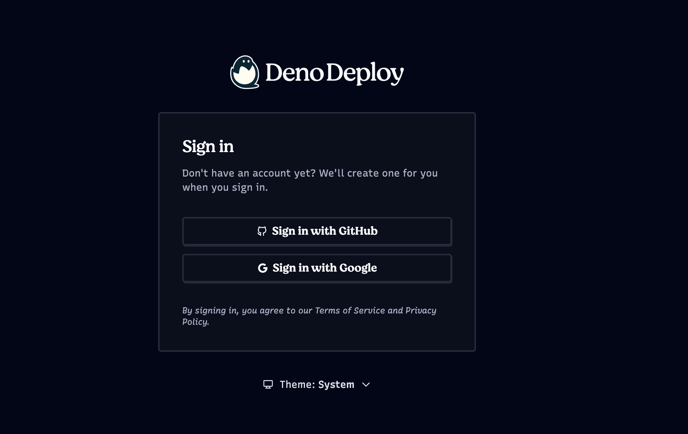
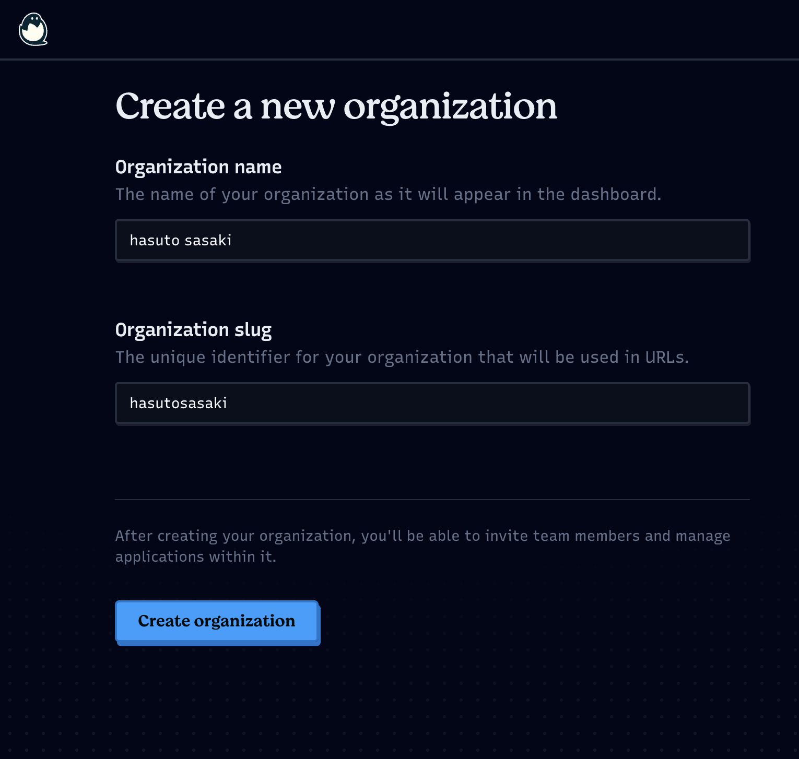
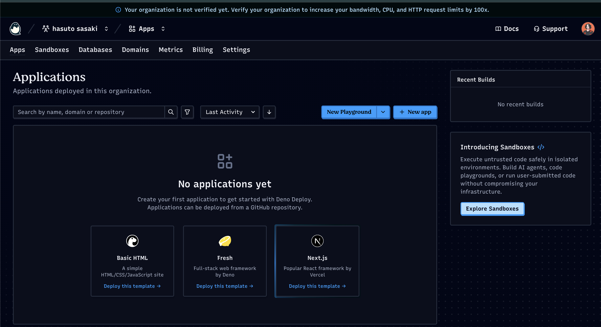
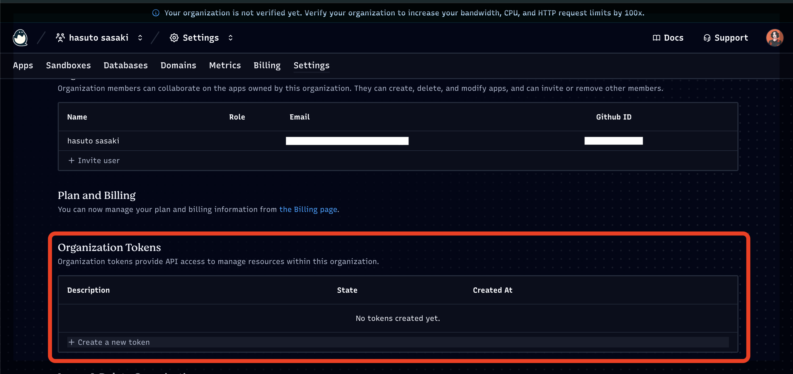
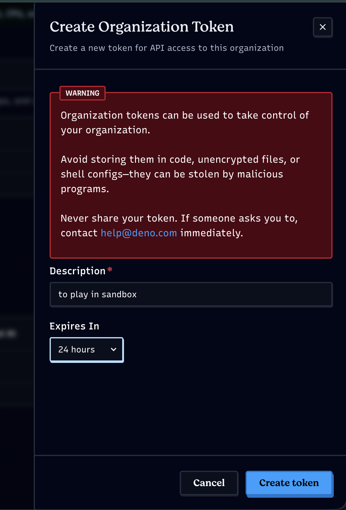
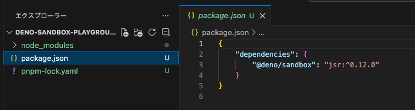
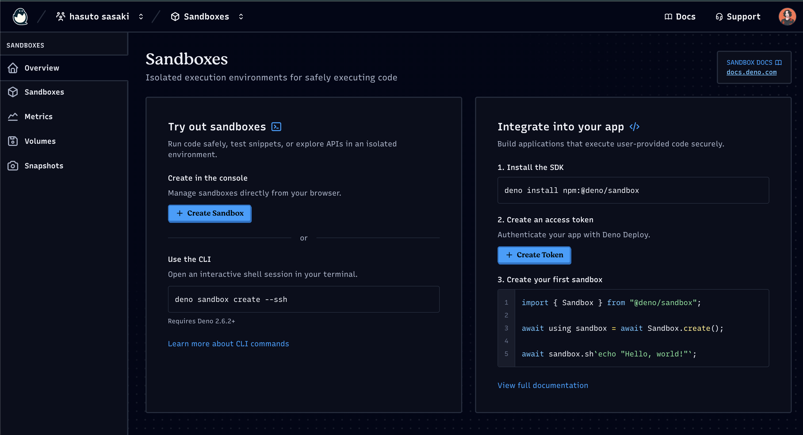
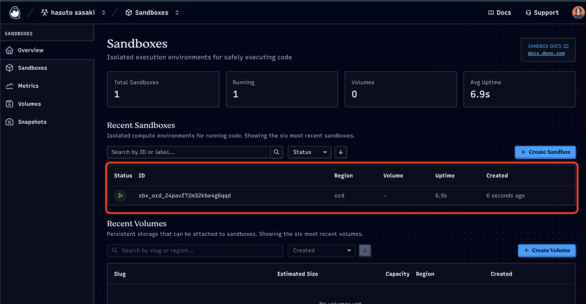
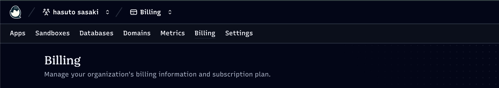
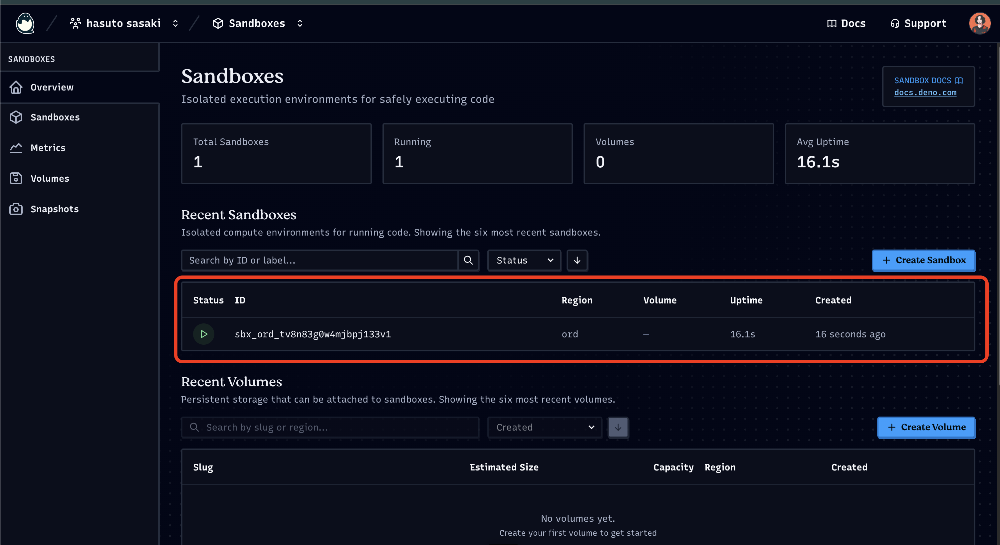

先日登壇させていただいたLT会で、Deno Sandbox について初めて知ったのですが、
TypeScript/JavaScript/Python からほんの数行のコードでサンドボックス環境が1秒未満で起動し、使用後はすぐ破棄されるというもので、非常に面白そうだったので、実際に触ってみることにしました。
まずは、環境構築から、簡単なコマンドの実行、危険なコマンドの実行まで色々試してみたので、それを紹介していきたいと思います。

## Deno Sandbox とは

Deno Sandbox とは、Linux microVM のサンドボックス環境で、許可したネットワーク通信のみに制限した上で、信頼できないコードを安全に実行できるサービスです。
他にも色々と特徴がありますが、そこら辺は、実際に触ってみながら、紹介していきたいと思います。

※ 本記事は 2026年2月21日時点の情報で、Deno Sandbox
v0.12.0（ベータ版）を基に検証しています。今後のアップデートにより仕様や挙動が変更される可能性があるため、最新の情報は[公式ドキュメント](https://docs.deno.com/sandbox/)をご確認ください。

### 料金

- CPU TIME: $0.05/CPU-hr

- Memory: $0.016/GiB-hr

- Volume usage: $0.20/GiB-month

ずっと起動しっぱなしにしない限りは、無料枠内で十分遊べると思います。

[Deno Sandbox](https://deno.com/deploy/sandbox#sandbox-pricing)

## Deno Sandbox を使えるようにする

環境構築は、公式のドキュメントを参考に進めていきます。
[Getting started](https://docs.deno.com/sandbox/getting_started/)

### Deno Deploy アカウントの作成

まずは Deno Deploy のアカウントが必要ということなので、Deno Deploy のアカウントを作成していきます。

> To use Deno Sandbox, you need a Deno Deploy account. If you do not have one yet you can sign up for a free account at console.deno.com.

GitHub アカウントか、Google アカウントでサインアップできます。



サインアップが完了したら、自分用の組織を作成します。



こんな感じでダッシュボードが表示されれば、OKです。



### 組織トークンを作成

ローカルから Deno Sandbox を使用するためには、組織トークンが必要になるため、作成します。




作成後に、コピーしたトークンを、環境変数 `DENO_DEPLOY_TOKEN` に設定します。

```bash
export DENO_DEPLOY_TOKEN=<your_token>
```

### SDKのインストール

私の環境では、pnpm を使用しているので、以下のコマンドでSDKをインストールします。

```bash
# Using pnpm
pnpm install jsr:@deno/sandbox
```

[公式のインストール手順](https://docs.deno.com/sandbox/getting_started/#install-the-sdk)

こんな感じに諸々できていたら、OKです。



### 最初の Sandbox を作成してみる

```typescript:main.ts
import { Sandbox } from "@deno/sandbox";
await using sandbox = await Sandbox.create();
await sandbox.sh`ls -lh /`;
```

### 実行

```bash
deno -EN main.ts
```

成功すると以下のような出力が表示されます。

```bash
$ deno -EN src/main.ts
total 72K
lrwxrwxrwx   1 root root    7 Feb  4 13:28 bin -> usr/bin
drwxr-xr-x   2 root root   27 Feb  4 13:28 boot
drwxr-xr-x   4 root root 4.0K Feb 21 01:51 data
drwxr-xr-x   4 root root 2.5K Feb 21 01:51 dev
drwxr-xr-x   1 root root 4.0K Feb  4 13:28 etc
drwxr-xr-x   3 root root   42 Feb  4 13:28 home
lrwxrwxrwx   1 root root    7 Feb  4 13:28 lib -> usr/lib
lrwxrwxrwx   1 root root    9 Feb  4 13:28 lib64 -> usr/lib64
drwxr-xr-x   2 root root   27 Feb  4 13:28 media
drwxr-xr-x   2 root root   27 Feb  4 13:28 mnt
drwxr-xr-x   2 root root   27 Feb  4 13:28 opt
dr-xr-xr-x 114 root root    0 Feb 21 01:49 proc
drwx------   2 root root   66 Feb  4 13:28 root
drwxrwxrwt   5 root root  100 Feb 21 01:49 run
lrwxrwxrwx   1 root root    8 Feb  4 13:28 sbin -> usr/sbin
drwxr-xr-x   2 root root   27 Feb  4 13:28 srv
dr-xr-xr-x  12 root root    0 Feb 21 01:49 sys
drwxrwxrwt   5 root root 4.0K Feb 21 01:51 tmp
drwxr-xr-x  12 root root  194 Feb  4 13:28 usr
drwxr-xr-x   1 root root 4.0K Feb  4 13:28 var
```

無事 Sandbox 内の　Linux micro VM のルートディレクトリの中身が表示されていることがわかります。

**ダッシュボードでSandboxの状況を確認する**

ダッシュボードに、先ほど作成した Sandbox 環境が表示されるはずが、何もありません。



おかしいなと思い、ドキュメントをちゃんと見てみると、`await using` ブロックが終わると、Sandboxは自動的にクリーンアップされると書いてありました。

> Cleanup happens automatically when your code drops the last reference (or the await using block ends). Call sandbox.kill() only if you need to tear the VM down ahead of that schedule.

`await using` ブロックを使用せずに、Sandboxを作成してみます。

```typescript
import { Sandbox } from "@deno/sandbox";
const sandbox = await Sandbox.create();
await sandbox.sh`ls -lh /`;
```



ダッシュボードに出ました！

**SDK 実行時にエラーが出る場合**

私が遭遇したエラーは以下の2点です。

このエラーが出る場合は、組織トークンが正しく設定されていない可能性があります。

```bash
error: Uncaught (in promise) MissingOrgError: An access token was provided, but it is not an organization token and no organization was provided via the 'org' option or the 'DENO_DEPLOY_ORG' environment variable.
```

このエラーが出る場合は、組織がまだ 認証されていない場合に出るため認証完了させて、支払い方法を設定する必要があります。

```bash
deno -EN src/main.ts
error: Uncaught (in promise) ConnectionEstablishmentError: Sandboxes are only available for verified organizations and organizations on the Pro plan. Please verify your organization to use sandboxes.
```

支払い方法の設定は、Billing ページから行うことができます。


## Sandbox を触ってみる

### Sandbox の設定

```typescript
await using sandbox = await Sandbox.create({
  allowNet: ["api.stripe.com", "api.openai.com"],
  region: "ams",
  memoryMb: 1024,
});
```

### コマンドとスクリプトの実行

```typescript
await using sandbox = await Sandbox.create();
await sandbox.sh`ls -lh /`;
```

### 中身をいろいろみてみる

**ディストロ（distro）の確認**

ディストロとは、Linuxディストリビューションの略で、ざっくりLinuxのバリエーションのことを指します。

```typescript
await using sandbox = await Sandbox.create();
await sandbox.sh`cat /etc/os-release`;
```

```bash
$ deno -EN src/main.ts
PRETTY_NAME="Debian GNU/Linux 13 (trixie)"
NAME="Debian GNU/Linux"
VERSION_ID="13"
VERSION="13 (trixie)"
VERSION_CODENAME=trixie
DEBIAN_VERSION_FULL=13.3
ID=debian
HOME_URL="https://www.debian.org/"
SUPPORT_URL="https://www.debian.org/support"
BUG_REPORT_URL="https://bugs.debian.org/"
```

このように、Debian GNU/Linux 13 (trixie) が使われていることがわかります。

**カーネルバージョンとアーキテクチャの確認**

```typescript
await using sandbox = await Sandbox.create();
await sandbox.sh`uname -a`;
```

```bash
$ deno -EN src/main.ts
Linux d95902 6.1.161-deployd #1 SMP PREEMPT_DYNAMIC Thu Feb 19 23:47:25 UTC 2026 x86_64 GNU/Linux
```

**何コアのCPUが割り当てられているのか**

```typescript
await using sandbox = await Sandbox.create();
await sandbox.sh`cat /proc/cpuinfo`;
```

```bash
$ deno -EN src/main.ts

processor       : 0
vendor_id       : AuthenticAMD
cpu family      : 25
model           : 1
model name      : AMD EPYC
stepping        : 1
microcode       : 0x1000065
cpu MHz         : 2844.656
cache size      : 512 KB
physical id     : 0
siblings        : 2
core id         : 0
cpu cores       : 2
apicid          : 0
initial apicid  : 0
fpu             : yes
fpu_exception   : yes
cpuid level     : 16
wp              : yes
flags           : fpu vme de pse tsc msr pae mce cx8 apic sep mtrr pge mca cmov pat pse36 clflush mmx fxsr sse sse2 ht syscall nx mmxext fxsr_opt pdpe1gb rdtscp lm constant_tsc rep_good nopl nonstop_tsc cpuid extd_apicid tsc_known_freq pni pclmulqdq ssse3 fma cx16 pcid sse4_1 sse4_2 x2apic movbe popcnt tsc_deadline_timer aes xsave avx f16c rdrand hypervisor lahf_lm cmp_legacy svm cr8_legacy abm sse4a misalignsse 3dnowprefetch osvw topoext perfctr_core invpcid_single ssbd ibrs ibpb stibp vmmcall fsgsbase tsc_adjust bmi1 avx2 smep bmi2 invpcid rdseed adx smap clflushopt clwb sha_ni xsaveopt xsavec xgetbv1 xsaves clzero xsaveerptr wbnoinvd arat npt lbrv nrip_save tsc_scale vmcb_clean flushbyasid pausefilter pfthreshold v_vmsave_vmload vgif umip pku ospke vaes vpclmulqdq rdpid
bugs            : sysret_ss_attrs spectre_v1 spectre_v2 spec_store_bypass srso ibpb_no_ret
bogomips        : 5689.31
TLB size        : 2560 4K pages
clflush size    : 64
cache_alignment : 64
address sizes   : 48 bits physical, 48 bits virtual
power management:

processor       : 1
vendor_id       : AuthenticAMD
cpu family      : 25
model           : 1
model name      : AMD EPYC
stepping        : 1
microcode       : 0x1000065
cpu MHz         : 2844.656
cache size      : 512 KB
physical id     : 0
siblings        : 2
core id         : 1
cpu cores       : 2
apicid          : 1
initial apicid  : 1
fpu             : yes
fpu_exception   : yes
cpuid level     : 16
wp              : yes
flags           : fpu vme de pse tsc msr pae mce cx8 apic sep mtrr pge mca cmov pat pse36 clflush mmx fxsr sse sse2 ht syscall nx mmxext fxsr_opt pdpe1gb rdtscp lm constant_tsc rep_good nopl nonstop_tsc cpuid extd_apicid tsc_known_freq pni pclmulqdq ssse3 fma cx16 pcid sse4_1 sse4_2 x2apic movbe popcnt tsc_deadline_timer aes xsave avx f16c rdrand hypervisor lahf_lm cmp_legacy svm cr8_legacy abm sse4a misalignsse 3dnowprefetch osvw topoext perfctr_core invpcid_single ssbd ibrs ibpb stibp vmmcall fsgsbase tsc_adjust bmi1 avx2 smep bmi2 invpcid rdseed adx smap clflushopt clwb sha_ni xsaveopt xsavec xgetbv1 xsaves clzero xsaveerptr wbnoinvd arat npt lbrv nrip_save tsc_scale vmcb_clean flushbyasid pausefilter pfthreshold v_vmsave_vmload vgif umip pku ospke vaes vpclmulqdq rdpid
bugs            : sysret_ss_attrs spectre_v1 spectre_v2 spec_store_bypass srso ibpb_no_ret
bogomips        : 5689.31
TLB size        : 2560 4K pages
clflush size    : 64
cache_alignment : 64
address sizes   : 48 bits physical, 48 bits virtual
power management:
```

このように色々できちゃいます。
TypeScript で、Linux のコマンドを実行して、VMにアクセスできるのは不思議な体験で面白いです。

## 危険なコードを実行して遊んでみる

そもそもとして、Deno Sandbox は公式で「The safest, simplest way to run untrusted code」「Built for AI agents」と謳われており、信頼できないコードやAIが生成したコードを安全に実行するための環境です。そこで、あえて危険なコードを実行してみて、どんな挙動になるのか見てみます。

**ファイルシステムを破壊してみる**

`rm -rf /` コマンドを実行してみます。
`-r,f` オプションで、再帰的,強制的にというオプションを付与し、`/` でルートディレクトリを指定しているので、これが実行されるとファイルシステムが破壊されます。

```typescript
await sandbox.sh`rm -rf /`;
```

```bash
$ deno -EN src/main.ts
rm: it is dangerous to operate recursively on '/'
rm: use --no-preserve-root to override this failsafe
```

「`/` を再帰的に操作するのは危険だよ」という警告が出て、`--no-preserve-root` オプションを付与しないと実行できないようになっていることがわかります。

今回は、Sandbox を捨てる前提で、`--no-preserve-root` オプションを付与して実行してみます。

```typescript
await sandbox.sh`rm -rf / --no-preserve-root`;
```

```bash
...
rm: cannot remove '/var/lib/dpkg/info/liblsan0:amd64.list': Permission denied
rm: cannot remove '/var/lib/dpkg/info/liblsan0:amd64.md5sums': Permission denied
...
```

--no-preserve-root オプションを付与しても、Permission denied エラーが出て、失敗しました。

実行しているユーザーを見てみます。

```typescript
await sandbox.sh`whoami`;
```

```bash
app
```

app は Deno Sandbox で用意されている非rootユーザーで、安全に動作するように、権限が制限されているため、ファイルシステムを破壊することができませんでした。

今回は、sudo コマンドで、root 権限にして強制的に実行してみます。

一旦、sudo コマンドが動作するかを確認するために、sudo コマンドで、whoami コマンドを実行してみます。

```typescript
await sandbox.sh`sudo whoami`;
```

```bash
> root
```

OKです。sudo コマンドは動作し、root 権限でコマンドが実行できることがわかります。

では改めて、sudo コマンドで、rm -rf / --no-preserve-root コマンドを実行してみます。

```typescript
await sandbox.sh`sudo rm -rf / --no-preserve-root`;
```

エラーは出ませんでしたが、TypeScript から実行するとスクリプト終了後に Sandbox が破棄されてしまい、実行後の状態を確認しづらいため、CLI で Sandbox を作成して検証してみます。

### まずは、CLI で sandbox を作成します。

```bash
$ deno sandbox create

Created sandbox with id 'sbx_ord_tv8n83g0w4mjbpj133v1'

Ctrl+C to stop the sandbox.
```

念の為、ダッシュボードも確認してみます。



無事立ち上がっています！

### 立ち上がった sandbox にアクセスしてみる

接続チェックのために、ls コマンドで、ルートディレクトリの中身を見てみます。

```bash
$ deno sandbox exec sbx_ord_tv8n83g0w4mjbpj133v1 -- ls -lh /

total 72K
lrwxrwxrwx   1 root root    7 Feb  4 13:28 bin -> usr/bin
drwxr-xr-x   2 root root   27 Feb  4 13:28 boot
drwxr-xr-x   4 root root 4.0K Feb 21 06:54 data
drwxr-xr-x   4 root root 2.5K Feb 21 06:54 dev
drwxr-xr-x   1 root root 4.0K Feb  4 13:28 etc
drwxr-xr-x   3 root root   42 Feb  4 13:28 home
lrwxrwxrwx   1 root root    7 Feb  4 13:28 lib -> usr/lib
lrwxrwxrwx   1 root root    9 Feb  4 13:28 lib64 -> usr/lib64
drwxr-xr-x   2 root root   27 Feb  4 13:28 media
drwxr-xr-x   2 root root   27 Feb  4 13:28 mnt
drwxr-xr-x   2 root root   27 Feb  4 13:28 opt
dr-xr-xr-x 113 root root    0 Feb 21 06:31 proc
drwx------   2 root root   66 Feb  4 13:28 root
drwxrwxrwt   5 root root  100 Feb 21 06:31 run
lrwxrwxrwx   1 root root    8 Feb  4 13:28 sbin -> usr/sbin
drwxr-xr-x   2 root root   27 Feb  4 13:28 srv
dr-xr-xr-x  12 root root    0 Feb 21 06:31 sys
drwxrwxrwt   5 root root 4.0K Feb 21 06:54 tmp
drwxr-xr-x  12 root root  194 Feb  4 13:28 usr
drwxr-xr-x   1 root root 4.0K Feb  4 13:28 var
```

OKです。

では、sudo コマンドで、`rm -rf / --no-preserve-root` コマンドを実行してみます。

```bash
$ deno sandbox exec sbx_ord_tv8n83g0w4mjbpj133v1 -- sudo rm -rf / --no-preserve-root

....省略
rm: cannot remove '/sys/module/workqueue/parameters/power_efficient': Operation not permitted
rm: cannot remove '/sys/module/jbd2/parameters/jbd2_debug': Operation not permitted
```

`/sys` の仮想ファイルはカーネルが管理しているため、削除できないようです。

現状どうなっているのかを、ls コマンドで見てみます。

```bash
$ deno sandbox exec sbx_ord_tv8n83g0w4mjbpj133v1 -- ls -lh /

Received JSON-RPC request: { jsonrpc: "2.0", id: 0 }
```

なんと、JSON-RPCのリクエストだけが返ってきて、ls コマンドの結果が返ってきませんでした。
原因としては、/usr/bin/ls など が削除されてしまったため、使えなくなったためです。
無事ファイルシステムを破壊することができました。

実際に、`sudo rm -rf / --no-preserve-root` コマンドを実行することはまずないと思いますが、純粋に `rm` コマンドを実行できないようにガードされていることを学ぶことができました。

[Management via CLI](https://docs.deno.com/sandbox/cli/)

**直接 ssh する方法もあります**

--ssh オプションを付与することで、sandbox に直接 接続 することもできます。

```bash
deno sandbox create --ssh
Created sandbox with id 'sbx_ord_keyg1q34wgascyj60ht2'
ssh 7c730999f0f6ee446c14468c966a67da@ssh.deno.net
            __    ╭─────────────────────────────────────╮
           /ᵔ_)  <  Welcome to Deno Sandbox             │
    .-----/ /     │ Sandbox sbx_ord_keyg1q34wgascyj60ht2│
 __/       /      │ Memory Usage: 300Mi/1.1Gi           │
<__.|_|-|_|       ╰─────────────────────────────────────╯

~ $
```

## まとめ

Deno Sandbox を触ってみて、Linux コマンドを TypeScript から実行できるのは、面白い体験でした。また、プロセスごとに VM が立ち上がり、プロセスを終了させると、VMもクリーンアップされ、次やるときはまた新しい VM が立ち上がるという点も非常に便利だなと感じました。
他にも、Sandbox の設定で、ネットワークアクセスを制限したり、メモリ使用量を制限したりなどいろいろできるようなので、今後もいろいろ試してみたいと思います。
