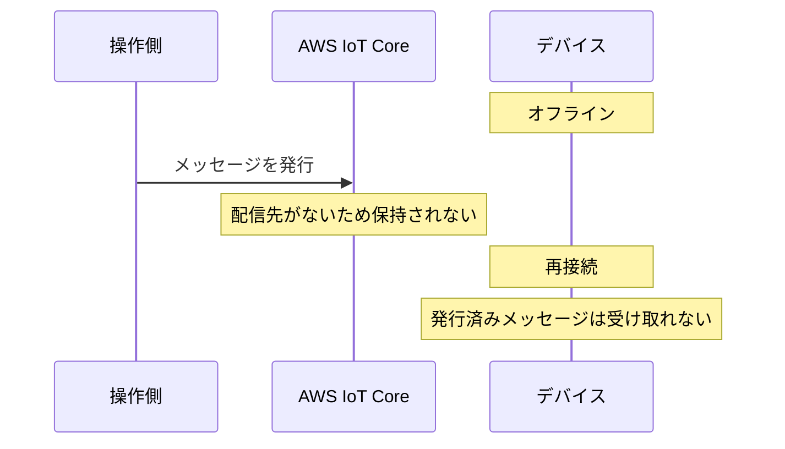
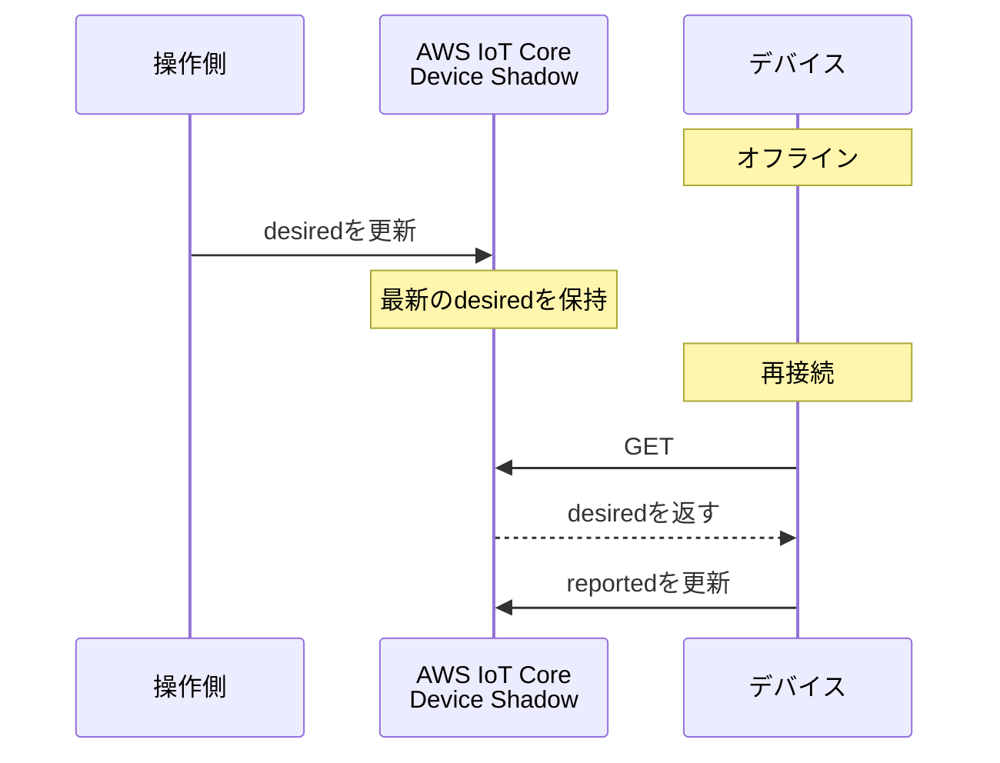
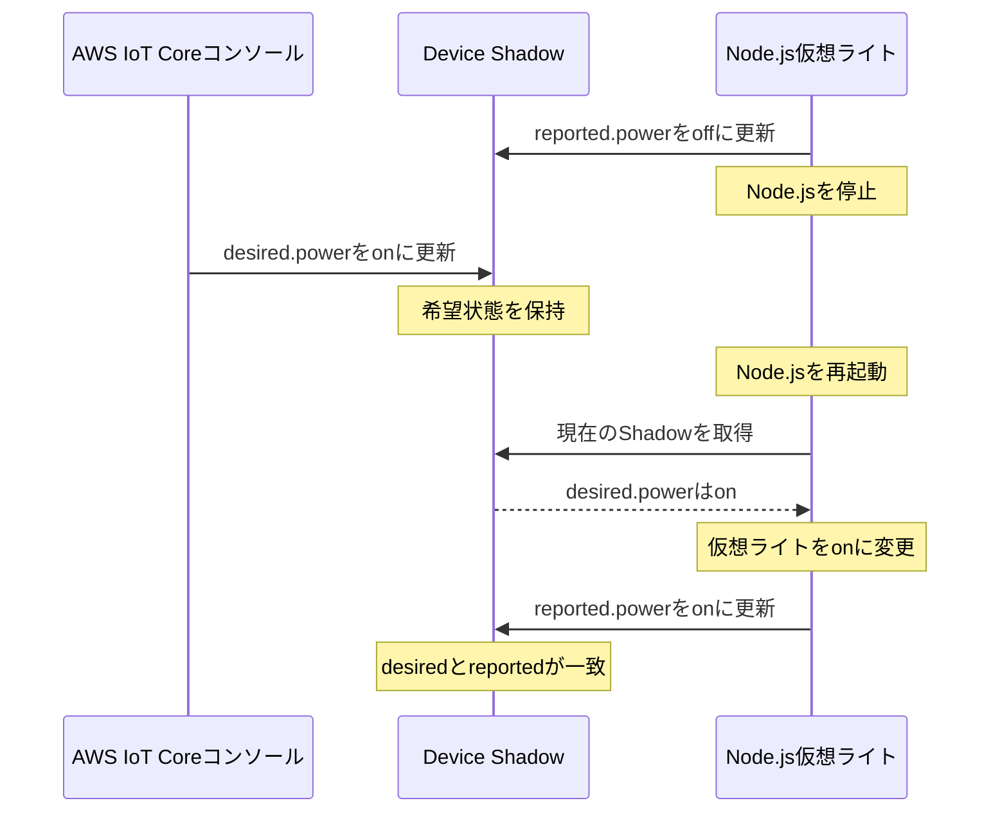
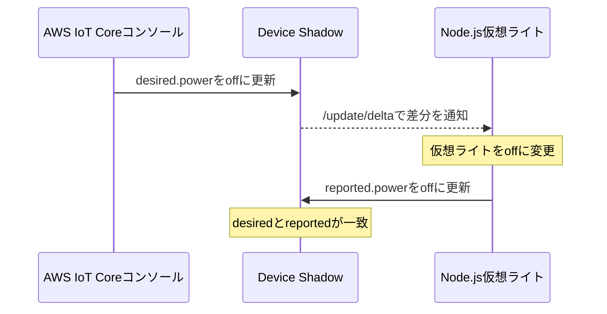

こんにちは。人材育成室 育成メンバーチームで研修中の はすと です。

IoTデバイスは、通信環境や電源の状態によって一時的にオフラインになることがあります。その間にスマートライトへ`ON`を指示した場合、再接続後にどう反映すればよいでしょうか。

この記事ではAWS IoT Device Shadowを使い、この状況を物理デバイスの代わりにNode.jsで再現します。仮想ライトを停止した状態と、起動したままの状態で希望を変更し、現在状態が追従するまでを試します。

## Device Shadowとは

Device Shadowは、Thing（モノ）に対応する状態をAWS IoT Core上に保持する仕組みです。デバイスがオフラインでも、アプリやサービスはShadowに保存された状態を確認したり、希望する状態を更新したりできます。

今回の状態同期で見るのは、`desired`、`reported`、`delta`の3つです。`desired`と`reported`はDevice Shadowで決められている状態です。`delta`は、両者の差分からAWS IoT Coreが計算する仮想的な状態です。

| 状態 | 更新する側 | 意味 |
| --- | --- | --- |
| `desired` | アプリや操作側 | デバイスに「こうなってほしい」と指定する状態 |
| `reported` | デバイス側 | デバイスが報告した現在状態 |
| `delta` | AWS IoT Core | `desired`と`reported`の差分 |

:::details 今回は扱わない項目
シャドウドキュメントには、属性ごとの更新時刻を持つ`metadata`、メッセージ作成時刻の`timestamp`、リクエストとレスポンスを対応付ける`clientToken`、更新ごとに増える`version`もあります。今回は状態同期の流れに絞るため、扱いません。
:::

たとえば、ライトの現在状態が`OFF`で、操作側が`ON`を希望している場合、Shadowドキュメントは次の状態になります。

```json
{
  "state": {
    "desired": {
      "power": "on"
    },
    "reported": {
      "power": "off"
    },
    "delta": {
      "power": "on"
    }
  }
}
```

`power`は今回の検証用に私が決めた項目ですが、`state`、`desired`、`reported`、`delta`はDevice Shadowの仕様で定められています。また、`delta`はAWS IoT Coreが算出するため、デバイスや操作側から直接更新しません。

### メッセージを溜める仕組みではない

Device Shadowが保持するのは、操作履歴ではなく最新の状態です。

たとえば、デバイスがオフライン中に`ON`、`OFF`、`ON`の順で希望状態を変更しても、3件の操作が順番に溜まるわけではありません。最後に更新された`ON`が`desired`へ残ります。

違いは、デバイスがオフライン中に指定した状態の扱いです。

#### 通常のMQTTメッセージ送受信

今回のように永続セッションを使わない場合、オフライン中に発行されたメッセージは、再接続後には受け取れません。



#### Device Shadow

Device Shadowでは、操作側が更新した最新の`desired`をAWS IoT Coreが保持します。



:::details MQTTの永続セッションとの違い
MQTTには、切断中のメッセージを再接続後に受け取るための永続セッションもあります。ただし、これはDevice Shadowとは別の仕組みです。

今回は永続セッションを使わず、Node.jsが再接続したときに現在のShadowを`GET`し、最新状態へ合わせます。
:::

## 今回確認する流れ

今回は、`nodejs-thing-demo`を使います。物理的なライトは用意せず、Node.jsの変数を仮想ライトの電源状態として扱います。モノをまだ作成していない場合は、前回書いた[こちらの記事](/articles/aws-iot-nodejs-virtual-device)を参考にしてください。



Node.jsは再接続時にShadowの`/get`トピックへメッセージを発行します。取得したShadowに`desired`があれば、その希望状態を仮想ライトへ反映し、`reported`を更新します。

## Shadow用のIoTポリシーを新しく作成する

Device ShadowもMQTTを使って操作しますが、通常のトピックではなく、`$aws/things/`から始まる予約済みトピックを使用します。

:::details 予約済みトピックを使う理由
`$`から始まるトピックはAWS IoT Core用に予約されています。利用者が新しい`$`で始まるトピックを作成することはできません。

Device Shadowは、Shadowを取得・更新・削除する操作と、その成功・失敗の通知をやり取りするために、この予約済みトピックを使います。`$aws/things/`配下を独自の用途には使いません。

AWS IoT CoreはShadow用トピックを追加することがあるため、`$aws/things/.../shadow/#`のようなワイルドカードでの購読は避け、必要なトピックだけを購読します。詳しくは[AWS公式のDevice Shadow MQTTトピック](https://docs.aws.amazon.com/iot/latest/developerguide/device-shadow-mqtt.html)を参照してください。
:::

今回Node.jsが使用するトピックは次のとおりです。

| トピック | Node.jsの操作 | 用途 |
| --- | --- | --- |
| `$aws/things/nodejs-thing-demo/shadow/get` | Publish | 現在のShadowを取得する |
| `$aws/things/nodejs-thing-demo/shadow/get/accepted` | Subscribe、Receive | 取得に成功したShadowを受け取る |
| `$aws/things/nodejs-thing-demo/shadow/get/rejected` | Subscribe、Receive | 取得エラーを受け取る |
| `$aws/things/nodejs-thing-demo/shadow/update` | Publish | `reported`を更新する |
| `$aws/things/nodejs-thing-demo/shadow/update/delta` | Subscribe、Receive | `desired`と`reported`の差分を受け取る |

AWS IoT Coreの画面左にあるナビゲーションで、「管理」の中にある「セキュリティ」を展開し、「ポリシー」を選択します。ポリシー一覧で「ポリシーを作成」を選択します。

「ポリシー名」に`nodejs-thing-demo-shadow-policy`を入力し、「ポリシードキュメント」を「JSON」表示へ切り替えます。


次の内容を入力し、「作成」を選択します。`<ACCOUNT_ID>`は、自分のAWSアカウントIDへ置き換えてください。

```json
{
  "Version": "2012-10-17",
  "Statement": [
    {
      "Effect": "Allow",
      "Action": "iot:Publish",
      "Resource": [
        "arn:aws:iot:ap-northeast-1:<ACCOUNT_ID>:topic/$aws/things/nodejs-thing-demo/shadow/get",
        "arn:aws:iot:ap-northeast-1:<ACCOUNT_ID>:topic/$aws/things/nodejs-thing-demo/shadow/update"
      ]
    },
    {
      "Effect": "Allow",
      "Action": "iot:Subscribe",
      "Resource": [
        "arn:aws:iot:ap-northeast-1:<ACCOUNT_ID>:topicfilter/$aws/things/nodejs-thing-demo/shadow/get/accepted",
        "arn:aws:iot:ap-northeast-1:<ACCOUNT_ID>:topicfilter/$aws/things/nodejs-thing-demo/shadow/get/rejected",
        "arn:aws:iot:ap-northeast-1:<ACCOUNT_ID>:topicfilter/$aws/things/nodejs-thing-demo/shadow/update/delta"
      ]
    },
    {
      "Effect": "Allow",
      "Action": "iot:Receive",
      "Resource": [
        "arn:aws:iot:ap-northeast-1:<ACCOUNT_ID>:topic/$aws/things/nodejs-thing-demo/shadow/get/accepted",
        "arn:aws:iot:ap-northeast-1:<ACCOUNT_ID>:topic/$aws/things/nodejs-thing-demo/shadow/get/rejected",
        "arn:aws:iot:ap-northeast-1:<ACCOUNT_ID>:topic/$aws/things/nodejs-thing-demo/shadow/update/delta"
      ]
    }
  ]
}
```

続いて、作成したポリシーをデバイス証明書へ追加します。「管理」→「すべてのデバイス」→「モノ」から`nodejs-thing-demo`を開き、「証明書」タブで証明書を選択します。「ポリシー」タブの「ポリシーをアタッチ」を選び、`nodejs-thing-demo-shadow-policy`へチェックを入れます。


「ポリシーをアタッチ」を選択します。接続用の`nodejs-thing-demo-Policy`は外さず、`nodejs-thing-demo-shadow-policy`を追加します。証明書に2つのポリシーが表示されれば完了です。


## Node.jsを仮想ライトとして動かす

前回の[検証用リポジトリ](https://github.com/HasutoSasaki/aws-iot-nodejs-device)で、`shadow-device.mjs`を作成します。証明書や接続先を設定した`.env`は、そのまま利用できます。

:::details .envをまだ作っていない場合
Node.js 24 LTSとpnpmを用意してから、リポジトリのルートで実行します。

リポジトリのルートで、まずテンプレートから`.env`を作成します。

```bash
pnpm install
cp .env.example .env
```

次に、「1 個のデバイスを接続」でダウンロードした接続キットを`certs`へ展開し、AWS IoT Coreのサーバー証明書を検証するためのAmazon Root CAを保存します。ZIPファイル名はダウンロードした実際の名前に読み替えてください。

```bash
mkdir -p certs
unzip ~/Downloads/connect_device_package.zip -d certs
curl -o certs/AmazonRootCA1.pem https://www.amazontrust.com/repository/AmazonRootCA1.pem
```

`.env`を開き、`AWS_IOT_ENDPOINT`を「接続」→「ドメイン設定」に表示される`iot:Data-ATS`のドメイン名へ変更します。`https://`は付けません。接続キット内の証明書・秘密鍵の名前が異なる場合は、`AWS_IOT_CERT_PATH`と`AWS_IOT_PRIVATE_KEY_PATH`も実際のパスに合わせます。

```dotenv
AWS_IOT_ENDPOINT=your-endpoint-ats.iot.ap-northeast-1.amazonaws.com
AWS_IOT_CLIENT_ID=nodejs-thing-demo
AWS_IOT_CERT_PATH=./certs/nodejs-thing-demo.cert.pem
AWS_IOT_PRIVATE_KEY_PATH=./certs/nodejs-thing-demo.private.key
AWS_IOT_CA_PATH=./certs/AmazonRootCA1.pem
```

`.env`と`certs`には接続先や秘密鍵が含まれるため、公開リポジトリへ追加しません。このリポジトリでは`.gitignore`で除外されています。
:::

スクリプト全体は、検証用リポジトリの[shadow-device.mjs](https://github.com/HasutoSasaki/aws-iot-nodejs-device/blob/main/shadow-device.mjs)を参照してください。ここでは、Device Shadowの動きを理解するために必要な処理だけを見ます。

ここからは、Node.jsが起動したときの処理を順に確認します。最初に現在のShadowを取得し、保存されている`desired.power`を確認します。`/get`の応答を受け取れるように、先に`/get/accepted`と`/get/rejected`を購読します。

この処理では、Shadowとの送受信に使うMQTTトピック名を`topics`にまとめ、配信保証レベルには`qos: 0`を指定します。

:::details QoSとは
QoS（Quality of Service）は、MQTTメッセージの配信保証レベルです。AWS IoT Coreでは`0`と`1`を使えます。

- `qos: 0`: 確認応答や再送を行いません。通信中に失われても問題ないメッセージ向けです。
- `qos: 1`: 受信確認（PUBACK）が返るまで再送します。同じメッセージを複数回受け取る可能性があります。

この検証では、状態そのものをDevice Shadowに保持するため、シンプルな`qos: 0`を使います。通信が切れた場合でも、再接続後に`desired`を取得し直せます。QoS 2はAWS IoT Coreではサポートされていません。詳しくは[AWS公式ドキュメント](https://docs.aws.amazon.com/iot/latest/developerguide/mqtt.html#mqtt-qos)を参照してください。
:::

```js
client.on("connect", () => {
  // Shadowの取得結果と、希望状態の変更を受け取るトピック
  const responseTopics = [topics.getAccepted, topics.getRejected, topics.delta];

  // QoS 0で購読してから、現在のShadowを取得する
  client.subscribe(responseTopics, { qos: 0 }, () => {
    // 空の本文で/getを発行する
    client.publish(topics.get, "", { qos: 0 });
  });
});
```

次に、`desired.power`を受け取ったら仮想ライトの状態を変更し、実際に反映した値を`reported.power`として`/update`へ送ります。

```js
function applyDesiredState(desiredState) {
  if (!desiredState || !["on", "off"].includes(desiredState.power)) {
    return;
  }

  // 希望状態を仮想ライトへ反映する
  power = desiredState.power;
  // 反映した現在状態をShadowへ返す
  publishReportedState();
}

function publishReportedState() {
  const payload = JSON.stringify({
    state: { reported: { power } },
  });

  // reportedを/updateトピックへ送信する
  client.publish(topics.update, payload, { qos: 0 });
}
```

`/get/accepted`で取得した`desired`を`applyDesiredState()`へ渡します。Shadowがまだない場合の`/get/rejected`では、初期状態の`reported.power=off`を送信してClassic Shadowを作成します。

Node.jsが接続中に`desired`が変わった場合は、`/update/delta`を受信します。この差分にも同じ`applyDesiredState()`を使い、仮想ライトを更新して`reported`を返します。

```js
if (topic === topics.delta) {
  console.log("希望状態の変更を受信しました");
  applyDesiredState(payload.state);
}
```

:::details このコードで確認できる範囲
`現在状態を送信しました`は、Node.jsから`/update`トピックへ送信したことを示すログです。Shadowに保存されたことは、後のコンソール画面で確認します。

このコードは、再接続時には`/get`、接続中は`/update/delta`で状態を同期します。`/update/accepted`・`/update/rejected`による応答確認は扱いません。
:::

:::details get、update、accepted、rejected、deltaの意味
Device ShadowはMQTTのpublish/subscribeを使って、リクエストとレスポンスに近い流れを作っています。

- `/get`: 現在のShadowを取得します。
- `/update`: `desired`または`reported`を更新します。
- `/accepted`: リクエストがAWS IoT Coreに受け付けられた場合に返ります。
- `/rejected`: 権限不足やJSONの誤りなどで、リクエストが拒否された場合に返ります。
- `/delta`: `desired`と`reported`に差がある場合に、デバイスへ差分を通知します。
:::

## 最初の状態を登録する

プロジェクトのルートで、次のコマンドを実行します。

:::details 同じクライアントIDのNode.jsを複数起動しない
この検証ではMQTTクライアントIDに`nodejs-thing-demo`を使います。同じIDでNode.jsを2つ起動すると、後から接続した方が既存の接続を切断するため、再接続を繰り返します。

起動前に、以前起動したNode.jsプロセスを`Ctrl+C`で停止してください。
:::

```bash
pnpm start:shadow
```

Classic Shadowがまだ存在しない場合、`/get/rejected`を受信します。今回のコードは、その場合に現在状態である`power=off`を`reported`へ送信し、Classic Shadowを作成します。

成功すると、ターミナルには次のログが表示されました。

```text
AWS IoT Coreへ接続しました: nodejs-thing-demo
現在のShadowを取得します
Shadowがまだないため、現在状態を登録します
現在状態を送信しました: power=off
```

AWS IoT Coreの画面左にあるナビゲーションで、「管理」の中にある「すべてのデバイス」を展開し、「モノ」を開きます。`nodejs-thing-demo`を選択して「Device Shadow」タブを開き、一覧の「Classic Shadow」を選択します。

Shadowドキュメントの`reported.power`が`off`になっていることを確認します。


## オフライン中に希望状態を変更する

ターミナルで`Ctrl+C`を入力し、Node.jsを停止します。これで仮想ライトがオフラインの状態になります。

AWS IoT CoreのClassic Shadow画面で「編集」を選択し、`desired.power`だけを`on`へ変更します。`reported.power`は、既存の`off`を残します。これはNode.jsが実際の状態を報告する値です。

```json
{
  "state": {
    "desired": {
      "power": "on"
    }
  }
}
```

「Device Shadow の状態」へ上記のJSONを入力し、「更新」を選択します。


Node.jsは停止しているため、仮想ライトの状態はまだ変わりません。Shadowには`desired.power=on`と`reported.power=off`が残り、その差として`delta.power=on`が確認できる状態になります。


## Node.jsを再接続する

もう一度Node.jsを起動します。

```bash
pnpm start:shadow
```

Node.jsはShadowを取得し、`desired.power=on`を仮想ライトへ反映します。その後、`reported.power=on`をAWS IoT Coreへ送信します。

```text
AWS IoT Coreへ接続しました: nodejs-thing-demo
現在のShadowを取得します
Shadowを取得しました
仮想ライト: ON
現在状態を送信しました: power=on
```

Classic Shadowを確認し、`desired.power`と`reported.power`がどちらも`on`になっていることを確認します。両者が一致すると差分がなくなるため、`delta.power`は表示されなくなります。


## Node.jsを起動したまま状態を変更する

ここではNode.jsを停止せずに、Classic Shadowの「編集」から`desired.power`を`off`へ変更します。`reported`はデバイス側が更新する値なので、コンソールからは変更しません。

```json
{
  "state": {
    "desired": {
      "power": "off"
    }
  }
}
```

更新すると、Node.jsは`/update/delta`で差分を受け取り、仮想ライトを`OFF`へ変更します。その後、`reported.power=off`を送信します。



```text
希望状態の変更を受信しました
仮想ライト: OFF
現在状態を送信しました: power=off
```

Classic Shadowで`desired.power`と`reported.power`がどちらも`off`になり、`delta`がなくなることを確認します。


この画面から、Node.jsが差分を受け取って`reported.power`を更新し、希望状態とのずれが解消されたことが分かります。

## 検証結果

Node.jsを停止している間も、コンソールから更新した`desired.power=on`がClassic Shadowに保持されました。この時点では`reported.power=off`のままで、AWS IoT Coreが`delta.power=on`を算出しています。

Node.jsを再起動すると、保存されていた希望状態を取得して仮想ライトを`ON`へ変更し、`reported.power=on`を送信できました。`desired`と`reported`が一致した後は、Shadowドキュメントから`delta`がなくなることも確認できました。

Node.jsが接続中に`desired.power`を変更した場合も、`/update/delta`を受信して仮想ライトへ反映し、`reported.power`を更新できることを確認しました。

## まとめ

Node.jsを仮想ライトとして使い、専用のハードがなくても、オフライン中に指定した状態を再接続後に反映できるかやってみました。`desired`、`reported`、`delta`を実際に動かしたことで、Device Shadowの動きを理解できました。

次は実際のハードウェアをつないで遊んでみたいと思います。

## 参考

- [AWS IoT Device Shadowサービス - AWS IoT Core](https://docs.aws.amazon.com/iot/latest/developerguide/iot-device-shadows.html)
- [Device Shadowサービスのドキュメント - AWS IoT Core](https://docs.aws.amazon.com/iot/latest/developerguide/device-shadow-document.html)
- [デバイスでShadowを使用する - AWS IoT Core](https://docs.aws.amazon.com/iot/latest/developerguide/device-shadow-comms-device.html)
- [Device ShadowのMQTTトピック - AWS IoT Core](https://docs.aws.amazon.com/iot/latest/developerguide/device-shadow-mqtt.html)
- [クライアント証明書へのポリシーのアタッチ - AWS IoT Core](https://docs.aws.amazon.com/iot/latest/developerguide/attach-to-cert.html)
