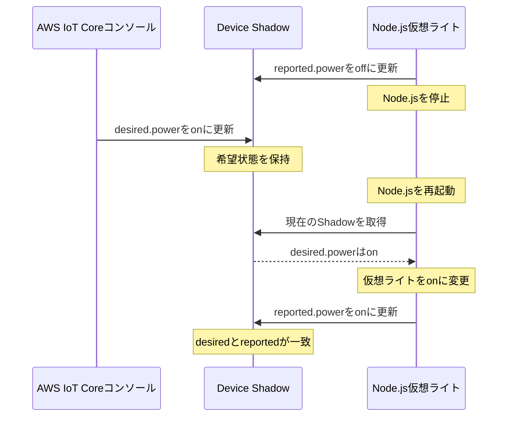

こんにちは。人材育成室 育成メンバーチームで研修中の はすと です。

前回は、Node.jsを仮想デバイスとしてAWS IoT Coreへ接続し、オンライン中のメッセージ送受信を試しました。

前回の実装では、Node.jsを停止している間に`command`トピックへ指示を送っても、再接続後にその指示を取り出す処理はありません。実際のIoTデバイスでは、通信環境や電源の状態によって一時的にオフラインになることがあります。その間に操作側から指定した状態は、どのようにデバイスへ反映するのでしょうか。

今回はAWS IoT Device Shadowを使い、Node.jsが停止している間に仮想ライトの希望状態を`ON`へ変更します。その後、Node.jsを再起動し、希望状態を取得して現在状態を返すまでを試してみます。

## Device Shadowとは

Device Shadowは、Thing（モノ）に対応する状態をAWS IoT Core上に保持する仕組みです。デバイスがオフラインでも、アプリやサービスはShadowに保存された状態を確認したり、希望する状態を更新したりできます。

Shadowドキュメントでは、主に`desired`、`reported`、`delta`の3つを扱います。これらは任意に付けた名前ではなく、Device Shadowで決められているプロパティ名です。

| プロパティ | 更新する側 | 意味 |
| --- | --- | --- |
| `desired` | アプリや操作側 | デバイスに「こうなってほしい」と指定する状態 |
| `reported` | デバイス側 | デバイスが報告した現在状態 |
| `delta` | AWS IoT Core | `desired`と`reported`の差分 |

たとえば、ライトの現在状態が`OFF`で、操作側が`ON`を希望している場合、Shadowドキュメントは次の状態になります。

```json
{
  "state": {
    "desired": {
      "power": "on"
    },
    "reported": {
      "power": "off"
    },
    "delta": {
      "power": "on"
    }
  }
}
```

`power`は今回の検証用に決めた項目名です。一方、`state`、`desired`、`reported`、`delta`はDevice Shadowの仕様で定められています。`delta`はAWS IoT Coreが算出するため、デバイスや操作側から直接更新しません。

### メッセージを溜める仕組みではない

Device Shadowが保持するのは、操作履歴ではなく最新の状態です。

たとえば、デバイスがオフライン中に`ON`、`OFF`、`ON`の順で希望状態を変更しても、3件の操作が順番に溜まるわけではありません。最後に更新された`ON`が`desired`へ残ります。

| 方法 | オンライン中 | オフライン中 | 再接続後 |
| --- | --- | --- | --- |
| 前回の`command`トピック実装 | 発行した指示をその場で受信する | 今回の実装では指示を受信できない | 再送しない限り、オフライン中の指示は受け取れない |
| Device Shadow | 操作側が`desired`を更新し、デバイスが`reported`を返す | AWS IoT Coreが最新の`desired`を保持する | デバイスが`desired`を取得して反映し、`reported`を更新する |

:::details MQTTの永続セッションとの違い
MQTTには、切断中のメッセージを再接続後に受け取るための永続セッションもあります。ただし、これはDevice Shadowとは別の仕組みです。

今回は永続セッションを使わず、Node.jsが再接続したときに現在のShadowを`GET`し、最新状態へ合わせます。
:::

## 今回確認する流れ

今回は、前回作成した`nodejs-thing-demo`をそのまま使います。物理的なライトは用意せず、Node.jsの変数を仮想ライトの電源状態として扱います。



Node.jsは再接続時にShadowの`/get`トピックへメッセージを発行します。取得したShadowに`desired`があれば、その希望状態を仮想ライトへ反映し、`reported`を更新します。

## Shadow用のIoTポリシーを新しく作成する

Device ShadowもMQTTを使って操作しますが、通常のトピックではなく、`$aws/things/`から始まる予約済みトピックを使用します。

今回Node.jsが使用するトピックは次のとおりです。

| トピック | Node.jsの操作 | 用途 |
| --- | --- | --- |
| `$aws/things/nodejs-thing-demo/shadow/get` | Publish | 現在のShadowを取得する |
| `$aws/things/nodejs-thing-demo/shadow/get/accepted` | Subscribe、Receive | 取得に成功したShadowを受け取る |
| `$aws/things/nodejs-thing-demo/shadow/get/rejected` | Subscribe、Receive | 取得エラーを受け取る |
| `$aws/things/nodejs-thing-demo/shadow/update` | Publish | `reported`を更新する |
| `$aws/things/nodejs-thing-demo/shadow/update/delta` | Subscribe、Receive | `desired`と`reported`の差分を受け取る |
| `$aws/things/nodejs-thing-demo/shadow/update/accepted` | Subscribe、Receive | 更新成功を受け取る |
| `$aws/things/nodejs-thing-demo/shadow/update/rejected` | Subscribe、Receive | 更新エラーを受け取る |

AWS IoT Coreの画面左にあるナビゲーションで、「管理」の中にある「セキュリティ」を展開し、「ポリシー」を選択します。ポリシー一覧で「ポリシーを作成」を選択します。

「ポリシー名」に`nodejs-thing-demo-shadow-policy`を入力し、「ポリシードキュメント」を「JSON」表示へ切り替えます。


次の内容を入力し、「作成」を選択します。`<ACCOUNT_ID>`は、自分のAWSアカウントIDへ置き換えてください。

```json
{
  "Version": "2012-10-17",
  "Statement": [
    {
      "Effect": "Allow",
      "Action": "iot:Publish",
      "Resource": "arn:aws:iot:ap-northeast-1:<ACCOUNT_ID>:topic/$aws/things/nodejs-thing-demo/shadow/*"
    },
    {
      "Effect": "Allow",
      "Action": "iot:Subscribe",
      "Resource": "arn:aws:iot:ap-northeast-1:<ACCOUNT_ID>:topicfilter/$aws/things/nodejs-thing-demo/shadow/*"
    },
    {
      "Effect": "Allow",
      "Action": "iot:Receive",
      "Resource": "arn:aws:iot:ap-northeast-1:<ACCOUNT_ID>:topic/$aws/things/nodejs-thing-demo/shadow/*"
    }
  ]
}
```

続いて、作成したポリシーをデバイス証明書へ追加します。「管理」→「すべてのデバイス」→「モノ」から`nodejs-thing-demo`を開き、「証明書」タブで証明書を選択します。「ポリシー」タブの「ポリシーをアタッチ」を選び、`nodejs-thing-demo-shadow-policy`へチェックを入れます。


「ポリシーをアタッチ」を選択します。`nodejs-thing-demo-shadow-policy`が一覧に表示されれば完了です。


:::details ポリシーにある*の意味
Shadow用ポリシーでは、`$aws/things/nodejs-thing-demo/shadow/`以下を`*`でまとめています。この`*`はIoTポリシーのARNで使うワイルドカードであり、MQTTのトピックフィルターで使う`#`とは別物です。このポリシーはShadowのトピック操作だけを許可するため、`iot:Connect`は含めません。接続の許可は、デバイス証明書に設定済みの接続用ポリシーが担います。
:::

## Node.jsを仮想ライトとして動かす

前回の[検証用リポジトリ](https://github.com/HasutoSasaki/aws-iot-nodejs-device)で、`shadow-device.mjs`を作成します。証明書や接続先を設定した`.env`は、そのまま利用できます。

:::details .envをまだ作っていない場合
リポジトリのルートで、まずテンプレートから`.env`を作成します。

```bash
pnpm install
cp .env.example .env
```

次に、「1 個のデバイスを接続」でダウンロードした接続キットを`certs`へ展開し、AWS IoT Coreのサーバー証明書を検証するためのAmazon Root CAを保存します。ZIPファイル名はダウンロードした実際の名前に読み替えてください。

```bash
mkdir -p certs
unzip ~/Downloads/connect_device_package.zip -d certs
curl -o certs/AmazonRootCA1.pem https://www.amazontrust.com/repository/AmazonRootCA1.pem
```

`.env`を開き、`AWS_IOT_ENDPOINT`を「接続」→「ドメイン設定」に表示される`iot:Data-ATS`のドメイン名へ変更します。`https://`は付けません。接続キット内の証明書・秘密鍵の名前が異なる場合は、`AWS_IOT_CERT_PATH`と`AWS_IOT_PRIVATE_KEY_PATH`も実際のパスに合わせます。

```dotenv
AWS_IOT_ENDPOINT=your-endpoint-ats.iot.ap-northeast-1.amazonaws.com
AWS_IOT_CLIENT_ID=nodejs-thing-demo
AWS_IOT_CERT_PATH=./certs/nodejs-thing-demo.cert.pem
AWS_IOT_PRIVATE_KEY_PATH=./certs/nodejs-thing-demo.private.key
AWS_IOT_CA_PATH=./certs/AmazonRootCA1.pem
```

`.env`と`certs`には接続先や秘密鍵が含まれるため、公開リポジトリへ追加しません。このリポジトリでは`.gitignore`で除外されています。
:::

スクリプト全体は、検証用リポジトリの[shadow-device.mjs](https://github.com/HasutoSasaki/aws-iot-nodejs-device/blob/main/shadow-device.mjs)を参照してください。ここでは、Device Shadowの動きを理解するために必要な処理だけを見ます。

まず、接続したらレスポンス用トピックを購読し、現在のShadowを取得します。先に購読しておくことで、`/get`の結果を取りこぼしません。

```js
client.on("connect", () => {
  const responseTopics = [
    topics.getAccepted,
    topics.getRejected,
    topics.updateAccepted,
    topics.updateRejected,
    topics.delta,
  ];

  client.subscribe(responseTopics, { qos: 0 }, () => {
    client.publish(topics.get, "", { qos: 0 });
  });
});
```

次に、`desired.power`を受け取ったら仮想ライトの状態を変更し、実際に反映した値を`reported.power`として`/update`へ送ります。

```js
function applyDesiredState(desiredState) {
  if (!desiredState || !["on", "off"].includes(desiredState.power)) {
    return;
  }

  power = desiredState.power;
  publishReportedState();
}

function publishReportedState() {
  const payload = JSON.stringify({
    state: { reported: { power } },
  });

  client.publish(topics.update, payload, { qos: 0 });
}
```

`/get/accepted`で取得した`desired`と、`/update/delta`で届いた差分は、どちらも`applyDesiredState()`へ渡します。Shadowがまだない場合の`/get/rejected`では、初期状態の`reported.power=off`を送信してClassic Shadowを作成します。

:::details get、update、accepted、rejectedの意味
Device ShadowはMQTTのpublish/subscribeを使って、リクエストとレスポンスに近い流れを作っています。

- `/get`: 現在のShadowを取得します。
- `/update`: `desired`または`reported`を更新します。
- `/accepted`: リクエストがAWS IoT Coreに受け付けられた場合に返ります。
- `/rejected`: 権限不足やJSONの誤りなどで、リクエストが拒否された場合に返ります。
- `/update/delta`: `desired`と`reported`に差が生じたときに配信されます。
:::

## 最初の状態を登録する

プロジェクトのルートで、次のコマンドを実行します。

```bash
node --env-file=.env shadow-device.mjs
```

Classic Shadowがまだ存在しない場合、`/get/rejected`を受信します。今回のコードは、その場合に現在状態である`power=off`を`reported`へ送信し、Classic Shadowを作成します。

成功すると、ターミナルには次のログが表示されました。

```text
AWS IoT Coreへ接続しました: nodejs-thing-demo
現在のShadowを取得します
Shadowがまだないため、現在状態を登録します
現在状態を発行しました: power=off
Shadowの更新が受け付けられました
```

AWS IoT Coreの画面左にあるナビゲーションで、「管理」の中にある「すべてのデバイス」を展開し、「モノ」を開きます。`nodejs-thing-demo`を選択して「Device Shadow」タブを開き、一覧の「Classic Shadow」を選択します。

Shadowドキュメントの`reported.power`が`off`になっていることを確認します。


## オフライン中に希望状態を変更する

ターミナルで`Ctrl+C`を入力し、Node.jsを停止します。これで仮想ライトがオフラインの状態になります。

AWS IoT CoreのClassic Shadow画面で「編集」を選択し、`desired.power`を`on`へ変更します。

```json
{
  "state": {
    "desired": {
      "power": "on"
    },
    "reported": {
      "power": "off"
    }
  }
}
```

「Device Shadow の状態」へ上記のJSONを入力し、「更新」を選択します。


Node.jsは停止しているため、仮想ライトの状態はまだ変わりません。Shadowには`desired.power=on`と`reported.power=off`が残り、その差として`delta.power=on`が確認できる状態になります。


## Node.jsを再接続する

もう一度Node.jsを起動します。

```bash
node --env-file=.env shadow-device.mjs
```

Node.jsはShadowを取得し、`desired.power=on`を仮想ライトへ反映します。その後、`reported.power=on`をAWS IoT Coreへ送信します。

```text
AWS IoT Coreへ接続しました: nodejs-thing-demo
現在のShadowを取得します
Shadowを取得しました
仮想ライト: ON
現在状態を発行しました: power=on
Shadowの更新が受け付けられました
```

Classic Shadowを確認し、`desired.power`と`reported.power`がどちらも`on`になっていることを確認します。両者が一致すると差分がなくなるため、`delta.power`は表示されなくなります。


## 検証結果

Node.jsを停止している間も、コンソールから更新した`desired.power=on`がClassic Shadowに保持されました。この時点では`reported.power=off`のままで、AWS IoT Coreが`delta.power=on`を算出しています。

Node.jsを再起動すると、保存されていた希望状態を取得して仮想ライトを`ON`へ変更し、`reported.power=on`を送信できました。`desired`と`reported`が一致した後は、Shadowドキュメントから`delta`がなくなることも確認できました。

## まとめ

Device Shadowは、オフライン中のメッセージを順番に溜めるのではなく、デバイスの最新状態をAWS IoT Core上に保持する仕組みです。操作側が`desired`へ希望状態を設定し、再接続したデバイスが状態を反映して`reported`を返すことで、両者の状態を合わせられます。

前回のMQTTによるメッセージ送受信に加えてDevice Shadowを試すことで、デバイスが常にオンラインとは限らない場合の状態管理も理解しやすくなりそうです。

## 参考

- [AWS IoT Device Shadowサービス - AWS IoT Core](https://docs.aws.amazon.com/iot/latest/developerguide/iot-device-shadows.html)
- [Device Shadowサービスのドキュメント - AWS IoT Core](https://docs.aws.amazon.com/iot/latest/developerguide/device-shadow-document.html)
- [デバイスでShadowを使用する - AWS IoT Core](https://docs.aws.amazon.com/iot/latest/developerguide/device-shadow-comms-device.html)
- [Device ShadowのMQTTトピック - AWS IoT Core](https://docs.aws.amazon.com/iot/latest/developerguide/device-shadow-mqtt.html)
- [クライアント証明書へのポリシーのアタッチ - AWS IoT Core](https://docs.aws.amazon.com/iot/latest/developerguide/attach-to-cert.html)
