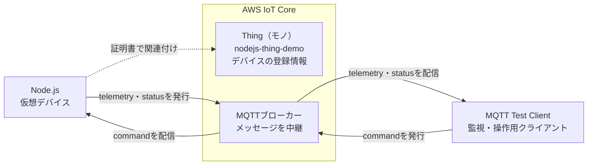
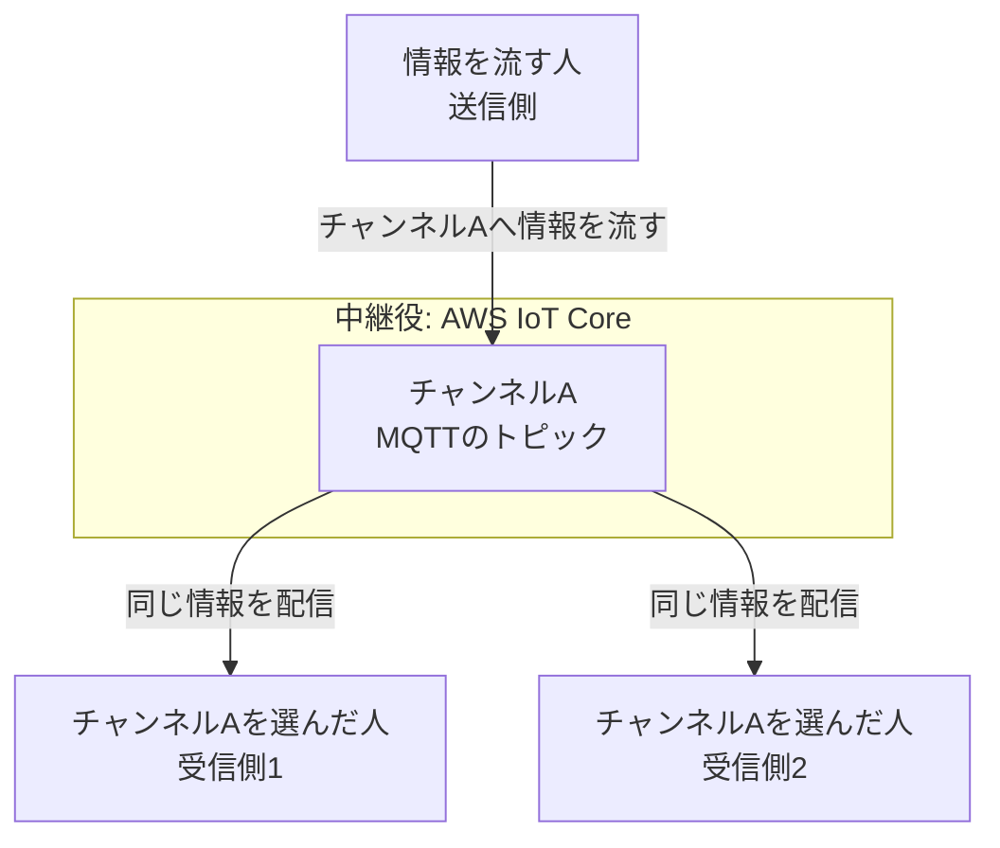
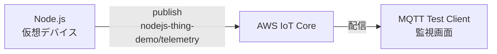
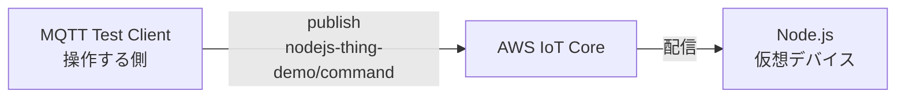
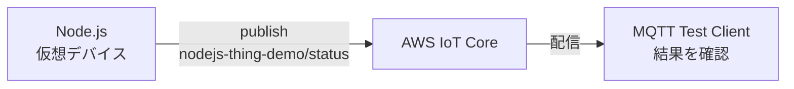
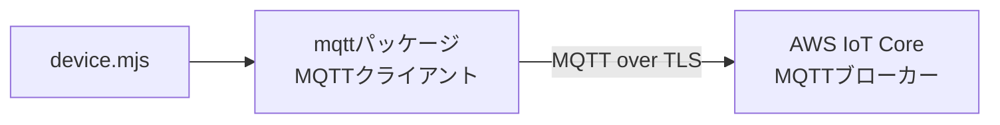

こんにちは。人材育成室 育成メンバーチームで研修中の はすと です。

社内で「AWS IoT Coreを勉強したい」とつぶやいたところ、濱田孝治（ハマコー）さんが書いたこちらの記事を紹介してもらいました。

@[card](https://dev.classmethod.jp/articles/mqtt-client-mqttx/)

この記事では、PCにMQTTクライアントであるMQTTXを導入し、AWS IoT Coreとの双方向通信を試しています。

私も記事を読むだけでなく、実際に手元で動かし、学んだ内容を記事として残したいと考えました。ただ、同じ手順をそのままなぞるのではつまらないので、自分が普段から使い慣れているNode.jsを使って試してみることにしました。

今回は、Node.jsのプロセスを「仮想デバイス」としてAWS IoT Coreへ接続してみます。物理デバイスを用意しなくても、手元のPCでスクリプトを動かすだけで、MQTTメッセージがAWS IoT Coreを介して送受信される様子を確認できます。

Node.jsでは「稼働時間とメモリ使用量」を送信し、AWS IoT CoreのMQTT Test Clientからは`restart`コマンドを送ります。`restart`は受信確認だけで、プロセスを実際に再起動しないデモです。ソフトウェアエンジニアが使い慣れているNode.jsから、AWS IoT Coreへ触れる入口になればと思います。

## 今回の構成

役割を分けると、AWS IoT Coreが何をしているかを捉えやすくなります。



点線はメッセージの流れではなく、Node.js用の証明書とThingの関連付けを表しています。

- **Thing（モノ）**: AWS IoT Coreに登録するデバイスの名前や属性です。物理機器そのものではなく、今回はNode.jsプロセスの登録先として使います。
- **Node.js**: MQTTで接続するデバイス側です。テレメトリを発行し、コマンドを購読します。
- **AWS IoT Core**: MQTTメッセージを必要な購読者へ配信し、証明書とIoTポリシーで接続を認可します。
- **MQTT Test Client**: コンソール上の確認・操作用クライアントです。本番デバイスの代わりではなく、メッセージを観察したりコマンドを発行したりするために使います。

このため、コンソール内だけでpublish/subscribeするよりも、Node.jsという別の接続者を置くと「IoT Coreを経由して届いた」ことを確認できます。

## モノを登録する

AWS IoT Coreの「接続」→「1 個のデバイスを接続」を開きます。画面の手順に沿って、Node.jsを接続するためのリソースを準備します。

### ステップ1: デバイスを準備する

画面の内容を確認し、「次へ」を選択します。


### ステップ2: モノを登録する

「新しいモノを作成」を選択し、モノの名前に`nodejs-thing-demo`を入力します。


### ステップ3: プラットフォームとSDKを選択する

デバイスプラットフォームは「Linux / macOS」、AWS IoTデバイスSDKは「Node.js」を選択します。


### ステップ4: 接続キットをダウンロードする

この手順では、AWS上にモノとポリシーが作成されます。証明書、秘密鍵、サンプルスクリプトなどを含む接続キットの内容を確認します。その後、「接続キットをダウンロード」を選択します。


証明書の秘密鍵は再取得できません。ダウンロードした接続キットは、安全な場所に保管します。

### ステップ5: 接続キットのサンプルは実行しない

ステップ5では、AWSが生成した`start.sh`を実行し、`sdk/test/js`トピックへの送信を確認できます。今回は自作の`device.mjs`と別のトピックを使うため、`start.sh`は実行せず、「続行」を選択します。

## 今回使うトピックとポリシー

トピックは、MQTTメッセージの配送先を表す名前です。

ラジオに例えると、トピックはチャンネルに当たります。送信側は、相手を直接指定せずにチャンネルへ情報を流します。受信側は、受け取りたいチャンネルを選んで待ちます。AWS IoT Coreは中継役となり、そのチャンネルを選んでいるクライアントへメッセージを配信します。



この例では、情報を流す操作が`publish`です。チャンネルを選んで待つ操作が`subscribe`です。同じチャンネルを選んだ複数の受信者へ、同じ情報が届きます。

REST APIのパスにも少し似ています。ただし、APIのように処理を直接呼び出すものではありません。トピックへメッセージを発行する操作を`publish`、トピックを購読する操作を`subscribe`と呼びます。

トピックはデバイス名を含めて、次の3つに分けました。

| トピック | 向き | 内容 |
| --- | --- | --- |
| `nodejs-thing-demo/telemetry` | Node.js → AWS IoT Core | 稼働時間とメモリ使用量 |
| `nodejs-thing-demo/command` | Test Client → Node.js | `restart`コマンド |
| `nodejs-thing-demo/status` | Node.js → AWS IoT Core | コマンドの受信結果 |

それぞれのトピックには、役割があります。

### telemetry: デバイスの状態を送る

Node.jsが自分の状態を知らせるためのトピックです。今回は10秒ごとに`runningTimeSeconds`（プロセスの稼働時間）と`memoryUsageBytes`（メモリ使用量）を送ります。実機なら温度、位置、バッテリー残量などを送る場所です。



### command: デバイスへ指示を送る

操作する側がデバイスへ指示を送るためのトピックです。今回はMQTT Test Clientから`{ "action": "restart" }`を送ります。`restart`は、Node.jsプロセスの再起動を依頼する指示です。ただし、今回は実際の再起動処理を実装せず、受信確認だけを行います。Node.jsはこのトピックを購読しているため、AWS IoT Coreを介して指示を受け取れます。



### status: 指示の結果を返す

デバイスが指示を受けた結果を返すためのトピックです。今回は`restart`を受信すると、`restart-requested`を返します。これは再起動の要求を受信したことを示す状態であり、再起動が完了したという意味ではありません。指示を送っただけで終わらせず、デバイスがどう受け取ったかを確認する用途です。



### IoTポリシーを編集する

接続キットと一緒に自動作成された`nodejs-thing-demo-Policy`は、SDKサンプル用のトピックだけを許可しています。今回は別のトピックを使うため、既存ポリシーの内容を変更します。

AWS IoT Coreの画面左にあるナビゲーションで、「管理」の中にある「セキュリティ」を展開し、「ポリシー」を選択します。「AWS IoT ポリシー」の一覧が表示されたら、`nodejs-thing-demo-Policy`を選択します。


ポリシーの詳細画面が開いたら、右上の「アクティブなバージョンを編集」を選択します。
※ 私の環境では事前に動作検証を行ったため、ポリシーがすでに編集済みの状態になっています。


編集画面の「ポリシードキュメント」で、右上の「JSON」を選択します。


表示されたJSONを、以下の内容へ置き換えます。これは証明書ではなく、許可する操作を定めるポリシードキュメントです。`<ACCOUNT_ID>`は自分のAWSアカウントIDへ置き換えます。

:::details リージョンとAWSアカウントIDの確認
この記事では、東京リージョン（`ap-northeast-1`）を使用します。別のリージョンを使う場合は、ポリシー内の`ap-northeast-1`を使用するリージョンへ置き換えてください。

`<ACCOUNT_ID>`には、AWSマネジメントコンソール右上のアカウントメニューで確認できる12桁のAWSアカウントIDを指定します。

[AWS公式ドキュメント](https://docs.aws.amazon.com/iot/latest/developerguide/iot-policies.html)によると、ポリシーの変更が反映されるまで6〜8分かかる場合があります。保存直後に接続できない場合は、少し待ってから再度実行してください。
:::

```json
{
  "Version": "2012-10-17",
  "Statement": [
    {
      "Effect": "Allow",
      "Action": "iot:Connect",
      "Resource": "arn:aws:iot:ap-northeast-1:<ACCOUNT_ID>:client/nodejs-thing-demo"
    },
    {
      "Effect": "Allow",
      "Action": "iot:Publish",
      "Resource": [
        "arn:aws:iot:ap-northeast-1:<ACCOUNT_ID>:topic/nodejs-thing-demo/telemetry",
        "arn:aws:iot:ap-northeast-1:<ACCOUNT_ID>:topic/nodejs-thing-demo/status"
      ]
    },
    {
      "Effect": "Allow",
      "Action": "iot:Subscribe",
      "Resource": "arn:aws:iot:ap-northeast-1:<ACCOUNT_ID>:topicfilter/nodejs-thing-demo/command"
    },
    {
      "Effect": "Allow",
      "Action": "iot:Receive",
      "Resource": "arn:aws:iot:ap-northeast-1:<ACCOUNT_ID>:topic/nodejs-thing-demo/command"
    }
  ]
}
```

JSONを入力したら、画面下部の「編集したバージョンをこのポリシーのアクティブバージョンとして設定します」にチェックを入れます。最後に、「新しいバージョンとして保存」を選択します。


既に証明書へ関連付けられているポリシーを編集するため、関連付けのやり直しは不要です。

`iot:Subscribe`は`topicfilter`、実際に届くメッセージの`iot:Receive`は`topic`を指定する点に注意します。IoTポリシーのアクションごとに指定するARNが異なります。

## Node.jsを仮想デバイスとして動かす

### MQTTとmqttパッケージの役割

MQTTは、機器同士でメッセージを送受信するための通信規約です。先ほど説明した`publish`と`subscribe`を使って通信します。

今回使う[`mqtt`](https://github.com/mqttjs/MQTT.js)は、Node.jsからMQTTを利用するためのクライアントライブラリで、AWS IoT Coreへの接続、`publish`、`subscribe`を行います。

:::details HTTPとの違いとmqttパッケージの役割
HTTPでは、基本的にクライアントがリクエストを送り、サーバーがレスポンスを返します。MQTTでは接続を維持し、購読中のトピックにメッセージが届くと、AWS IoT Coreからクライアントへ配信されます。

`mqtt`はAWSのサービスではありません。Node.jsのコードとAWS IoT Coreの間で、MQTTによる通信を担当します。


:::

検証時はNode.js v24.19.0と、`mqtt` v5.15.2を使用しました。

作業用のディレクトリを作り、MQTTクライアントライブラリを追加します。

```bash
mkdir aws-iot-nodejs-device
cd aws-iot-nodejs-device
pnpm init
pnpm add mqtt@5.15.2 --save-exact
```

次に、ダウンロードした接続キットを`certs`ディレクトリへ展開し、ルートCA証明書を取得します。ダウンロード時のファイル名が異なる場合は、コマンド内のZIPファイル名を読み替えてください。

```bash
mkdir -p certs
unzip ~/Downloads/connect_device_package.zip -d certs
curl -o certs/AmazonRootCA1.pem https://www.amazontrust.com/repository/AmazonRootCA1.pem
```

展開後、`certs`ディレクトリに証明書と秘密鍵があることを確認します。ファイル名が後述する`.env`の指定と異なる場合は、実際のファイル名に読み替えてください。

`curl`はURLからファイルを取得するコマンドです。ここでは[AWS公式手順](https://docs.aws.amazon.com/iot/latest/developerguide/iot-dc-prepare-device-test.html)と同様に、AWS IoT Coreのサーバー証明書を確認するためのルートCA証明書を取得しています。

:::details AmazonRootCA1.pemが必要な理由
`AmazonRootCA1.pem`は、接続先が正しいAWS IoT CoreであることをNode.js側で確認するためのルートCA証明書です。
:::

### コンソールで接続先を確認する

AWS IoT Coreへ接続するには、AWSアカウントとリージョンごとのデータエンドポイントが必要です。AWS IoT Coreの「接続」→「ドメイン設定」を開き、`iot:Data-ATS`行の「ドメイン名」をコピーします。


エンドポイントは次のようなホスト名です。

```text
xxxxxxxxxxxxxx-ats.iot.ap-northeast-1.amazonaws.com
```

:::details AWS CLIで確認する場合
コンソールを使わない場合は、次のコマンドでも確認できます。

```bash
aws iot describe-endpoint \
  --endpoint-type iot:Data-ATS \
  --query endpointAddress \
  --output text
```

複数のAWS CLIプロファイルを使っている場合は、`aws`の直後に`--profile <PROFILE_NAME>`を追加します。
:::

メッセージの送受信では、Node.jsが`mqtt`パッケージを通じて、このエンドポイントへ直接接続します。

### 接続情報を環境変数へ設定する

接続先や証明書のパスは実行環境ごとに異なるため、コードから切り離して環境変数で渡します。

```dotenv
AWS_IOT_ENDPOINT=xxxxxxxxxxxxxx-ats.iot.ap-northeast-1.amazonaws.com
AWS_IOT_CLIENT_ID=nodejs-thing-demo
AWS_IOT_CERT_PATH=./certs/nodejs-thing-demo.cert.pem
AWS_IOT_PRIVATE_KEY_PATH=./certs/nodejs-thing-demo.private.key
AWS_IOT_CA_PATH=./certs/AmazonRootCA1.pem
```

:::details 各環境変数とmTLSの役割
各環境変数には、次の役割があります。

| 環境変数 | 役割 |
| --- | --- |
| `AWS_IOT_ENDPOINT` | コンソールで確認したAWS IoT Coreの接続先 |
| `AWS_IOT_CLIENT_ID` | MQTT接続を識別する名前。IoTポリシーの`client`と一致させる |
| `AWS_IOT_CERT_PATH` | AWS IoT Coreへデバイスの身元を示す証明書の保存場所 |
| `AWS_IOT_PRIVATE_KEY_PATH` | 証明書の所有者であることを示す秘密鍵の保存場所 |
| `AWS_IOT_CA_PATH` | 接続先が正しいAWS IoT Coreであることを確認するCA証明書の保存場所 |

証明書と秘密鍵を使うことで、Node.jsとAWS IoT Coreは相互に接続相手を確認します。この仕組みを相互TLS認証（mTLS）と呼びます。
:::

この内容をプロジェクト直下の`.env`へ保存します。Node.jsの`--env-file`オプションを使うと、`.env`の値を`process.env`から参照できます。

### 接続コード

以下をプロジェクト直下の`device.mjs`へ保存します。mTLSで接続し、接続後に10秒ごとのテレメトリ送信を開始します。`restart`を受けたときは、実際の処理は行わず、受信したことだけを`status`トピックへ返します。

```js
import { readFileSync } from "node:fs";
import process from "node:process";
import mqtt from "mqtt";

const requiredEnvironmentVariables = [
  "AWS_IOT_ENDPOINT",
  "AWS_IOT_CLIENT_ID",
  "AWS_IOT_CERT_PATH",
  "AWS_IOT_PRIVATE_KEY_PATH",
  "AWS_IOT_CA_PATH",
];

for (const name of requiredEnvironmentVariables) {
  if (!process.env[name]) {
    throw new Error(`${name} を設定してください`);
  }
}

const thingName = "nodejs-thing-demo";
const clientId = process.env.AWS_IOT_CLIENT_ID;
const topics = {
  command: `${thingName}/command`,
  status: `${thingName}/status`,
  telemetry: `${thingName}/telemetry`,
};

const client = mqtt.connect({
  host: process.env.AWS_IOT_ENDPOINT,
  port: 8883,
  protocol: "mqtts",
  protocolVersion: 4,
  clientId,
  cert: readFileSync(process.env.AWS_IOT_CERT_PATH),
  key: readFileSync(process.env.AWS_IOT_PRIVATE_KEY_PATH),
  ca: readFileSync(process.env.AWS_IOT_CA_PATH),
  reconnectPeriod: 1_000,
});

function publish(topic, body) {
  client.publish(topic, JSON.stringify({ ...body, sentAt: new Date().toISOString() }), {
    qos: 0,
  });
}

function publishTelemetry() {
  publish(topics.telemetry, {
    runningTimeSeconds: Math.floor(process.uptime()),
    memoryUsageBytes: process.memoryUsage().rss,
  });
}

let telemetryTimer;

client.on("connect", () => {
  console.log(`connected: clientId=${clientId}`);

  client.subscribe(topics.command, (error) => {
    if (error) {
      console.error("failed to subscribe:", error);
      return;
    }

    console.log(`subscribed: ${topics.command}`);
    publish(topics.status, { state: "online" });
    publishTelemetry();

    if (!telemetryTimer) {
      telemetryTimer = setInterval(publishTelemetry, 10_000);
    }
  });
});

client.on("message", (topic, payload) => {
  const command = JSON.parse(payload.toString());
  console.log(`received: ${topic}`, command);

  if (command.action === "restart") {
    publish(topics.status, {
      state: "restart-requested",
      note: "demo only: process is not restarted",
    });
    return;
  }

  publish(topics.status, {
    state: "rejected",
    reason: "unsupported command",
  });
});

client.on("error", (error) => {
  console.error("mqtt error:", error);
});

client.on("close", () => {
  if (telemetryTimer) {
    clearInterval(telemetryTimer);
    telemetryTimer = undefined;
  }
});

function shutdown() {
  if (telemetryTimer) {
    clearInterval(telemetryTimer);
    telemetryTimer = undefined;
  }

  client.end();
}

process.on("SIGINT", shutdown);
process.on("SIGTERM", shutdown);
```

同じコードは、検証用リポジトリ[HasutoSasaki/aws-iot-nodejs-device](https://github.com/HasutoSasaki/aws-iot-nodejs-device)にも置いています。

## MQTT Test Clientで受信する

AWS IoT Coreの「MQTT テストクライアント」を開きます。「トピックをサブスクライブする」タブのトピックのフィルターに`nodejs-thing-demo/#`を入力します。その後、「サブスクライブ」を選択します。

末尾の`#`は、`nodejs-thing-demo/`から始まるすべてのトピックを受信するためのワイルドカードです。これにより、`telemetry`、`command`、`status`を1回の操作で確認できます。


MQTT Test Clientを開いたまま、別のターミナルでプロジェクトのルートからNode.jsを起動します。

```bash
node --env-file=.env device.mjs
```

接続と購読に成功すると、ターミナルに次のログが表示されます。

```text
connected: clientId=nodejs-thing-demo
subscribed: nodejs-thing-demo/command
```

:::details connectedが表示されない場合
証明書が有効であること、`.env`のエンドポイントと証明書パスが正しいこと、アクティブなIoTポリシーで`client/nodejs-thing-demo`への接続と各トピックへの操作が許可されていることを確認します。
:::

起動すると、`telemetry`トピックに10秒ごとのメッセージが届きました。`runningTimeSeconds`が増えているため、同じNode.jsプロセスから継続して送られていることが分かります。


次に、「トピックに公開する」タブを開きます。トピック名に`nodejs-thing-demo/command`、メッセージペイロードに次のJSONを入力し、「発行」を選択します。

```json
{ "action": "restart" }
```


受信画面には、発行した`command`と、Node.jsが返した`status`が続けて表示されました。`restart-requested`は実装上の受信確認であり、プロセスの再起動はしていません。


## 検証結果

今回の検証では、次の流れを実際に確認できました。

- Node.jsが証明書を使ってAWS IoT Coreへ接続できること
- Node.jsから送信したテレメトリをMQTT Test Clientで受信できること
- `runningTimeSeconds`が10秒ずつ増え、継続して送信されること
- MQTT Test Clientから送信した`restart`をNode.jsが受信できること
- Node.jsが受信結果として`restart-requested`を返せること

Node.jsを仮想デバイスとして動かし、物理デバイスを用意せずにAWS IoT Coreを介したメッセージ送受信を確認できました。

## まとめ

AWS IoT Coreに触れる前は、IoTの検証には専用のハードウェアが必要だと思い、始めるまでのハードルが高いと感じていました。しかし、使い慣れたNode.jsを仮想デバイスにすれば、物理デバイスを用意せずにAWS IoT Coreを介したメッセージ送受信と、メッセージが中継される流れを確認できます。ソフトウェアエンジニアにとって取り組みやすい入門方法だと感じました。

今回はオンライン中のメッセージ送受信だけを扱いました。デバイスがオフラインの間に「設定してほしい状態」を残すために、次はDevice Shadowを試してみたいと思います。

## 参考

- [AWS IoT Core MQTT テストクライアント](https://docs.aws.amazon.com/iot/latest/developerguide/view-mqtt-messages.html)
- [AWS IoT Core のMQTTトピック](https://docs.aws.amazon.com/iot/latest/developerguide/topics.html)
- [AWS IoTポリシーによるpublish/subscribeの制御](https://docs.aws.amazon.com/iot/latest/developerguide/pub-sub-policy.html)
- [AWS IoTポリシーアクション](https://docs.aws.amazon.com/iot/latest/developerguide/iot-policy-actions.html)
- [AWS IoT Device SDK](https://docs.aws.amazon.com/iot/latest/developerguide/iot-sdks.html)
