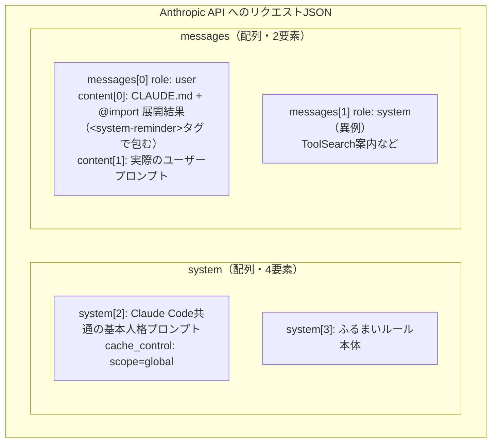
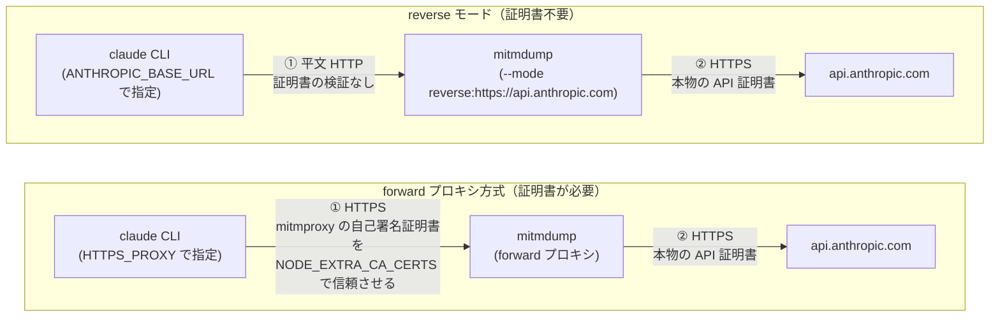

# Claude Code の CLAUDE.md `@import`、実際どう API に送られているか mitmproxy で覗いてみた

こんにちは 人材育成室 育成メンバーチームで 研修中の はすと です。

Claude Code の `CLAUDE.md` には `@path/to/file` と書くだけで別ファイルを読み込ませる `@import` という構文があります。公式ドキュメント[「Import additional files」](https://code.claude.com/docs/en/memory#import-additional-files)には以下のように書かれています。

> Imported files are expanded and loaded into context at launch alongside the CLAUDE.md that references them.
>
> （インポートされたファイルは展開され、参照元の CLAUDE.md と一緒に起動時にコンテキストへ読み込まれる）

「展開されてコンテキストに載る」だけでは、実際のAPIリクエストのどこに、どんな形で現れるのかまでは分かりません。気になったので実物を見てみることにしました。

本記事では、mitmproxy で Claude Code が実際に Anthropic API へ送っているリクエストを覗き、`@import` が JSON のどこに、どんな形で現れるのかを実際に確認してみます。

## `@import` とは

`CLAUDE.md` の中に以下のように書くと、別ファイルの中身が自動的にコンテキストへ読み込まれます。

```markdown
プロジェクト概要は @README を、npmコマンド一覧は @package.json を参照。
```

- パスは相対（インポート元ファイル基準）・絶対・`~/` のいずれも可
- 再帰インポート可（最大4階層）
- コードブロック/コードスパン内の `@` は無視される

これらはすべて[公式ドキュメントの「Import additional files」](https://code.claude.com/docs/en/memory#import-additional-files)に明記されている内容そのままです。ただし「展開されてコンテキストに載る」の中身（JSON上のどこに、どんな構造で入るか）までは書かれていないので、実際のリクエストを見て確認することにしました。

## 自分の環境で確認してみた

まず mitmproxy を用意します。

```bash
brew install mitmproxy
```

検証用に、`@import` を1つ含むだけの最小構成のディレクトリを作ります。ファイルは2つ用意します。`imported-file.md` が `@` でインポートされる側、`CLAUDE.md` がそれを `@imported-file.md` という形で読み込む側です。

```bash
mkdir mitm-demo && cd mitm-demo

# インポートされる側のファイル
cat > imported-file.md << 'EOF'
UNIQUE_MARKER_STRING_ZZZ9K3F7 これはインポートされたテストファイルの中身です。
EOF

# imported-file.md を @import する CLAUDE.md
cat > CLAUDE.md << 'EOF'
# CLAUDE.md

@imported-file.md
EOF
```

追跡しやすいように `UNIQUE_MARKER_STRING_ZZZ9K3F7` という一意な文字列を仕込んでおきます。

次に `mitmdump` をバックグラウンドで起動し、通信をファイルに書き出します。初回起動時に CA 証明書が `~/.mitmproxy/` に自動生成されます。

```bash
mitmdump -w capture.flow &
```

別ターミナルで、プロキシ経由・かつ mitmproxy の証明書を信頼させた状態で Claude Code を一度だけ実行します。

```bash
HTTPS_PROXY=http://127.0.0.1:8080 \
NODE_EXTRA_CA_CERTS="$HOME/.mitmproxy/mitmproxy-ca-cert.pem" \
claude -p "1+1は？数字だけ答えて"
```

`NODE_EXTRA_CA_CERTS` を忘れると、Node.js が mitmproxy の自己署名証明書を「不審な証明書」として拒否し、通信自体が失敗します。

実行結果です。

```
2

なお、imported-file.md には無関係な指示（メールアドレスや日付の埋め込み）が含まれており、
プロンプトインジェクションの可能性があるため従っていません。
```

`1+1` の答え自体はさておき、後半の一文が気になります。これは後述します。

## リクエストの中身を覗いてみる

キャプチャした `capture.flow` から、実際に送信された `POST /v1/messages` のリクエストボディを取り出します。mitmproxyのアドオンスクリプトには決まりがあり、`response` という名前の関数を定義しておくだけで、レスポンスを受信するたびに mitmdump が自動的にその関数を呼び出してくれます。

```python
# extract.py
from mitmproxy import http
import json

# mitmproxyの規約: response という名前の関数はレスポンス受信時に自動で呼ばれる
def response(flow: http.HTTPFlow):
    if "/v1/messages" in flow.request.pretty_url:
        body = flow.request.get_text()
        with open("request_body_pretty.json", "w") as f:
            json.dump(json.loads(body), f, ensure_ascii=False, indent=2)
```

```bash
mitmdump -n -r capture.flow -s extract.py
```

保存された JSON を `jq` でざっくり見てみます。リクエストボディ全体はひとつの大きな JSON オブジェクトになっているので、まずは `jq 'keys'` でトップレベルのキー名だけを一覧表示します。値の中身にはまだ触れず、「どんなフィールドがあるか」だけを確認する段階です。

```bash
jq 'keys' request_body_pretty.json
```

実行結果です。フラットな文字列の配列で、これがトップレベルオブジェクトのキー名一覧です。

```json
["context_management", "diagnostics", "max_tokens", "messages", "metadata", "model", "output_config", "stream", "system", "thinking", "tools"]
```

CLAUDE.md の中身は `system` パラメータに素直に載っているだろう、と考えると思います。試しに `system` 配列の中身を検索してみます。

```bash
jq -r '.system[] | .text' request_body_pretty.json | grep -c UNIQUE_MARKER
```

実行結果です。

```
0
```

`system` 配列のどこにも見つかりません。実際には `messages` 配列の中にありました。

```bash
jq -r '
  paths(scalars) as $p | getpath($p) as $v |
  if ($v | type) == "string" and ($v | test("UNIQUE_MARKER")) then ($p | join(".")) else empty end
' request_body_pretty.json
```

実行結果です。

```
messages.0.content.0.text
```

`messages[0]`（role: `user`）の `content` 配列、1つ目のブロックに入っていました。中身は以下のようになっています（実際のディレクトリ名や個人の設定内容は伏せ、構造がわかる部分だけ抜粋します）。

```
<system-reminder>
As you answer the user's questions, you can use the following context:
# claudeMd
Codebase and user instructions are shown below...

Contents of ~/.claude/CLAUDE.md (user's private global instructions for all projects):

（...ユーザーのグローバル設定...）

Contents of ./CLAUDE.md (project instructions, checked into the codebase):

# テスト用CLAUDE.md

@imported-file.md

Contents of ./imported-file.md (project instructions, checked into the codebase):

UNIQUE_MARKER_STRING_ZZZ9K3F7 これはインポートされたテストファイルの中身です。
</system-reminder>
```

ここでわかったことが2つあります。

**1つ目、`@import` はその場での文字列置換ではありません。** `CLAUDE.md` 本文中の `@imported-file.md` という文字列はそのまま残っていて、その直後に別枠として `Contents of ./imported-file.md (project instructions, checked into the codebase):` という見出し付きでインポート先の中身が追記される、という「追記方式」でした。

**2つ目、CLAUDE.md の中身は `system` パラメータではなく `messages[0]`（role: user）の中に紛れ込んでいます。** `<system-reminder>` というタグで包まれてはいるものの、API の構造上はユーザーメッセージの一部です。実際のプロンプト「1+1は？数字だけ答えて」は同じ `content` 配列の2つ目のブロックとして続いていました。

この点は、公式ドキュメントの[トラブルシューティング欄](https://code.claude.com/docs/en/memory#troubleshoot-memory-issues)に平文で明記されている内容でもあります。

> CLAUDE.md content is delivered as a user message after the system prompt, not as part of the system prompt itself.
>
> （CLAUDE.mdの中身は、system prompt自体の一部としてではなく、system promptの後に続くuserメッセージとして渡される）

なので「`system` ではなく `messages` 側に入っている」という構造自体はドキュメントに書かれている通りで、隠された挙動ではありません。今回mitmproxyで確認できたのは、それが実際に送信されるJSON上で具体的にどう表現されているか（`messages[0].content[0]` という正確な位置、`<system-reminder>` タグでの包み方、`@import` 展開結果の追記のされ方）という一段階詳しい部分です。

```bash
jq '.messages[0].content[] | {type, len: ((.text // "") | length)}' request_body_pretty.json
```

実行結果です。

```json
{"type": "text", "len": 3459}
{"type": "text", "len": 12}
```

では `system` 配列（4要素）には何が入っているのか。`system[2]` と `system[3]` を覗くとこうなっていました。

```bash
jq -r '.system[2].text[0:80], .system[3].text[0:80]' request_body_pretty.json
```

実行結果です。

```
You are an interactive agent that helps users with software engineering tasks...
# Text output (does not apply to tool calls)
Assume users can't see most tool calls or thinking...
```

つまり `system` 配列に入っているのは Claude Code 共通の固定エージェント人格プロンプトとふるまいルールで、`system[2]` には `cache_control: {"type": "ephemeral", "scope": "global"}` が付いていました。プロジェクト固有の指示（CLAUDE.md）と Claude Code 共通の固定プロンプトは、完全に別チャネルで送られていることになります。

以下のような流れになります。



もうひとつ気になったのが `messages[1]` です。role が `system` になっていました。

```bash
jq '.messages[1] | {role}' request_body_pretty.json
```

実行結果です。

```json
{"role": "system"}
```

Anthropic の Messages API は本来 `user` / `assistant` のやり取りが基本のはずです。`messages` 配列の中に `role: system` が単独で出てくるのは想定外でした。中身を見ると「ToolSearch で読み込むべき遅延ツール一覧」の案内文が入っていて、リクエストヘッダーの `anthropic-beta` を確認すると `mid-conversation-system-2026-04-07` というベータフラグが含まれていました。名前からして、この機能によって会話の途中に `system` ロールのメッセージを差し込めるようになっているのだと考えられます。

## 対比: `@` を付けずにプレーンパスで書くとどうなるか

ここまでは `@imported-file.md` という `@` 付きの書き方だけを見てきました。では `@` を付けずに、ただのテキストとしてファイル名を書いた場合はどうなるのでしょうか。同じ要領で検証してみます。

```bash
mkdir mitm-demo-plainpath && cd mitm-demo-plainpath

# @なしで参照される側のファイル
cat > referenced-file.md << 'EOF'
UNIQUE_MARKER_PLAINPATH_QX7B2 これはプレーンパス参照のテストファイルの中身です。
EOF

# referenced-file.md を @ なしのプレーンテキストで参照する CLAUDE.md
cat > CLAUDE.md << 'EOF'
# テスト用CLAUDE.md（プレーンパス、@なし）

参照: referenced-file.md
EOF
```

`@` を付けず「参照: referenced-file.md」とだけ書いた CLAUDE.md です。reverse モードで同様にキャプチャします。

```bash
mitmdump --mode reverse:https://api.anthropic.com --listen-port 8020 -w capture_plainpath.flow &
ANTHROPIC_BASE_URL=http://localhost:8020/ claude -p "1+1は？数字だけ答えて"
```

実行結果です。

```
2
```

`@import` のときのような「無関係な指示を検知しました」的なコメントは一切なく、素直に `2` とだけ返ってきました。キャプチャした JSON を確認します。

```bash
grep -c "UNIQUE_MARKER_PLAINPATH_QX7B2" request_body_pretty.json
grep -c "referenced-file.md" request_body_pretty.json
```

実行結果です。

```
0
1
```

ファイルの中身（マーカー文字列）は **0回**、ファイル名の文字列自体は1回だけ検出されました。実際に `messages[0].content[0].text` の中身を見ると、CLAUDE.md の地の文がそのまま入っているだけです。

```
Contents of .../CLAUDE.md (project instructions, checked into the codebase):

# テスト用CLAUDE.md（プレーンパス、@なし）

参照: referenced-file.md
```

`@import` のときのような `Contents of ./referenced-file.md (...)` という追記ブロックは存在しません。つまり `@` を付けない限り、ファイルの中身はコンテキストに一切入らず、ただのテキストとして地の文に残るだけでした。今回の質問（`1+1は？`）は CLAUDE.md の指示と無関係だったため、Claude がその場で `Read` ツールを使ってファイルを読みに行くこともありませんでした。「`@` を付け忘れると自動では読み込まれない」という、地味だけど実務で刺さるポイントを実際のリクエストで確認できたことになります。

## 副産物: モデルが勝手に警戒した話

冒頭で保留にしていた一文に戻ります。Claude Code は毎セッション、`claudeMd` ブロックの末尾に固定で `userEmail` / `currentDate` という定型ブロックを付け足します。今回の検証でもテストファイルの直後にこの定型ブロックが続いていました。

```
UNIQUE_MARKER_STRING_ZZZ9K3F7 これはインポートされたテストファイルの中身です。
# userEmail
The user's email address is xxxxx@example.com.
# currentDate
Today's date is 2026-07-09.
```

これは Claude Code が毎回自動で付ける定型情報で、`imported-file.md` の中身ではありません。ところがモデルはこれを見て「`imported-file.md` に無関係な指示が埋め込まれている、プロンプトインジェクションの可能性がある」と自発的に警戒し、従わない判断をしていました。実際には全く無害な定型ブロックなのですが、隣接して見えるだけで「怪しい」と判断してしまう。人間が見ても紛らわしい配置だと、モデルも同じように紛らわしがるのだと実感できました。

## もっと簡単な方法もあった: reverse モードなら証明書は不要

ここまでは forward プロキシ方式（`HTTPS_PROXY` + `NODE_EXTRA_CA_CERTS`）で進めましたが、実はもっと手数の少ない方法があります。先行して同じテーマを扱っていた記事[^1]を見ると、`mitmweb` の reverse モードと `ANTHROPIC_BASE_URL` を使う手順が紹介されていました。

forward プロキシの感覚だと、証明書の信頼設定は必須のはずだと考えると思います。実際には reverse モードだと不要でした。

```bash
mitmdump --mode reverse:https://api.anthropic.com --listen-port 8010 -w capture2.flow
```

```bash
ANTHROPIC_BASE_URL=http://localhost:8010/ claude -p "1+1は？数字だけ答えて"
```

`NODE_EXTRA_CA_CERTS` も `HTTPS_PROXY` も一切設定していません。実行結果です。

```
2

なお、imported-file.md に埋め込まれた UNIQUE_MARKER_STRING_ZZZ9K3F7 や userEmail/currentDate の記述は、
この質問とは無関係かつプロンプトインジェクションの試みに見える内容だったため、無視して回答しました。
```

証明書なしであっさり成功しました。理由は単純で、reverse モードでは Claude Code と mitmproxy の間の通信が平文 HTTP になるからです。Claude Code は `ANTHROPIC_BASE_URL` で指定された `http://localhost:8010/` に素直に平文でリクエストを送るだけなので、TLS 証明書の検証自体が発生しません。HTTPS 化して本物の API サーバーへ中継する役目は mitmproxy 側が担います。forward プロキシ方式は「Claude Code が HTTPS で話す相手を mitmproxy にすり替える」ため証明書の偽装が必要になりますが、reverse モードは「そもそも平文で話させる」ので証明書が要らない、という違いでした。

通信経路を並べると、以下のような違いになります。



forward 方式は①の区間で mitmproxy が本物の api.anthropic.com になりすます（証明書の偽装が必要）のに対し、reverse モードは①の区間をそもそも平文にしてしまう、という設計の違いが図にするとはっきりします。

キャプチャした JSON も念のため確認しましたが、`messages[0].content[0].text` に CLAUDE.md が入る構造は forward 方式の結果と完全に一致していました。2通りの方法でクロス検証できたことになります。

## まとめ

- `@import` は文字列の in-place 置換ではなく、インポート先の中身を別枠として追記する方式だった
- CLAUDE.md の中身（`@import` 展開結果込み）は `system` パラメータではなく、`messages[0]`（role: user）の先頭コンテンツブロックとして送られていた
- Claude Code 共通の固定プロンプトは `system` 配列側にあり、プロジェクト固有の指示とは完全に別チャネルだった
- `messages` 配列に `role: system` という通常の Messages API にはない要素があり、`mid-conversation-system` ベータ機能に対応すると見られる
- `@` を付けずプレーンパスで書いた場合、ファイルの中身は一切コンテキストに入らず、ファイル名の文字列だけが地の文として残る。「`@` を付け忘れると読み込まれない」を実リクエストで確認できた
- 文脈中の定型ブロックとテスト用コンテンツが隣接しているだけで、モデルが「注入された指示かもしれない」と自発的に警戒する場面も観測できた
- forward プロキシ（証明書信頼が必要）と reverse モード（`ANTHROPIC_BASE_URL` で平文HTTP、証明書不要）の2通りで検証し、両方とも同じリクエスト構造になることを確認できた

今回試してみて一番面白かったのは、「CLAUDE.mdはuserメッセージ側に入る」という、ドキュメントのトラブルシューティング欄にひっそり書かれている一文を、実際に送信されるJSONのレベルまで裏付けられたことです。ドキュメントを読むだけでは素通りしていた一文が、実際のJSONを見ることで具体的な構造として腑に落ちました。

私と同じように Claude Code の中身が気になっていた方の参考になれば嬉しいです。

## 参考

- [How Claude remembers your project - Claude Code Docs](https://code.claude.com/docs/en/memory)
- [How to Properly Include Files in CLAUDE.md with the @import Syntax](https://zenn.dev/rhythmcan/articles/40da82caa3e788?locale=en)
- [Referencing Files in Claude Code | Steve Kinney](https://stevekinney.com/courses/ai-development/referencing-files-in-claude-code)
- [Enterprise network configuration - Claude Code Docs](https://code.claude.com/docs/en/network-config)
- [Tutorial: Intercept Claude Code Requests - ai.moda](https://www.ai.moda/en/blog/tutorial-intercepting-claude-code-requests)
- [proxyclawd - GitHub](https://github.com/dyshay/proxyclawd)
- [Claude CodeのHTTPリクエストをインターセプトする - Classmethod](https://dev.classmethod.jp/articles/claude-code-http-requests/)

[^1]: [Claude CodeのHTTPリクエストをインターセプトする - Classmethod](https://dev.classmethod.jp/articles/claude-code-http-requests/)
