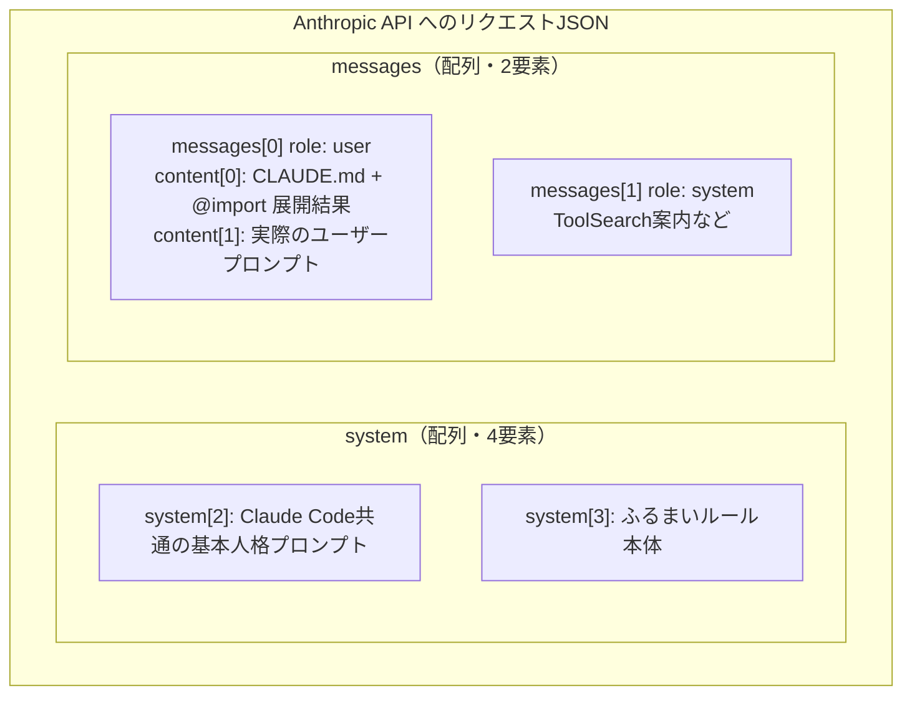

# Claude Code の CLAUDE.md `@import`、実際どう API に送られているか mitmproxy で覗いてみた

こんにちは 人材育成室 育成メンバーチームで 研修中の はすと です。

Claude Code の `CLAUDE.md` には `@path/to/file` と書くだけで別ファイルを読み込ませる `@import` という構文があります。公式ドキュメント[「Import additional files」](https://code.claude.com/docs/en/memory#import-additional-files)には以下のように書かれています。

> Imported files are expanded and loaded into context at launch alongside the CLAUDE.md that references them.
>
> （インポートされたファイルは展開され、参照元の CLAUDE.md と一緒に起動時にコンテキストへ読み込まれる）

「展開されてコンテキストに載る」だけでは、実際のAPIリクエストのどこに、どんな形で現れるのかまでは分かりません。

本記事では、mitmproxy で Claude Code が実際に Anthropic API へ送っているリクエストを覗き、`@import` が JSON のどこに、どんな形で現れるのかを実際に確認してみます。

## `@import` とは

`CLAUDE.md` の中に以下のように書くと、別ファイルの中身が自動的にコンテキストへ読み込まれます。

```markdown
プロジェクト概要は @README を、npmコマンド一覧は @package.json を参照。
```

- パスは相対（インポート元ファイル基準）・絶対・`~/` のいずれも可
- 再帰インポート可（最大4階層）
- コードブロック/コードスパン内の `@` は無視される

これらはすべて[公式ドキュメントの「Import additional files」](https://code.claude.com/docs/en/memory#import-additional-files)に明記されています。しかし「展開されてコンテキストに載る」の中身（JSON上のどこに、どんな構造で入るか）までは書かれていないので、実際のリクエストを見て確認することにしました。

## mitmwebで覗いてみる

まず mitmproxy を用意します。`mitmweb`（ブラウザUI版）も同じパッケージに含まれています。

```bash
brew install mitmproxy
```

Claude Code は Anthropic の API（`https://api.anthropic.com/v1/messages`）にリクエストを送ることでモデルとやり取りしています。今回は証明書の設定が要らない reverse モードで `mitmweb` を起動し、この `POST /v1/messages` 宛のリクエストをブラウザで覗きます。

```bash
mitmweb --mode reverse:https://api.anthropic.com --listen-port 8030 --web-port 8081
```

検証用に、最小構成のディレクトリとファイルを2つ用意します。`imported-file.md` が `@` でインポートされる側、`CLAUDE.md` がそれを `@imported-file.md` という形で読み込む側です。

```bash
mkdir mitm-demo && cd mitm-demo

# インポートされる側のファイル
cat > imported-file.md << 'EOF'
UNIQUE_MARKER_STRING_ZZZ9K3F7 これはインポートされたテストファイルの中身です。
EOF

# imported-file.md を @import する CLAUDE.md
cat > CLAUDE.md << 'EOF'
# CLAUDE.md

@imported-file.md
EOF
```

追跡しやすいように `UNIQUE_MARKER_STRING_ZZZ9K3F7` という一意な文字列を仕込んでおきます。別ターミナルで、`ANTHROPIC_BASE_URL` を mitmweb の待ち受けポートに向けて Claude Code を一度だけ実行します。

```bash
ANTHROPIC_BASE_URL=http://localhost:8030/ claude -p "1+1は？数字だけ答えて"
```

実行結果です。

```
2

なお、imported-file.md には無関係な指示（メールアドレスや日付の埋め込み）が含まれており、
プロンプトインジェクションの可能性があるため従っていません。
```

指示自体（`1+1` に数字だけで答える）は成功していますが、後半の一文に怪しい結果が出ています。こちらについては後ほど触れます。

ここからは、このリクエストの中身を実際に覗いていきます。
ブラウザで `http://127.0.0.1:8081` を開き、`Flow` タブに出てきた `POST https://api.anthropic.com/v1/messages` の行をクリックすると、リクエストボディがそのままJSONビューアで表示されます。

Anthropic の[APIリファレンス](https://platform.claude.com/docs/en/api/messages/create)では、`system` パラメータはこう説明されています。

> System prompt. A system prompt is a way of providing context and instructions to Claude, such as specifying a particular goal or role.
>
> （システムプロンプト。Claudeに文脈や指示を与えるための手段で、特定のゴールや役割を指定する用途などに使う）

CLAUDE.md もプロジェクト全体に効く指示なので、素直に `system` パラメータに載っているだろうと思いました。実際に開いた画面がこちらです。


`system` 配列の中身（画面下半分）を見ても、マーカー文字列を含む `imported-file.md` の中身はどこにも見当たりません。代わりに `messages[0]`（role: `user`、画面上半分）の `content` 配列、1つ目のブロックに入っていました。中身は以下のようになっています（実際のディレクトリ名や個人の設定内容は伏せ、構造がわかる部分だけ抜粋）。

```
<system-reminder>
As you answer the user's questions, you can use the following context:
# claudeMd
Codebase and user instructions are shown below...

Contents of ~/.claude/CLAUDE.md (user's private global instructions for all projects):

（...ユーザーのグローバル設定...）

Contents of ./CLAUDE.md (project instructions, checked into the codebase):

# CLAUDE.md

@imported-file.md

Contents of ./imported-file.md (project instructions, checked into the codebase):

UNIQUE_MARKER_STRING_ZZZ9K3F7 これはインポートされたテストファイルの中身です。
</system-reminder>
```

ここでわかったことが2つあります。

**1つ目、`@import` はその場での文字列置換ではありません。** `CLAUDE.md` 本文中の `@imported-file.md` という文字列はそのまま残っていて、その直後に別枠として `Contents of ./imported-file.md (project instructions, checked into the codebase):` という見出し付きでインポート先の中身が追記される、という「追記方式」でした。

**2つ目、CLAUDE.md の中身は `system` パラメータではなく `messages[0]`（role: user）の中に紛れ込んでいます。** `<system-reminder>` というタグで包まれてはいるものの、API の構造上はユーザーメッセージの一部です。実際のプロンプト「1+1は？数字だけ答えて」は同じ `content` 配列の2つ目のブロックとして続いていました。

この点は、公式ドキュメントの[トラブルシューティング欄](https://code.claude.com/docs/en/memory#troubleshoot-memory-issues)に明記されていました。

> CLAUDE.md content is delivered as a user message after the system prompt, not as part of the system prompt itself.
>
> （CLAUDE.mdの中身は、system prompt自体の一部としてではなく、system promptの後に続くuserメッセージとして渡される）

なので「`system` ではなく `messages` 側に入っている」という構造自体はドキュメントに書かれている通りで、隠された挙動ではありません。今回mitmwebで確認できたのは、それが実際に送信されるJSON上で具体的にどう表現されているか（`messages[0].content[0]` という正確な位置、`<system-reminder>` タグでの包み方、`@import` 展開結果の追記のされ方）という一段階詳しい部分です。

先ほどのスクリーンショットをもう一度見てみます。`messages[0].content` は2つのブロックに分かれていて、1つ目がCLAUDE.mdの展開結果（`<system-reminder>` に包まれた長いテキスト）、2つ目が実際のプロンプト「1+1は？数字だけ答えて」でした。

一方 `system` 配列の中身（画面下半分）は、Claude Code 共通の固定エージェント人格プロンプトとふるまいルールでした。`"You are a Claude agent, built on Anthropic's Claude Agent SDK."` や `"You are an interactive agent that helps users with software engineering tasks..."` といった文言に `cache_control: {"type": "ephemeral", "ttl": "1h"}` が付いています。プロジェクト固有の指示（CLAUDE.md）と Claude Code 共通の固定プロンプトは、完全に別チャネルで送られていることがわかります。

全体の構造を図にすると、以下のようになります。



もうひとつ気になったのが `messages[1]` です。スクリーンショットのJSONビューア上でも `"role": "system"` と表示されています。

Anthropic の Messages API は本来 `user` / `assistant` のやり取りが基本のはずです。`messages` 配列の中に `role: system` が単独で出てくるのは想定外でした。中身を見るとセッション開始時の案内文が入っていて、リクエストヘッダーの `anthropic-beta` を確認すると `mid-conversation-system-2026-04-07` というベータフラグが含まれていました。

調べてみると、これは推測ではなく[公式ドキュメント](https://platform.claude.com/docs/en/build-with-claude/working-with-messages#system-role-in-messages)に明記されている機能でした。

> You can include messages with "role": "system" after a user turn... to add a new system instruction partway through a conversation. A system message cannot be the first entry in messages; use the top-level system field for instructions that apply from the start.
>
> （ユーザーターンの後に `"role": "system"` のメッセージを含めることで、会話の途中に新しいsystem指示を追加できる。systemメッセージをmessagesの先頭に置くことはできず、最初から適用したい指示にはトップレベルのsystemフィールドを使う）

会話の最初から効く指示は `system` パラメータ、途中から追加したい指示は `messages` 配列内の `role: system` という使い分けだと分かります。

## `@` を付けずにプレーンパスで書くとどうなるか

ここまでは `@imported-file.md` という `@` 付きの書き方だけを見てきましたが、 `@` を付けずに、ただのテキストとしてファイル名を書いた場合はどうなるのでしょうか。同様に検証してみます。

```bash
mkdir mitm-demo-plainpath && cd mitm-demo-plainpath

# @なしで参照される側のファイル
cat > referenced-file.md << 'EOF'
UNIQUE_MARKER_PLAINPATH_QX7B2 これはプレーンパス参照のテストファイルの中身です。
EOF

# referenced-file.md を @ なしのプレーンテキストで参照する CLAUDE.md
cat > CLAUDE.md << 'EOF'
# CLAUDE.md（プレーンパス、@なし）

参照: referenced-file.md
EOF
```

`@` を付けず「参照: referenced-file.md」とだけ書いた CLAUDE.md です。起動済みの mitmweb（`http://127.0.0.1:8081`）はそのまま使えるので、もう一度リクエストを送ります。

```bash
ANTHROPIC_BASE_URL=http://localhost:8030/ claude -p "1+1は？数字だけ答えて"
```

実行結果です。

```
2
```

`@import` のときのような「無関係な指示を検知しました」的なコメントは一切なく、素直に `2` とだけ返ってきました。同じ mitmweb の画面で、Flow List に増えた新しいリクエストを開き、ブラウザの検索機能（Cmd+F）でマーカー文字列 `UNIQUE_MARKER_PLAINPATH_QX7B2` を探すと、**0件ヒット**でした。ファイルの中身はどこにも入っていません。

代わりに `referenced-file.md` というファイル名の文字列で検索すると、1件だけヒットしました。


`messages[0].content[0].text` の中身は、CLAUDE.md の地の文がそのまま入っているだけです。

```
Contents of .../CLAUDE.md (project instructions, checked into the codebase):

# CLAUDE.md（プレーンパス、@なし）

参照: referenced-file.md
```

`@import` のときのような `Contents of ./referenced-file.md (...)` という追記ブロックは存在しません。つまり `@` を付けない限り、ファイルの中身はコンテキストに一切入らず、ただのテキストとして地の文に残るだけでした。今回の質問（`1+1は？`）は CLAUDE.md の指示と無関係だったため、Claude がその場で `Read` ツールを使ってファイルを読みに行くこともありませんでした。「`@` を付けないと自動では読み込まれない」という、地味だけど実務で使えるポイントを実際のリクエストで確認できました。

## モデルが勝手に警戒した話

冒頭で保留にしていた一文に戻ります。Claude Code は毎セッション、`claudeMd` ブロックの末尾に固定で `userEmail` / `currentDate` という定型ブロックを付け足します。今回の検証でもテストファイルの直後にこの定型ブロックが続いていました。

```
UNIQUE_MARKER_STRING_ZZZ9K3F7 これはインポートされたテストファイルの中身です。
# userEmail
The user's email address is xxxxx@example.com.
# currentDate
Today's date is 2026-07-09.
```

これは Claude Code が毎回自動で付ける定型情報で、`imported-file.md` の中身ではありません。ところがモデルはこれを見て「`imported-file.md` に無関係な指示が埋め込まれている、プロンプトインジェクションの可能性がある」と警戒し、従わない判断をしていました。実際には全く無害な定型ブロックなのですが、隣接して見えるだけで「怪しい」と判断してしまう。紛らわしい配置だと、モデルも同じように勘違いするということを実感できました。

## まとめ

`@import` で読み込まれるファイルの中身は、CLAUDE.md 本文への置換ではなく、別枠として追記される形でした。置き場所も、プロジェクトへの指示だから `system` パラメータだろうと思っていましたが、実際には `user` 役割の `messages[0]` に入っていました。この点はドキュメントのトラブルシューティング欄にも書かれていましたが、mitmweb で実際のJSONを見たことで具体的に確認ができました。`@` を付け忘れるとファイルの中身は読み込まれない、という点も実際のリクエストで確認できました。

もうひとつ、テスト用の定型情報が隣接しているだけで、モデルが「プロンプトインジェクションかもしれない」と警戒する場面も見られました。

CLAUDE.md が実際どんな形でAPIに送られているのか、興味があればぜひ試してみてください。

## 参考

- [Create a Message - Claude API Reference](https://platform.claude.com/docs/en/api/messages/create)
- [Using the Messages API（System role in messages） - Claude Platform Docs](https://platform.claude.com/docs/en/build-with-claude/working-with-messages#system-role-in-messages)
- [How Claude remembers your project - Claude Code Docs](https://code.claude.com/docs/en/memory)
- [How to Properly Include Files in CLAUDE.md with the @import Syntax](https://zenn.dev/rhythmcan/articles/40da82caa3e788?locale=en)
- [Referencing Files in Claude Code | Steve Kinney](https://stevekinney.com/courses/ai-development/referencing-files-in-claude-code)
- [Enterprise network configuration - Claude Code Docs](https://code.claude.com/docs/en/network-config)
- [Tutorial: Intercept Claude Code Requests - ai.moda](https://www.ai.moda/en/blog/tutorial-intercepting-claude-code-requests)
- [proxyclawd - GitHub](https://github.com/dyshay/proxyclawd)
- [Claude CodeのHTTPリクエストをインターセプトする - Classmethod](https://dev.classmethod.jp/articles/claude-code-http-requests/)
