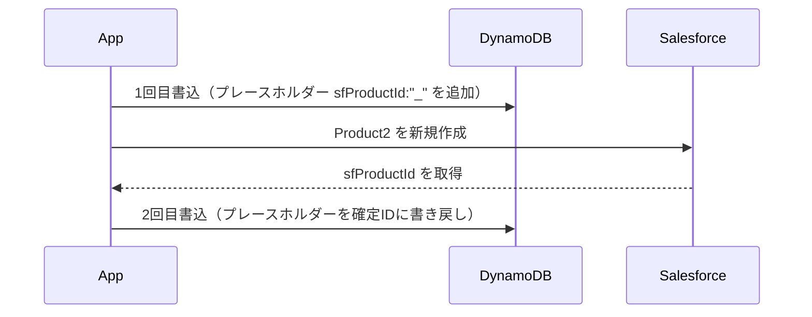
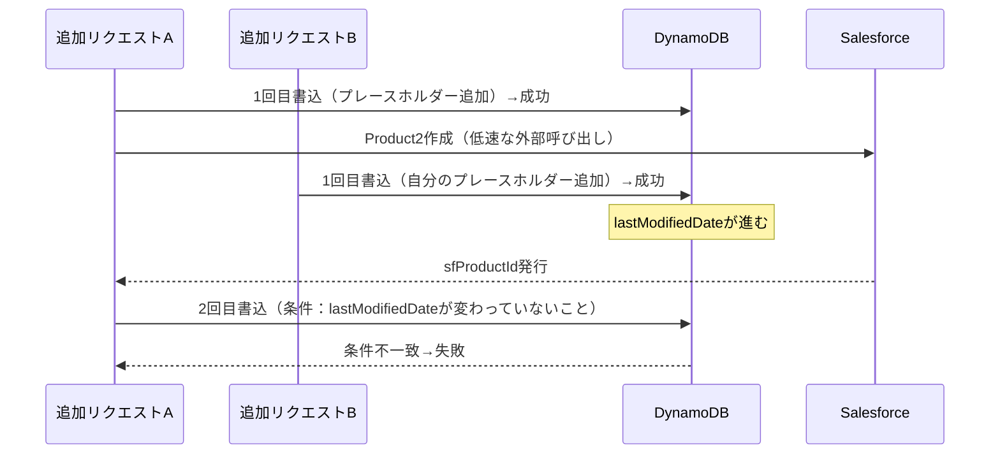
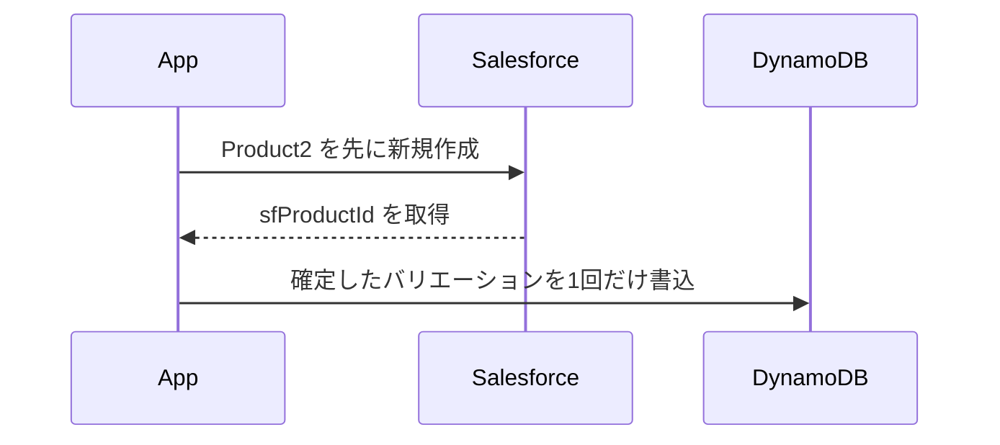
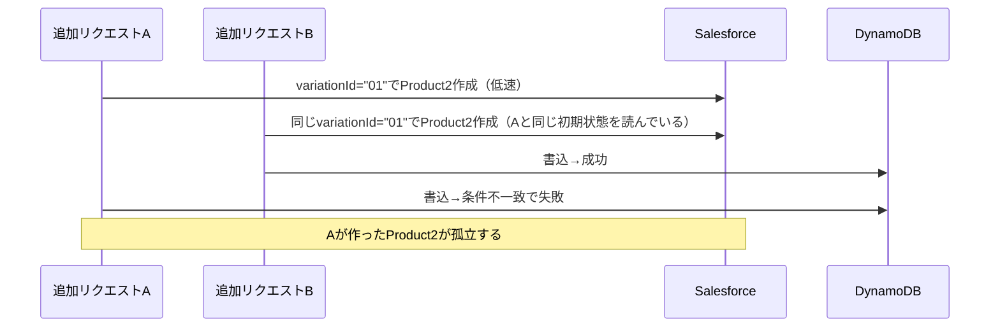

# DynamoDB + 外部API呼び出しを挟む処理の楽観ロックを検証してみた

こんにちは 人材育成室 育成メンバーチームで 研修中の はすと です。

DynamoDBの楽観ロックというと、「バージョン属性を条件式（ConditionExpression）に入れて、一致していたら更新する」という教科書的なパターンで大体解決する、というイメージを持っている方が多いと思います。私もそう思っていました。

ところが、実務で「DynamoDBへの書込」と「外部SaaS（今回はSalesforce）へのAPI呼び出し」の両方を1つの業務処理でやる必要があるケースに当たったとき、この教科書パターンだけでは足りない場面に何度も遭遇しました。しかも「更新を1回にまとめればシンプルで安全になるはず」という直感が、外部API呼び出しを挟むケースでは裏切られる、という経験もしました。

本記事では、DynamoDBの1アイテムに外部SaaS側のIDを紐づけて保存するような処理で、楽観ロックをどう設計すべきかを、実際にハマったポイントを交えて検証してみます。

## やりたいこと

題材として、次のようなAPIを考えます。

- 商品（Product）に「バリエーション」を1件追加するAPI
- バリエーションを追加するときは、対応するSalesforce側のオブジェクト（`Product2`）も新規作成し、そのIDをDynamoDB側のバリエーションにも記録する必要がある

DynamoDB側のイメージはこんな感じです。

```json
{
  "productId": "P001",
  "lastModifiedDate": 1720000000000,
  "variations": [
    { "id": "01", "name": "スタンダード", "sfProductId": "a0X1x000003ABCD" }
  ]
}
```

ポイントは、「DynamoDBへの書込」だけで完結せず、「外部のHTTP API呼び出し」を挟むことです。SalesforceへのAPI呼び出しはネットワーク越しなので、DynamoDBよりずっと低速ですし、DynamoDBの`TransactWriteItems`（複数アイテムをまとめて原子的に書き込む機能）に含めることもできません。この「外部API呼び出しを挟む」という一点が、今回の検証全体のキモになります。

## 最初の実装：2回書込方式

最初に考えたのは、こういう処理順序でした。



1回目・2回目とも、DynamoDBの`lastModifiedDate`（アイテム全体の「最終更新日時」）を条件式にした楽観ロックを入れました。読み取り時点の`lastModifiedDate`と一致していたら書き込む、という単純な仕組みです。

## 検証：2つの追加が同時に走ったら何が起きるか

これを検証するために、2つの追加リクエスト（AとB）が同時に走るケースをトレースしてみました。



Bは自分のバリエーションを正しく追加しているだけで、何も悪いことをしていません。それなのに、Aの2回目書込は「アイテム全体のバージョンが変わった」という理由で失敗してしまいます。

しかもこの時点で、AはSalesforce側に**Product2をすでに作成済み**です。DynamoDBへの書き戻しが失敗するので、このSalesforceオブジェクトは誰にも紐づかない孤立レコードとして残ります。呼び出し元がAをリトライすると、Salesforce側にさらにもう1つProduct2ができてしまいます。

「先に始めた方が、自分と無関係な同時実行の巻き添えで失敗する」というのは、直感的にはかなり気持ちの悪い挙動でした。

## 修正案1：要素単位のロックにする

原因は明確でした。2回目書込の条件を「アイテム全体の`lastModifiedDate`」にしていたことです。2回目書込が本来見るべきなのは「自分が追加したバリエーション1件」だけのはずです。

DynamoDBのConditionExpressionは、リストの特定インデックスに対してネストした条件を書けます。

```js
// 2回目書込：自分の要素だけを条件にする
ConditionExpression: "variations[0].id = :variationId AND variations[0].sfProductId = :placeholder"
```

これで、Bが別のインデックスに追加しても、Aの条件とは衝突しなくなりました。AもBも両方成功します。

## Slackで指摘された、もう一段深い論点

ここで社内のレビューから「そもそも2回に分けて更新している時点で無理があるのでは」という指摘が入りました。

検証してみると、これは半分正しく半分は誤解でした。DynamoDBの条件付き書込は「後から来た方が失敗する」という単純な順序保証はしていません。条件式が今のDB値と一致するかどうかだけを見ています。なので「Bが正しく成功する」こと自体は、Bが最新の状態を正しく読んで正しく書いているだけなので、楽観ロックとしては何も間違っていません。

ただし、レビュアーが本当に求めていたのは「同時に来た追加は1件ずつしか通したくない」という業務ルールでした。これは私が最初に持っていた「1回目が成功したのに2回目で失敗するのはおかしい」という要求と、実は両立しません。両立させるには、悲観ロックにせず後発を安全に即座に失敗させる別の仕組み（DB上に「処理中」を示すフラグを持たせる等）が必要で、それはそれで「フラグが詰まったら以降の追加が全部止まる」という別のリスクを抱えます。

## 修正案2：更新を1回にまとめてみる

「2回書込がそもそもややこしいのでは」という指摘を受けて、次のように処理順序を変えてみました。



Salesforceで先にオブジェクトを作ってから、DynamoDBへは確定した内容を1回だけ書き込む形です。教科書的な「読んで、条件をつけて、1回だけ書く」という一番シンプルな楽観ロックの形に近づきました。

## 想定 vs 実際：1回にまとめると本当にシンプルになるのか

「更新回数を減らせば、その分衝突の起きる隙も減ってシンプルで安全になるはず」と考えると思います。

実際にトレースしてみると、**むしろ衝突しやすくなっていました**。

2回書込の設計では、1回目書込（プレースホルダー追加によるID確保）がSalesforce呼び出しの**前**に、アイテム全体のバージョンで直列化されていました。つまり「2つの追加が同じIDのままSalesforceを呼んでしまう」ということが、構造上起こり得ませんでした。どちらか一方は、Salesforceを呼ぶ前の1回目書込の時点で弾かれます。

1回書込の設計では、DynamoDBへの書込がSalesforce呼び出しの**後**に1回だけです。つまり2つの追加リクエストが、両方とも「まだ何も書き込まれていない」同じ初期状態を読んでしまい、**同じIDで両方ともSalesforceにオブジェクトを作成してしまう**、という状況が起こり得ます。



最終的にどちらか一方が失敗して孤立レコードが残る、という結末は2回書込のときと同じですが、**衝突する時間の幅（Salesforce呼び出しという低速な処理がまるごと衝突ウィンドウになる）が広がっている**ぶん、むしろ発生しやすくなっています。「更新回数を減らせば安全になる」という直感は、外部API呼び出しを挟むケースでは必ずしも成立しない、というのが今回の検証で一番驚いた発見でした。

## 気づき：孤立レコードを冪等キーで解消しようとして、もっと危ないことに気づいた

孤立レコード問題を解消する案として、「SalesforceのProduct2作成を、外部キー的な一意識別子（ExternalId的なフィールド）によるupsertにする」というアイデアが浮かびました。variationIdを起点にその一意識別子を組めば、失敗して作り直したときに同じレコードを指すはず、という発想です。

これを検証したところ、危険な副作用があることに気づきました。

- AとBが同じ初期状態から同じvariationId（例:`"01"`）を計算した場合、外部キーも同じ値になる
- Aが先にSalesforceでオブジェクトを作成（Aのデータで新規作成）
- Aが先にDynamoDBへの書込にも成功（Aの操作はこの時点で完全に成立・完了している）
- ところがBのSalesforce呼び出しは、Aが作成した**あと**に実行される可能性があります。その場合Bのupsert呼び出しは「Aが作ったレコードと外部キーが一致する」と判定し、**Aが作ったレコードの中身をBのデータで上書き**してしまいます

DynamoDB側は「id=01はAのデータ」と正しく記録しているのに、Salesforce側の実データはBのものにすり替わっている、というサイレントな不整合が発生しうるということです。

これは「孤立レコードが残る」（気づいて手動対応できる）よりもたちが悪いと感じました。システムが正しいと信じているレコードの中身が、気づかれないまま間違っているからです。

根本原因は、variationIdが冪等キーとして必要な2条件をどちらも満たさないことでした。

- **同時実行中に一意にならない**（AもBも同じ初期状態を見れば同じ値を計算する）
- **リトライ後も安定しない**（先に別の追加が枠を埋めれば、リトライ時の値が変わる）

有効な冪等キーにするには、呼び出し元（クライアント）が1回のユーザー操作につき生成し、リトライ時も同じ値を送り直す「冪等キートークン」が必要になります。ロック（同時実行の検知）と冪等性（同じ操作のリトライ）は別の関心事で、片方の対策がもう片方の解決にはならない、と気づいた瞬間でした。

## Math.maxパターンと、もっとシンプルにする方法

1回書込方式では、書き込む`lastModifiedDate`の新しい値をこう計算していました。

```js
const nextLastModifiedDate = Math.max(currentTimestamp(), product.lastModifiedDate + 1);
```

`lastModifiedDate`はミリ秒精度のウォールクロック時刻で、これを楽観ロックの版としても使っています。単純に`currentTimestamp()`だけを使うと、理論上「読み取りと書込が同一ミリ秒に起きる」「システム時刻がNTP補正等で後退する」といったケースで、書込後も版の値が実質変わらない（あるいは後退する）可能性があります。そうなると以降の楽観ロックが更新を検知できなくなります。`Math.max`は、通常時は実際の現在時刻を使いつつ、異常系でも「前回値より確実に1以上大きい値」を保証するための仕組みです。

ただ、このコードだけを見た人からは「なぜ+1？」がすぐには伝わらず、意図が読み取りにくいという指摘をもらいました。もっとシンプルにできないか、他の方法も検討してみました。

| 案 | 新規フィールド | クロックの心配 | 特徴 |
|---|---|---|---|
| `lastModifiedDate` + `Math.max` | 不要 | あり（対処済み） | 表示用の日時と版が同じフィールドなので意図が読み取りにくい |
| 専用の`version`カウンタ＋DynamoDBの`ADD`（アトミック加算） | 必要（スキーマ変更） | 無し | サーバー側が原子的に+1するので衝突・後退という概念自体が存在しない。役割分離ができて一番堅牢 |
| `size(variations)`（配列サイズ）を条件にする | 不要 | 無し | 「追加操作は配列が増える」という事実そのものを条件にできる。ただし複数の配列（例：バリエーションとオプション）でIDを共有している場合、片方だけの条件では不十分になる |

`lastModifiedDate`をウォールクロック時刻と楽観ロックの版という2つの役割に使っていることが、そもそもの複雑さの根っこにありました。専用のバージョンカウンタを別に持てば、DynamoDBの`ADD`によるアトミック加算に任せられるので、クロックの心配自体が構造的に発生しなくなります。既存のフィールドを流用するか、新しいフィールドを増やすか、というトレードオフに落ち着きました。

## まとめ

- DynamoDBの楽観ロック自体は教科書通りシンプルですが、外部の非トランザクショナルなAPI呼び出しを挟んだ瞬間に設計の難度が跳ね上がります
- 「更新回数を減らせばシンプルになる」という直感は、外部API呼び出しを挟むケースでは必ずしも成立しません。むしろ衝突ウィンドウが広がることがあります
- 冪等性（同じ操作のリトライ対策）とロック（同時実行の検知）は別の関心事です。片方の対策がもう片方の解決にはならず、無理に兼用しようとすると（今回のupsertの例のように）デデュープどころかデータ不整合を招くことがあります
- ウォールクロックを版として使う場合は単調増加の保証が必要になりますが、専用カウンタや配列サイズなど、そもそもクロックに依存しない条件を選べる場面もあります

外部API連携を含む処理で楽観ロックを設計するときは、「衝突が起きる瞬間はどこか」「その瞬間、外部システム側に副作用のある呼び出しをすでに行っていないか」を具体的にトレースしてみることが大事だと感じました。私と同じように外部API連携を含むDynamoDB設計で悩んでいる方の参考になれば嬉しいです。

## 参考

- [Amazon DynamoDBで楽観的排他制御を実装する](https://dev.classmethod.jp/articles/dynamodb-optimistic-locking/)
- [Implement optimistic locking on a DynamoDB table | AWS re:Post](https://repost.aws/knowledge-center/dynamodb-implement-optimistic-locking)
- [DynamoDB and optimistic locking with version number - Amazon DynamoDB](https://docs.aws.amazon.com/amazondynamodb/latest/developerguide/DynamoDBMapper.OptimisticLocking.html)
