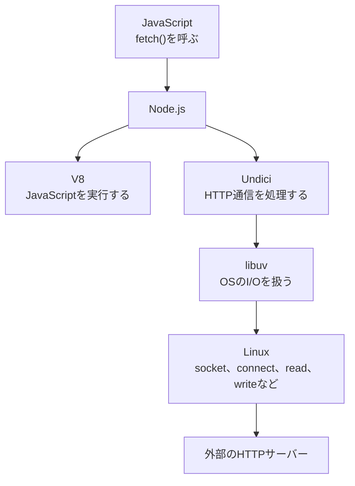
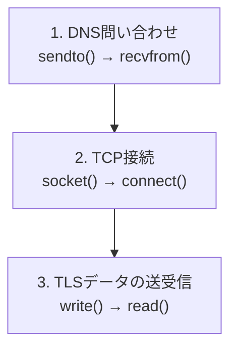

こんにちは 人材育成室 育成メンバーチームで 研修中の はすと です。

低レイヤーを意識していないと、`fetch()`を呼んだときにNode.jsがHTTP通信を全部処理しているように見えると思います。

では、DNSの問い合わせやTCP接続、TLS、データの送受信は、どこまでNode.jsが担当して、どこからOSへ渡しているのでしょうか。

以前、[Node.jsの非同期処理をシステムコールレベルで覗いてみた](https://dev.classmethod.jp/articles/nodejs-async-deep-dive-with-syscalls/)という記事でファイルI/Oの動きを見ました。今回はその続きとして、`fetch()`のネットワークI/OがOSへ渡るところを`strace`で見てみます。

## 今回見る範囲

今回知りたいのは、`fetch()`の使い方ではありません。Node.jsとOSの境界を見るため、範囲を次の3つに絞って見てみます。

- Node.jsの組み込み`fetch()`がUndiciを使ってHTTP処理を始めるところ
- Node.jsがlibuvを通じてLinuxのネットワークI/Oを利用するところ
- ネットワークI/Oで呼ばれるシステムコールを`strace`で見ること

今回見るのは、`fetch()`を呼んだあとにNode.jsがOSへ何を依頼するかです。

## Node.jsからOSまでの道筋

今回確認する処理の流れは次のようになります。



V8はJavaScriptを実行するエンジンで、UndiciはNode.jsの組み込み`fetch()`が利用するHTTP/1.1クライアントです。Node.jsの公式ドキュメントにも、次のように書かれています。

> The implementation is based upon undici, an HTTP/1.1 client written from scratch for Node.js.

Node.js向けに一から書かれたHTTP/1.1クライアントを基に実装されている、という意味です。[Node.jsの`fetch()`](https://nodejs.org/api/globals.html#fetch)に記載されています。

libuvの公式ドキュメントでは、LinuxのネットワークI/Oについて次のように説明されています。

> all (network) I/O is performed on non-blocking sockets which are polled using the best mechanism available on the given platform: epoll on Linux

non-blocking socketと`epoll`でI/Oの準備ができるまで待つ、という内容です。[libuvのI/O loop](https://docs.libuv.org/en/v1.x/design.html#the-i-o-loop)に記載されています。

`epoll`まで含めても動作上の問題はありません。ただ、今回は通信の開始とデータの送受信だけを見るため、`strace`の対象を`network`、`read`、`write`に絞っています。

## 検証環境

検証コードは、プライベートリポジトリの[await-strace-lab](https://github.com/HasutoSasaki/await-strace-lab)に置いています。

今回実行するファイルは、リポジトリのルートから見ると次のものです。

```text
scripts/single-fetch/fetch.mjs
```

Docker内でNode.jsと`strace`を実行します。`fetch()`は、外部公開APIへ読み取り専用のGETを1回だけ送ります。

```text
Node.js v26.7.0
libuv 1.52.1
Undici 8.9.0
Debian GNU/Linux 13.6 (trixie)
strace 6.13+ds-1
```

外部APIを使っているため、実行環境によって結果は少し変わります。以下では、私の環境で実行したときのログを例に見ていきます。

## 検証コード

Docker内では、`/work/scripts/single-fetch/fetch.mjs`として実行します。外部APIへ`fetch()`を1回呼び出します。

この記事で見るのは、`fetch()`を呼び出したあとに記録されたシステムコールです。

## 実行するコマンド

検証リポジトリのルートから、Dockerイメージを作成し、保存先を指定して実行します。

```bash
docker build -t await-strace-lab .
```

```bash
docker run --rm \
  -v "$PWD/results:/work/results" \
  await-strace-lab
```

Node.jsプロセスは、次の`strace`で追跡されます。

```bash
strace -f -ttt -yy -e trace=network,read,write \
  -o /work/results/fetch.strace \
  node /work/scripts/single-fetch/fetch.mjs
```

- `-f`: Node.jsが使う別スレッドも追跡するため
- `-ttt`: システムコールの時刻をUnix時刻で出すため
- `-yy`: ファイルディスクリプタの接続先を表示するため
- `-e trace=network,read,write`: ネットワークと読み書きに絞るため

実行結果は、次のファイルに保存されます。

```text
results/fetch.strace
```

## 結果の全体像

保存されたログを先に全体で見ると、次の流れになっています。



この流れ自体は、HTTPSで外部APIへ接続するときに一般的なものです。今回は、それがNode.jsのシステムコールとしてどう現れるかを見ています。

## DNSのシステムコールを見る

DNSは、ホスト名をIPアドレスへ変換する仕組みです。今回のURLでは、`httpbin.org`がホスト名にあたります。`strace`はDNSパケットをホスト名として整形しませんが、パケットの中には`\7httpbin\3org`のようにホスト名が含まれています。長い引数は短くしています。

```text
sendto(... UDP ...:53 ..., "... \7httpbin\3org\0 ...", 29, ...) = 29
recvfrom(... UDP ...:53 ..., "... \7httpbin\3org\0 ...", 1024, ...) = 191
```

`\7`と`\3`はDNSパケット内のラベルの長さを表しているため、`httpbin.org`と読めます。`sendto()`でDNS問い合わせを送り、`recvfrom()`で応答を受け取っています。`fetch()`が`httpbin.org`の接続先を調べるために発生した通信です。DNSキャッシュが使われれば、同じ実行結果にならないこともあります。

## TCP接続のシステムコールを見る

次に、HTTPSの接続開始を見てみます。

```text
socket(AF_INET, SOCK_STREAM|SOCK_CLOEXEC|SOCK_NONBLOCK, IPPROTO_IP) = 18<TCP:[...]>
connect(..., {sa_family=AF_INET, sin_port=htons(443), ...}) = -1 EINPROGRESS
getsockopt(..., SOL_SOCKET, SO_ERROR, [0], [4]) = 0
```

`socket()`でnon-blockingのTCPソケットを作り、`connect()`で443番ポートへの接続を開始しています。

`connect()`の結果は`EINPROGRESS`でした。接続処理がすぐには完了しないため、完了を待たずに処理へ戻ったということです。その後、`getsockopt()`で接続結果が成功だったことを確認しています。

ここで見えているのは、`fetch()`が開始したネットワークI/Oに伴うシステムコールです。Node.jsが`connect()`を通じてLinuxへ接続処理を依頼したと読めます。

## TLSの読み書きを見る

接続後には、TLSの通信が発生しています。

```text
write(... TCP:[...:443] ..., "\26\3\1...", 1606) = 1606
read(... TCP:[...:443] ..., "\26\3\3...", 65536) = 4267
write(... TCP:[...:443] ..., "\26\3\3...", 126) = 126
read(... TCP:[...:443] ..., "\26\3\3...", 65536) = 273
```

`write()`と`read()`の引数はバイナリで表示されています。今回はHTTPSを使っているため、`strace`から平文の`GET`やJSON本文を直接読めたわけではありません。

ここでは、443番ポートのTCPソケットに対してTLSのデータが読み書きされたと解釈しています。TLSの内部処理そのものを`strace`が説明しているわけではありません。

## straceで見えたこと

今回の実測で、次のことがわかりました。

- `fetch()`を呼ぶと、ネットワーク関連のシステムコールを確認できた
- DNS問い合わせを`sendto()`で送り、`recvfrom()`で応答を受け取った
- `connect()`で443番ポートへの接続を開始した
- `connect()`は`EINPROGRESS`を返し、後から接続成功を確認した
- `read()`と`write()`でTLSデータを読み書きした

`fetch()`はJavaScriptのPromiseを返すだけの処理ではありません。今回の条件では、その呼び出しをきっかけにNode.jsがネットワークI/Oを開始し、OSとのやり取りが発生しました。

## Node.jsの中で見えないこと

一方で、`strace`だけでは確認できないこともあります。

- `fetch()`を呼び出したJavaScriptの位置
- UndiciがHTTP処理を進める細かな流れ
- TLSの暗号化処理の細かな流れ
- Linuxカーネル内部のTCP状態の変化
- 外部HTTPサーバーが受け取ったリクエストの内容

`strace`が見ているのは、Node.jsプロセスが発行したシステムコールです。JavaScriptの処理や、Node.js内部のPromiseの状態を直接観測しているわけではありません。

## まとめ

今回は、Node.jsの`fetch()`を`strace`で追いかけ、DNS問い合わせ、TCP接続、TLSの読み書きに関係するシステムコールを確認できました。HTTP処理はNode.jsに組み込まれたUndiciが進め、ソケットI/OはLinuxへ依頼します。

`strace`を使うと、Node.js側の処理とLinuxへ依頼するI/Oの境界を具体的に見られます。

興味があれば、手元でも`fetch()`のシステムコールを追いかけてみてください。

## 参考

- [Node.js `fetch()`](https://nodejs.org/api/globals.html#fetch)
- [libuv Design overview](https://docs.libuv.org/en/v1.x/design.html)
- [strace](https://strace.io/)
