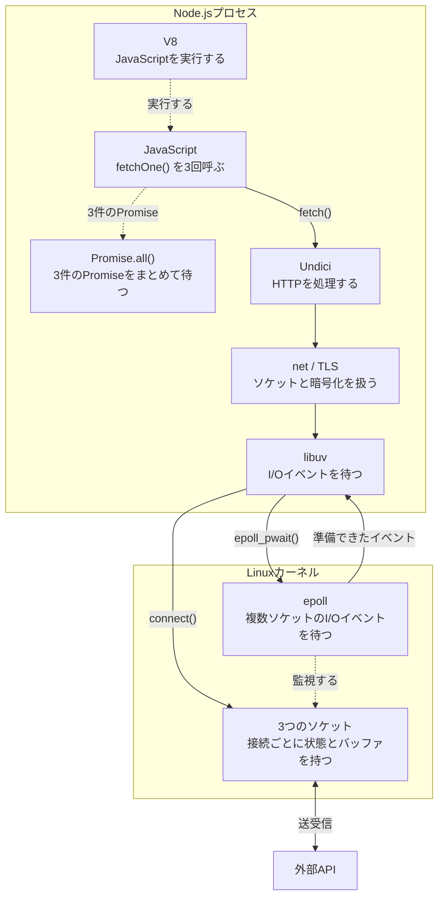
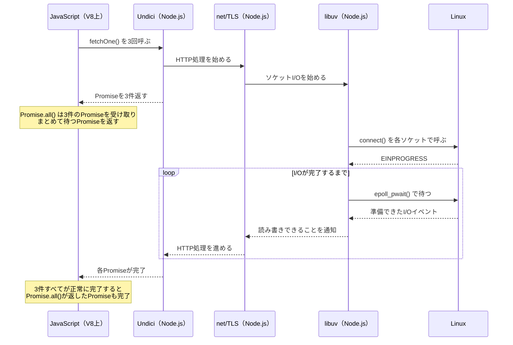
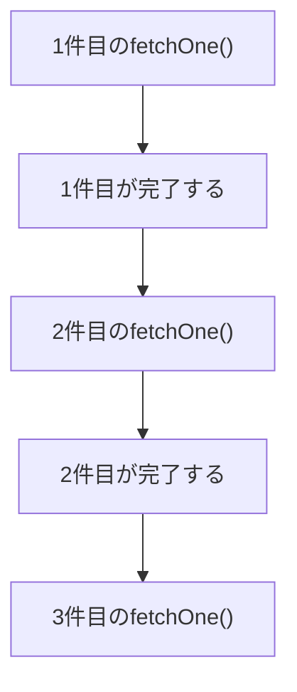
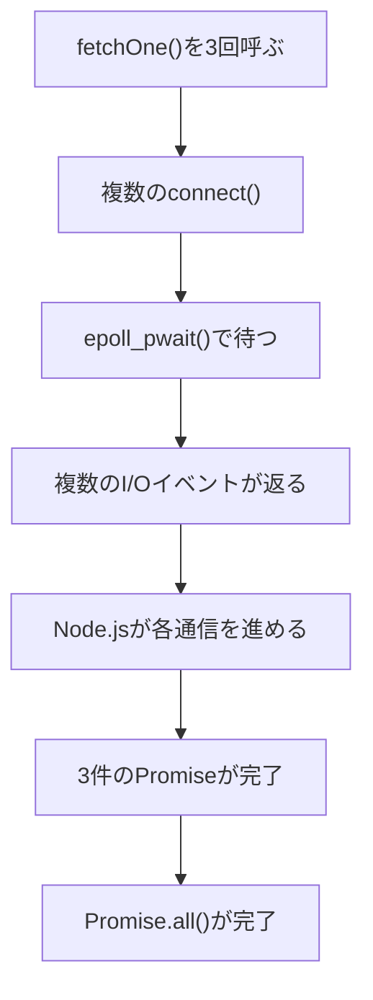

こんにちは 人材育成室 育成メンバーチームで 研修中の はすと です。

JavaScriptを書いていると、`Promise.all()`を使って複数の非同期処理をまとめて扱うことがありますが、コードだけを見ると`Promise.all()`が通信を並行して進めているように見えると思います。

前回、[Node.jsのfetch()がOSへI/Oを依頼するところをstraceで覗いてみた](/articles/nodejs-fetch-strace)では、単発の`fetch()`を`strace`で追い、Node.jsプロセスにネットワーク関連のシステムコールが出ることを確認しました。複数のリクエストを続けて始めると、システムコールの動きはどう変わるのでしょうか。

今回は、前回と同じ外部公開APIへ3件リクエストを送り、各`fetch()`を順番に`await`する場合と、3件の`fetch()`を先に呼んでから`Promise.all()`で待つ場合を`strace`で比べてみます。確認するのは、TCP接続を始める`connect()`と、準備できたI/Oイベントを待つ`epoll_pwait()`がログのどこに出るかです。

## 結論

`Promise.all()`は、渡されたPromiseをまとめて待つものです。通信を始めるのはそれぞれの`fetch()`で、`Promise.all()`ではありません。複数の`fetch()`を完了前に呼ぶと、Linux上では複数のソケットI/Oが進行中になります。Node.jsはlibuvを通じて`epoll_pwait()`でI/Oイベントを待ち、この検証のように3件が正常に完了すると`Promise.all()`も完了します。

## Node.jsとLinuxの役割

Node.jsはV8でJavaScriptを実行します。`fetch()`でHTTPリクエストを進めるのはNode.jsに組み込まれたUndiciです。Node.jsが使うlibuvは、Linuxの`epoll`を使ってnon-blockingなソケットI/Oを待ちます。LinuxはTCP接続とパケットの送受信を担います。[libuv Design overview](https://docs.libuv.org/en/v1.x/design.html)

`epoll_pwait()`は、`epoll_wait()`と同様に、登録された複数のファイルディスクリプタで準備できたI/Oイベントを待つシステムコールです。[epoll_wait(2) - Linux manual page](https://man7.org/linux/man-pages/man2/epoll_wait.2.html)

3件の`fetch()`を続けて呼ぶとき、Node.jsプロセスとLinuxの役割は次のようにつながります。



`Promise.all()`はV8で実行されるJavaScriptの処理で、I/Oの経路には入らず、3件のPromiseをまとめて待つだけです。各`fetch()`の処理はUndici、`net`/TLS、libuvを通ってLinuxのソケットへ進みます。



2つ目の図では、Node.jsプロセス内のJavaScript、Undici、`net`/TLS、libuvのやり取りを示しています。`Promise.all()`がPromiseを受け取ったあとも、libuvが`epoll_pwait()`で待機し、Linuxから届くイベントに応じてHTTP処理が進みます。`strace`では、図中の`connect()`と`epoll_pwait()`を確認します。

:::details Linuxが複数のI/Oを扱える理由

TCP接続ごとに、Linuxは別のソケットとして接続状態と送受信バッファを管理します。受信したパケットは、通信ごとのIPアドレスとポートの組み合わせから対応するソケットへ振り分けられるため、複数の通信のデータが混ざることはありません。

`epoll_pwait()`には複数のソケットを登録できます。Linuxはそれぞれのソケットを進め、読み書きできる状態になったものだけをイベントとして返します。JavaScriptの処理が同時に複数実行されるわけではなく、I/Oの待ち時間が重なります。

CPU時間、NIC、ネットワーク帯域は共有するため、複数の通信が増えれば遅延や帯域の取り合いは起こります。
:::

## 検証コード

検証コードは、[await-strace-lab](https://github.com/HasutoSasaki/await-strace-lab)の`scripts/multi-fetch/`にあります。前回と同じ`https://httpbin.org/get`へ、読み取り専用のGETを3回送ります。順番に待つ実行と、3件の`fetchOne()`を先に呼ぶ実行を1回ずつ行うため、この比較では合計6回送ります。

`scripts/multi-fetch/sequential.mjs`では、3件を順番に待ちます。

```js
async function fetchOne() {
  const response = await fetch('https://httpbin.org/get')
  await response.arrayBuffer()
}

await fetchOne()
await fetchOne()
await fetchOne()
```

`scripts/multi-fetch/concurrent.mjs`では、3件の`fetchOne()`を先に呼んでから、`Promise.all()`で待ちます。

```js
async function fetchOne() {
  const response = await fetch('https://httpbin.org/get')
  await response.arrayBuffer()
}

await Promise.all([
  fetchOne(),
  fetchOne(),
  fetchOne(),
])
```

`Promise.all()`を使うコードでは、配列の各`fetchOne()`が先に評価され、3件のPromiseができてから`Promise.all()`が呼ばれます。2つのコードの違いは、次の`fetchOne()`を呼ぶ前に待つかどうかです。順番に待つコードは、1件目が終わってから2件目を呼びます。`response.arrayBuffer()`は、レスポンス本文を読み終えるまで各`fetchOne()`を完了させないために呼んでいます。

## 実行するコマンド

検証リポジトリのルートから実行します。

```bash
docker build -t await-strace-lab .
docker run --rm \
  -v "$PWD/results:/work/results" \
  await-strace-lab sh /work/runners/fetch-comparison.sh
```

Docker内では`/work/runners/fetch-comparison.sh`が、順番に待つ実行と、3件の`fetchOne()`を先に呼ぶ実行を順に行います。`connect()`は接続開始を、`epoll_pwait()`はI/Oイベントの待機を見るために追跡しています。

```sh
#!/bin/sh
set -e

mkdir -p /work/results

strace -e trace=connect,epoll_pwait \
  -o /work/results/sequential.strace \
  node /work/scripts/multi-fetch/sequential.mjs

strace -e trace=connect,epoll_pwait \
  -o /work/results/concurrent.strace \
  node /work/scripts/multi-fetch/concurrent.mjs
```

`strace`のログは`results/sequential.strace`と`results/concurrent.strace`に保存されます。

## 実行結果

直列では、各`fetchOne()`が完了してから次の`fetchOne()`を呼びます。

```text
# 1つのソケットが2つの宛先IPを試している
connect(18, {sa_family=AF_INET, sin_port=htons(443), sin_addr=inet_addr("35.168.253.89")}, 16) = -1 EINPROGRESS
...
connect(18, {sa_family=AF_INET, sin_port=htons(443), sin_addr=inet_addr("34.238.93.120")}, 16) = -1 EINPROGRESS
...
# イベントが来なかったため、タイムアウトで戻る
epoll_pwait(13, [], 1024, 184, NULL, 8) = 0
# 書き込み可能になったイベントを受け取る
epoll_pwait(13, [{events=EPOLLOUT, data=0x12}], 1024, 309, NULL, 8) = 1
...
# 読み込み可能になったイベントを受け取る
epoll_pwait(13, [{events=EPOLLIN, data=0x12}], 1024, 498, NULL, 8) = 1
```

`connect()`の行数は`fetch()`の回数ではありません。Node.jsは、複数のIPアドレスを得た場合、接続できるまで順に接続を試すことがあります。[Node.jsの`net`ドキュメント](https://nodejs.org/api/net.html#socketconnectoptions-connectlistener)

この実行では、1件目の`fetchOne()`が同じファイルディスクリプタで2つのIPを試しています。後続の2件には新しい`connect()`がなく、接続を再利用したと読めます。

`epoll_pwait()`は接続の完了だけでなく登録済みのI/Oイベントを待つため、イベントがなければ`[] = 0`で戻り、読み込み可能になれば`EPOLLIN`を返しますが、`EPOLLOUT`が返っても今回は`getsockopt(SO_ERROR)`を追跡していないため接続成功とは断定できません。[connect(2) - Linux manual page](https://man7.org/linux/man-pages/man2/connect.2.html)

1件目が完了するまで、2件目と3件目の`fetchOne()`は呼ばれません。



`Promise.all()`を使うコードでは、3件の`fetchOne()`を呼んでから、その戻り値を`Promise.all()`へ渡して待ちます。今回のログでは、3つのファイルディスクリプタに対する`connect()`が並び、その後に`epoll_pwait()`が3件の`EPOLLOUT`イベントを返しました。

```text
# 3つのソケットが、1つ目の宛先IPへ接続を試す
connect(19, {sa_family=AF_INET, sin_port=htons(443), sin_addr=inet_addr("100.58.6.74")}, 16) = -1 EINPROGRESS
connect(20, {sa_family=AF_INET, sin_port=htons(443), sin_addr=inet_addr("100.58.6.74")}, 16) = -1 EINPROGRESS
connect(18, {sa_family=AF_INET, sin_port=htons(443), sin_addr=inet_addr("100.58.6.74")}, 16) = -1 EINPROGRESS
...
# 同じ3つのソケットが、2つ目の宛先IPへ接続を試す
connect(19, {sa_family=AF_INET, sin_port=htons(443), sin_addr=inet_addr("54.91.104.72")}, 16) = -1 EINPROGRESS
connect(20, {sa_family=AF_INET, sin_port=htons(443), sin_addr=inet_addr("54.91.104.72")}, 16) = -1 EINPROGRESS
connect(18, {sa_family=AF_INET, sin_port=htons(443), sin_addr=inet_addr("54.91.104.72")}, 16) = -1 EINPROGRESS
# 3つのソケットが書き込み可能になったときのepoll_pwait()
epoll_pwait(13, [{events=EPOLLOUT, data=0x12}, {events=EPOLLOUT, data=0x14}, {events=EPOLLOUT, data=0x13}], 1024, 480, NULL, 8) = 3
```

この実行で`connect()`が6行あるのは、3件の`fetchOne()`が6回実行されたからではありません。3つのソケットがそれぞれ2つのIPを試したため、`3 × 2`で6行になっています。`EINPROGRESS`は、non-blockingな接続処理がまだ終わっていないことを表します。

その後の`epoll_pwait()`は、準備できたI/Oイベントを返します。この行では、3件の書き込み可能イベントをまとめて返しています。

ログの流れは次のように読めます。3件の`fetchOne()`がI/Oを始めたあと、`Promise.all()`は3件のPromiseが正常に完了するのを待ちます。



ここで分かるのは、`Promise.all()`が`epoll_pwait()`を呼んだり、Linuxへ並行処理を指示したりするわけではないことです。3件の`fetch()`を先に呼ぶことで、Linux上では複数のソケットI/Oが進行中になります。Node.jsは`epoll_pwait()`で、それらのI/Oイベントを待ちます。

接続先のIPや接続の再利用によって、`connect()`の数や順番は変わります。そのため、比較では`connect()`の総数ではなく、複数のソケットI/Oが進行中になったあとに、複数のイベントが返る流れを見ます。

## Promise.all()とepoll_pwait()の役割

3件の`fetchOne()`を先に呼ぶコードでは、それぞれがPromiseを返します。そのあとに`Promise.all()`が呼ばれ、3件の完了をまとめて待つPromiseを返します。

この検証では3件すべてが正常に完了するため、`Promise.all()`が返すPromiseも完了します。[ECMAScript Language Specification](https://tc39.es/ecma262/multipage/control-abstraction-objects.html#sec-promise.all)

一方、`epoll_pwait()`はLinuxのシステムコールです。Node.jsランタイムのlibuvはこれを呼び出して、複数ソケットのI/Oイベントを待ちます。通信を開始するのは`fetch()`の処理であり、HTTPの処理を進めるのはNode.js側のUndiciです。

## まとめ

複数の`fetch()`を、どれかが完了する前に呼ぶと、Linux上では複数のソケットI/Oが進行中になります。Linuxが各ソケットのI/Oを進め、Node.jsはlibuvを通じて`epoll_pwait()`で準備できたイベントを待ちます。`Promise.all()`は、開始済みのPromiseをまとめて待つ役割です。

`strace`を使って、JavaScriptのコードだけでは見えにくい、複数の`fetch()`がLinuxの複数ソケットI/Oとして進む流れを覗くことができました。

興味があれば、手元でも`strace`で複数の`fetch()`の動きを追いかけてみてください。

## 参考

- [Node.js fetch - Node.js](https://nodejs.org/api/globals.html#fetch)
- [Node.js net - Node.js](https://nodejs.org/api/net.html)
- [Design overview - libuv](https://docs.libuv.org/en/v1.x/design.html)
- [socket(7) - Linux manual page](https://man7.org/linux/man-pages/man7/socket.7.html)
- [connect(2) - Linux manual page](https://man7.org/linux/man-pages/man2/connect.2.html)
- [epoll_wait(2) - Linux manual page](https://man7.org/linux/man-pages/man2/epoll_wait.2.html)
- [Promise.all - ECMAScript Language Specification](https://tc39.es/ecma262/multipage/control-abstraction-objects.html#sec-promise.all)
