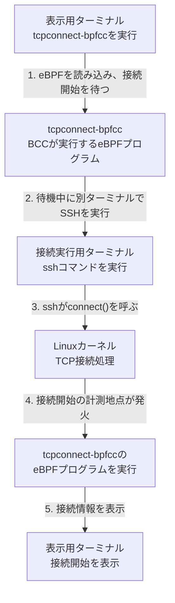
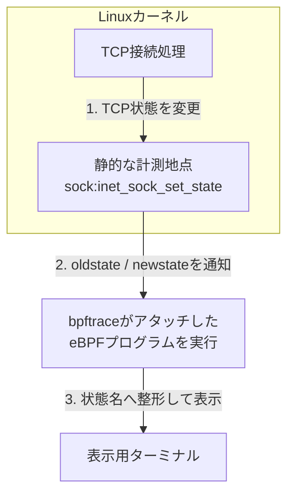

こんにちは 人材育成室 育成メンバーチームで 研修中の はすと です。

前回は`strace`を使い、`ssh`コマンドがLinuxカーネルへ発行するシステムコールを観測しました。ソケットは、アプリケーションがネットワーク通信に使う入口です。`ssh`が非ブロッキングに設定したソケットでは、接続がすぐに完了しないと`connect()`が`EINPROGRESS`（接続処理がまだ完了していないことを示す値）を返します。その後の`ppoll()`と`getsockopt(SO_ERROR)`で成否を確認していることが分かりました。

ただ、これで分かったのは「`ssh`プロセスがLinuxカーネルに何を依頼したか」までです。`connect()`を受け取ったLinuxカーネルの中で、TCP接続がどの状態を経たのかまでは、`strace`では見えません。

そこで今回は、eBPF(`bpftrace`/BCC)を使い、`connect()`の先、カーネル内部のTCP状態遷移を観測してみます。

前回の記事: [straceでSSHコマンドの内部を覗いてみた](https://dev.classmethod.jp/articles/ssh-strace-syscall-peek/)

## eBPF・bpftrace・BCCとは

```text
   ssh
    │
System Call   ← 前回、straceで見ていた場所
    │
Linux Kernel
    │  └─ TCPの状態遷移   ← 今回、eBPFで見る場所
    │
   NIC
    │
  Server
```

eBPFは、カーネルのソースコードを変更したりカーネルモジュールを読み込んだりせずに、検証器のチェックを通ったプログラムをカーネル内で実行できる技術です。実行には権限が必要であり、どのようなプログラムでも無条件に安全に実行できるわけではありません。

出典: [What is eBPF? - eBPF公式サイト](https://ebpf.io/what-is-ebpf/)
> "It is used to safely and efficiently extend the capabilities of the kernel without requiring to change kernel source code or load kernel modules."
> (カーネルのソースコードを変更したりカーネルモジュールを読み込んだりすることなく、カーネルの機能を安全かつ効率的に拡張するために使われる)

`bpftrace`と`BCC`(BPF Compiler Collection)は、どちらもこのeBPFのプログラムを書きやすくするためのツールです。`bpftrace`はDTraceやSystemTapに似た専用の言語を持ち、短いスクリプトで書けます。

出典: [bpftrace - bpftrace/bpftrace](https://github.com/bpftrace/bpftrace)
> "bpftrace is a general purpose tracing tool and language for Linux. It leverages eBPF... The bpftrace language is inspired by awk, C, and predecessor tracers such as DTrace and SystemTap."
> (bpftraceはLinux向けの汎用トレーシングツール兼言語で、eBPFを利用している。bpftraceの言語はawkやC、DTraceやSystemTapといった先行するトレーサーから着想を得ている)

`BCC`は、PythonなどからBPFプログラムを作成・読み込みしやすくするツールキットです。今回使う`tcpconnect-bpfcc`もBCCに含まれるツールの1つです。

出典: [bcc - iovisor/bcc](https://github.com/iovisor/bcc)
> "BCC is a toolkit for creating efficient kernel tracing and manipulation programs... It makes use of extended BPF (Berkeley Packet Filters), formally known as eBPF"
> (BCCは効率的なカーネルトレーシング・操作プログラムを作成するためのツールキットで、拡張BPF、正式にはeBPFと呼ばれる機能を利用している)

今回は`bpftrace`とBCCを使い、`connect()`の先でカーネルが実際に何をしていたのかを、TCPソケットの状態遷移として確認します。

## strace では見えなかったところ

前回確認できたのは、`connect()`の返り値と、その後のシステムコールまでです。

```text
connect(3, {sa_family=AF_INET6, ... "::1" ...}, 28) = -1 EINPROGRESS (Operation now in progress)
getsockopt(3, SOL_SOCKET, SO_ERROR, [ECONNREFUSED], [4]) = 0
```

`connect()`が呼ばれたことや、その結果が成功・拒否・タイムアウトのどれだったかは分かります。しかし、その間にTCPソケットがカーネル内部でどのような状態を経たのかは、システムコールの記録には出てきません。ここから先を、bpftraceとBCCで覗いていきます。

## 検証環境

前回と同じ考え方で、使い捨てのUbuntuコンテナ1つにクライアントもサーバーも同居させます。capabilityは、Linuxが特定の特権操作を個別に許可する仕組みです。次は、今回の環境で動作を確認した構成です。

```bash
docker run -d --name ssh-ebpf-demo \
  --cap-add BPF \
  --cap-add PERFMON \
  --cap-add SYS_RESOURCE \
  -v /sys/kernel/tracing:/sys/kernel/tracing:ro \
  ubuntu:24.04 sleep infinity
```

- `CAP_BPF`と`CAP_PERFMON`は、トレーシングBPFプログラムの読み込みに関係します。`CAP_PERFMON`は、perf_eventsによる計測の権限も与えます。
- `CAP_SYS_RESOURCE`は、bpftraceが必要に応じてメモリロックなどのリソース上限を変更するために追加しています。tracepointへの接続そのものを許可するcapabilityではありません。
- tracefsは、tracepointなどの計測情報を公開する仮想ファイルシステムです。`/sys/kernel/tracing`を読み取り専用でマウントし、今回の環境では動作しました。
- `-d`と`sleep infinity`でコンテナを起動したままにし、後続のコマンドを`docker exec`で実行できるようにします。

eBPFプログラムはcolima VMのカーネルへ接続されます。そのため、観測範囲はコンテナ内に限定されません。同じVM上の別プロセスが条件に一致した場合、そのイベントも記録されます。

動作確認したバージョンです。

| ソフトウェア | バージョン |
| --- | --- |
| コンテナOS | Ubuntu 24.04 |
| カーネル(colima VM) | 6.8.0-117-generic |
| Docker Server | 29.5.2 |
| bpftrace | 0.20.2 |
| bpfcc-tools(BCC) | 0.29.1 |
| OpenSSH | 9.6p1 |

この構成では、後述するbpftraceスクリプトをアタッチできました。さらに、SSHで`127.0.0.1:22`へ接続し、`CLOSE → SYN_SENT → CLOSE`を確認しています。

:::details BCCを実行するための補足

`tcpconnect-bpfcc`は、実行時にカーネル依存のBPFコードを処理します。BCC公式資料では、BPFプログラムのコンパイルに、対応するカーネルヘッダー（カーネルのC APIの定義）が必要になる場合があると説明されています。ヘッダーの準備方法はディストリビューションとカーネルに依存するため、エラーになった場合は[BCCのインストール手順](https://github.com/iovisor/bcc/blob/master/INSTALL.md)を確認してください。

:::

コンテナの中に`openssh-server`・`openssh-client`・`bpftrace`・`bpfcc-tools`を入れ、前回と同じく検証専用のユーザー`sshdemo`を作成し、使い捨てのed25519鍵を生成しました。`ssh sshdemo@127.0.0.1`で自分自身に接続する構成です。

## tcpconnect-bpfccでTCP接続の開始を見る

最初に確認したいのは、「どのプロセスが、どこへTCP接続を始めたか」です。ここではBCCに含まれる`tcpconnect-bpfcc`を使います。

同じ検証環境を操作するターミナルを2つ開きます。

- **表示用ターミナル**では、`tcpconnect-bpfcc`を起動し、接続開始の情報が表示されるのを待ちます。
- **接続実行用ターミナル**では、`ssh`を実行してTCP接続を発生させます。

接続を発生させると、その情報が表示用ターミナルへ表示されます。



まず表示用ターミナルで、`tcpconnect-bpfcc`を起動します。

```bash
docker exec -it ssh-ebpf-demo tcpconnect-bpfcc
```

`tcpconnect-bpfcc`は接続開始を待ち受けたままになります。続いて、接続実行用ターミナルからSSH接続を実行します。

```bash
docker exec ssh-ebpf-demo \
  ssh sshdemo@127.0.0.1 echo TCPCONNECT_RETEST
```

表示用ターミナルに次の結果が表示されました。

```text
PID     COMM         IP SADDR            DADDR            DPORT
7019    ssh          4  127.0.0.1        127.0.0.1        22
```

`strace`で見た`connect(..., sin_addr=inet_addr("127.0.0.1"))`と対応する能動接続を、カーネル側からも観測できました。プロセス名、PID、送信元・宛先アドレス、宛先ポートが一致しています。

### tcpconnect-bpfccで分かったこと

この結果から、`ssh`プロセスが`127.0.0.1:22`への接続を始めたことが分かります。一方、接続が成功したのか、途中でどの状態を経たのかは分かりません。

`tcpconnect-bpfcc`は接続開始を素早く確認する入口として便利です。しかし今回知りたいのは、`connect()`の後に起きる状態変化です。このコマンドは状態遷移を表示しないため、次は表示内容を指定できるbpftraceスクリプトを使います。`tcpconnect-bpfcc`は`Ctrl+C`で停止します。

## TCPソケットの状態遷移を観測する

ここからが本題です。Linuxカーネルには、ソケットの状態変更を記録する`sock:inet_sock_set_state`というtracepointがあります。tracepointは、カーネルのソースコードにあらかじめ定義された静的な計測地点です。このtracepointは、TCPソケットの状態が変わると、変更前と変更後の状態をイベントとして通知します。



図の`bpftrace`は状態を変えません。カーネルが状態を変更し、tracepointがイベントを通知し、そのイベントを受け取ったプログラムが端末へ表示します。

```bash
docker exec ssh-ebpf-demo \
  bpftrace -lv 'tracepoint:sock:inet_sock_set_state'
```

実行結果です。

```text
tracepoint:sock:inet_sock_set_state
    const void * skaddr
    int oldstate
    int newstate
    __u16 sport
    __u16 dport
    __u16 family
    __u16 protocol
    __u8 saddr[4]
    __u8 daddr[4]
    __u8 saddr_v6[16]
    __u8 daddr_v6[16]
```

`oldstate`/`newstate`は、tracepointでは`int`型の状態番号として渡されます。今回のスクリプトは`protocol == 6`でTCPに絞っているため、この番号をLinuxカーネルのTCP状態定義(`include/net/tcp_states.h`)と対応付けます。

```c
enum {
	TCP_ESTABLISHED = 1,
	TCP_SYN_SENT,
	TCP_SYN_RECV,
	TCP_FIN_WAIT1,
	TCP_FIN_WAIT2,
	TCP_TIME_WAIT,
	TCP_CLOSE,
	TCP_CLOSE_WAIT,
	TCP_LAST_ACK,
	TCP_LISTEN,
	TCP_CLOSING,
	TCP_NEW_SYN_RECV,
	...
};
```

出典: [torvalds/linux - include/net/tcp_states.h](https://github.com/torvalds/linux/blob/master/include/net/tcp_states.h)

後述する`@state`マップは、この番号をキーとして状態名へ置き換えます。たとえば`oldstate == 7`は`CLOSE`、`newstate == 2`は`SYN_SENT`です。スクリプトには、ここで示した`1`から`12`までの状態を登録しています。

### bpftraceスクリプトとは

これから作る`ssh-tcp-state.bt`は、bpftraceが読み取るテキスト形式のプログラムです。通常のアプリケーションやカーネルモジュールではありません。`bpftrace`コマンドにファイルを渡すと、実行中だけ指定したtracepointにプログラムがアタッチされます。

このファイルは、次の3つの部分でできています。

1. `BEGIN`: TCP状態番号を状態名へ変換する表を用意する
2. `tracepoint:sock:inet_sock_set_state`: TCPかつ22番ポートに関わる状態変更を受け取り、状態名へ変換して表示する
3. `END`: 終了時に状態名の表を削除する

次に、このスクリプトをファイルへ保存して実行します。先ほどの表示用ターミナルから、コンテナのシェルへ入ります。

```bash
docker exec -it ssh-ebpf-demo bash
```

コンテナ内で、次の内容を`/tmp/ssh-tcp-state.bt`へ保存します。以下のコマンドは、コードブロック全体をそのまま実行できます。

```bash
cat > /tmp/ssh-tcp-state.bt <<'EOF'
BEGIN
{
  @state[1] = "ESTABLISHED";
  @state[2] = "SYN_SENT";
  @state[3] = "SYN_RECV";
  @state[4] = "FIN_WAIT1";
  @state[5] = "FIN_WAIT2";
  @state[6] = "TIME_WAIT";
  @state[7] = "CLOSE";
  @state[8] = "CLOSE_WAIT";
  @state[9] = "LAST_ACK";
  @state[10] = "LISTEN";
  @state[11] = "CLOSING";
  @state[12] = "NEW_SYN_RECV";
}

tracepoint:sock:inet_sock_set_state
/args->protocol == 6 && (args->dport == 22 || args->sport == 22)/
{
  printf("%-16s pid=%-7d %-12s -> %-12s sport=%d dport=%d\n",
    comm, pid, @state[args->oldstate], @state[args->newstate],
    args->sport, args->dport);
}

END
{
  clear(@state);
}
EOF
```

`inet_sock_set_state`はTCP以外のプロトコルでも使われるため、`protocol == 6`（TCP）も条件に加えています。ポート番号だけで絞るより、意図しないイベントを拾いにくくなります。

作成したスクリプトを、同じ表示用ターミナルで実行します。

```bash
bpftrace /tmp/ssh-tcp-state.bt
```

`Attaching 3 probes...`と表示されたら、状態遷移を記録する準備は完了です。表示用ターミナルは動かしたままにし、SSHコマンドは接続実行用ターミナルで実行します。終了するときは、表示用ターミナルで`Ctrl+C`を押します。

`strace`は`ssh`プロセス1つにアタッチし、そのプロセスが発行したシステムコールだけを記録します。一方このスクリプトはカーネルのtracepointにアタッチしているため、対象プロセスを問わず、22番ポートに関わるTCPソケットの状態変化であれば、クライアント側(`ssh`)とサーバー側(`sshd`)の両方を同時に記録できます。

## 接続成功時の状態遷移を見る

接続実行用ターミナルから、コンテナ内のSSHクライアントを実行します。

```bash
docker exec ssh-ebpf-demo \
  ssh sshdemo@127.0.0.1 echo STATE_RETEST_OK
```

表示用ターミナルに次の状態遷移が表示されました。

```text
ssh              pid=7098    CLOSE        -> SYN_SENT     sport=0 dport=22
ssh              pid=7098    SYN_SENT     -> ESTABLISHED  sport=41338 dport=22
ssh              pid=7098    LISTEN       -> SYN_RECV     sport=22 dport=0
ssh              pid=7098    SYN_RECV     -> ESTABLISHED  sport=22 dport=41338
ssh              pid=7098    ESTABLISHED  -> FIN_WAIT1    sport=41338 dport=22
ssh              pid=7098    ESTABLISHED  -> CLOSE_WAIT   sport=22 dport=41338
sshd             pid=7100    CLOSE_WAIT   -> LAST_ACK     sport=22 dport=41338
sshd             pid=7100    FIN_WAIT1    -> FIN_WAIT2    sport=41338 dport=22
sshd             pid=7100    FIN_WAIT2    -> CLOSE        sport=41338 dport=22
sshd             pid=7100    LAST_ACK     -> CLOSE        sport=22 dport=41338
```

ログの先頭にある`CLOSE → SYN_SENT`は、クライアント側で接続を始めたときの遷移です。ここでは`sport=0`と表示されています。最初の`CLOSE`は、「今ここでソケットを閉じた」という操作ではありません。まだ接続が成立していない状態を表す`TCP_CLOSE`です。`ssh`が`connect()`を呼ぶと、カーネルのTCPスタックが`CLOSE`から`SYN_SENT`へ変更し、接続を開始します。

この状態変更を記録するのが、前節で説明した`inet_sock_set_state` tracepointです。bpftraceスクリプトは、tracepointが渡した状態番号を名前へ置き換えて表示しているだけです。状態を変更しているのはbpftraceではなく、カーネルのTCPスタックです。

今回のLinux 6.8・IPv4の接続では、`bind()`していないソケットを`SYN_SENT`へ変更した後に送信元ポートを選びます。そのため、最初の行は`sport=0`で、次の`SYN_SENT → ESTABLISHED`から送信元ポート41338が表示されています。41338が`CLOSE`から始まったことを示すログではありません。

出典: [tcp_ipv4.c（Linux v6.8のtcp_v4_connect）- torvalds/linux](https://github.com/torvalds/linux/blob/v6.8/net/ipv4/tcp_ipv4.c#L2690-L2711)

この出力をクライアント側とサーバー側に分けると、次のようになります。

**クライアント側**

```text
sport=0:     CLOSE → SYN_SENT
sport=41338: SYN_SENT → ESTABLISHED → FIN_WAIT1 → FIN_WAIT2 → CLOSE
```

**サーバー側**（sport=22）

```text
LISTEN → SYN_RECV → ESTABLISHED → CLOSE_WAIT → LAST_ACK → CLOSE
```

同じ1回のSSH接続でも、能動的に閉じたクライアント側では`FIN_WAIT1`・`FIN_WAIT2`、受動的に閉じたサーバー側では`CLOSE_WAIT`・`LAST_ACK`が観測されました。

今回のログからは、クライアントが接続を始めて`ESTABLISHED`に到達するまでの状態変化を確認できました。SYNやSYN/ACKなどのパケットまで確認したくなったら、`tcpdump`も併せて見るとよさそうです。

:::details comm/PIDは実行コンテキストを示す

スクリプトの`comm`と`pid`は、tracepointの`args`に含まれる値ではありません。bpftraceが、tracepoint発火時に実行中だったスレッドから取得する組み込み値です。

今回のログでは、先頭6件が`ssh`のPID 7098、残り4件が`sshd`のPID 7100と分かれています。そのため、この閉じた検証環境では、接続処理のどの段階で`ssh`と`sshd`が実行されていたかを知る手掛かりになります。

ただし、PID 7098の行にも`sport=22`のサーバー側状態があり、PID 7100の行にも`sport=41338`のクライアント側状態があります。`comm`やPIDだけをソケットの役割を示す普遍的な根拠にはせず、ここでは`sport`と`dport`でクライアント側・サーバー側を判断します。

出典: [bpftrace Standard Library（comm）](https://bpftrace.org/docs/release_026/stdlib#comm)、[bpftrace Standard Library（pid）](https://bpftrace.org/docs/release_025/stdlib#pid)、[bpftrace Language（tracepoint arguments）](https://github.com/bpftrace/bpftrace/blob/master/docs/language.md#arguments)

:::

### 接続成功の観測から分かったこと

`strace`では、`connect()`が始まり、後から接続成功を確認するまでのシステムコールを追えます。bpftraceでは、その間にクライアント側が`SYN_SENT`から`ESTABLISHED`へ進み、サーバー側にも対応する状態変化が起きたことを確認できました。

さらに、SSHコマンドの終了後に行われる接続の切断も観測できました。ただし、bpftraceの出力にはSSHプロトコルの認証や暗号化処理は現れません。今回の観測対象は、SSHが利用するTCPソケットの状態です。

## 接続拒否時の状態遷移を見る

`sshd`をコンテナ内だけで停止し、接続実行用ターミナルから接続を試しました。

```bash
docker exec ssh-ebpf-demo pkill sshd
docker exec ssh-ebpf-demo \
  ssh -o ConnectTimeout=3 sshdemo@127.0.0.1 echo SHOULD_FAIL
```

実行結果です。

```text
ssh              pid=6740    CLOSE        -> SYN_SENT     sport=0 dport=22
ssh              pid=6740    SYN_SENT     -> CLOSE        sport=55048 dport=22
```

接続拒否の場合も、カーネル内部では接続動作が始まり、`ESTABLISHED`に到達せず`SYN_SENT`から`CLOSE`へ遷移していました。同じコンテナ内の接続で待ち受けるソケットがないため、接続拒否を示すTCPのリセットパケット（RST）を受け取ります。`strace`側では、最終結果を`ECONNREFUSED`として確認できます。

### 接続拒否の観測から分かったこと

`strace`の`ECONNREFUSED`だけを見ると、接続処理がすぐ失敗したことまでしか分かりません。bpftraceを組み合わせると、一度は`SYN_SENT`へ進んだものの、`ESTABLISHED`へ到達せず閉じたことが分かります。

一方、状態遷移だけでは、なぜ`SYN_SENT`から`CLOSE`へ移ったのかを断定できません。エラーの種類は`strace`、状態変化はbpftrace、RSTなどのパケットは`tcpdump`で確認する、という役割分担になります。

## 到達不能でタイムアウトする場合を見る

最後に、応答しない接続先として、文書用に予約されている`192.0.2.1`へ接続します。この環境では接続がタイムアウトしましたが、経路やファイアウォールの設定によっては別のエラーになる場合があります。

表示用ターミナルでは、引き続きbpftraceスクリプトを動かしておきます。接続実行用ターミナルで次のコマンドを実行します。

```bash
docker exec ssh-ebpf-demo \
  ssh -o ConnectTimeout=3 sshdemo@192.0.2.1 echo SHOULD_TIMEOUT
```

SSHコマンドは3秒後にタイムアウトしました。

```text
ssh: connect to host 192.0.2.1 port 22: Connection timed out
```

同時に、表示用ターミナルでは次の状態遷移が表示されました。

```text
ssh              pid=342873  CLOSE        -> SYN_SENT     sport=0 dport=22
ssh              pid=342873  SYN_SENT     -> CLOSE        sport=55420 dport=22
```

### 到達不能の観測から分かったこと

接続試行中、ソケットは`SYN_SENT`のまま待機します。このスクリプトは状態が変わったときだけ出力するため、待機中には新しい行が表示されません。3秒後に`ssh`がタイムアウトしてソケットを閉じると、`SYN_SENT → CLOSE`が表示されました。

`ppoll()`は、ソケットにイベントが届くか、指定時間が過ぎるまでカーネルに待機を依頼するシステムコールです。今回の`strace`とbpftraceを並べると、次のようになりました。

| 結果 | `strace`で見えた最終確認 | bpftraceで見えた状態遷移 |
| --- | --- | --- |
| 成功 | `connect() = 0` | `CLOSE → SYN_SENT → ESTABLISHED` |
| 接続拒否 | `connect() = -1 EINPROGRESS`の直後に`getsockopt(SO_ERROR)`で`ECONNREFUSED` | `CLOSE → SYN_SENT → CLOSE` |
| 到達不能 | `connect() = -1 EINPROGRESS`の後、`ppoll(...)=0 (Timeout)` | `CLOSE → SYN_SENT → CLOSE` |

接続拒否の今回のログには、`ppoll()`は現れませんでした。`getsockopt(SO_ERROR)`が返した`ECONNREFUSED`で失敗を確認しています。一方、到達不能では、3秒間待機した`ppoll()`が戻り値0、つまり待機時間切れで終わりました。[`connect(2)`](https://man7.org/linux/man-pages/man2/connect.2.html)と[`poll(2)`](https://man7.org/linux/man-pages/man2/poll.2.html)にも、非ブロッキングの`connect()`の後は待機と`SO_ERROR`で成否を確認でき、`ppoll()`の戻り値0は時間切れを表すとあります。

拒否と到達不能では、今回どちらも`CLOSE → SYN_SENT → CLOSE`になりました。bpftraceが表示するのは状態変化であり、失敗理由や待機時間までは含まれません。失敗の種類は、`strace`の戻り値と併せて判断します。

## まとめ

今回の検証では、`strace`で`ssh`プロセスがOSへ依頼したこととその結果を、eBPFでカーネル内のTCP状態遷移を確認できました。同じSSH接続でも、確認する場所によって見えるものが異なります。

接続拒否と到達不能が、今回どちらも`SYN_SENT → CLOSE`になったことも確認できました。このため、失敗理由を知りたいときは`strace`、状態遷移を追いたいときはeBPFを使うなど、見たいものに応じて手段を選ぶ必要があると学べました。パケットまで確認したくなったら、`tcpdump`を併用します。

身近な`ssh`コマンドでも、層ごとに見えるものが異なると学べました。SSH接続の動きが気になったときの参考になれば嬉しいです。

## 参考

- [What is eBPF? - eBPF公式サイト](https://ebpf.io/what-is-ebpf/)
- [bpftrace - bpftrace/bpftrace](https://github.com/bpftrace/bpftrace)
- [bcc - iovisor/bcc](https://github.com/iovisor/bcc)
- [Docker run reference（Linux capabilities）- Docker Docs](https://docs.docker.com/engine/containers/run/)
- [capability.h（CAP_BPF/CAP_PERFMON）- torvalds/linux](https://github.com/torvalds/linux/blob/master/include/uapi/linux/capability.h)
- [Perf events and tool security - Linux Kernel documentation](https://docs.kernel.org/admin-guide/perf-security.html)
- [BCC Reference Guide（カーネルヘッダー）- iovisor/bcc](https://github.com/iovisor/bcc/blob/master/docs/reference_guide.md#environment-variables)
- [tcp_states.h - torvalds/linux](https://github.com/torvalds/linux/blob/master/include/net/tcp_states.h)
- [tcp_ipv4.c（Linux v6.8のTCP_SYN_SENTへの状態変更）- torvalds/linux](https://github.com/torvalds/linux/blob/v6.8/net/ipv4/tcp_ipv4.c#L2690-L2711)
- [sock.h（inet_sock_set_state tracepoint）- torvalds/linux](https://github.com/torvalds/linux/blob/master/include/trace/events/sock.h)
- [tcp_minisocks.c（TIME_WAIT処理）- torvalds/linux](https://github.com/torvalds/linux/blob/master/net/ipv4/tcp_minisocks.c)
- [connect(2) - Linux man-pages](https://man7.org/linux/man-pages/man2/connect.2.html)
- [RFC 9293 - Transmission Control Protocol (TCP)](https://www.rfc-editor.org/info/rfc9293/)
- [bpftrace(8) - bpftrace公式マニュアル](https://github.com/bpftrace/bpftrace/blob/master/man/adoc/bpftrace.adoc)
- [bpftrace Reference Guide](https://github.com/bpftrace/bpftrace/blob/master/docs/reference_guide.md)
- [BCC tcpconnect - iovisor/bcc](https://github.com/iovisor/bcc/blob/master/tools/tcpconnect.py)
- [RFC 5737 - IPv4 Address Blocks Reserved for Documentation](https://datatracker.ietf.org/doc/html/rfc5737)
- [straceでSSHコマンドの内部を覗いてみた - DevelopersIO](https://dev.classmethod.jp/articles/ssh-strace-syscall-peek/)
