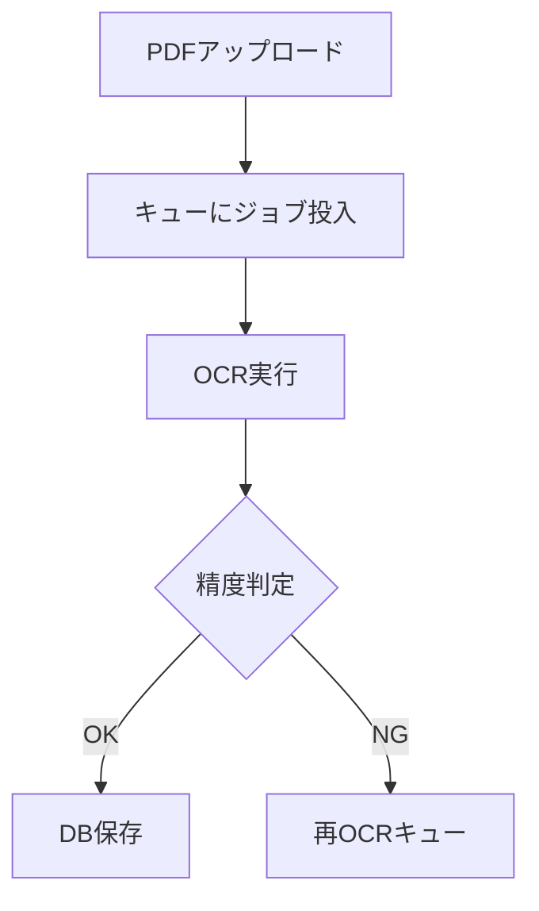
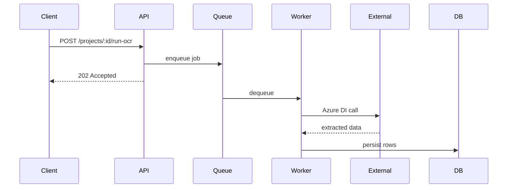

# [Draft] 業務フローを Mermaid で書き切る運用 — 実装とドキュメントを乖離させないために

## この記事の狙い

- 「ドキュメントは作った瞬間に古くなる」問題に対し、**Mermaidをコードと同じリポジトリに置き、PR駆動で更新する**運用を紹介する
- 文章による業務フロー説明 vs Mermaid図の使い分け指針を示す
- 「図を書くのは億劫」を壊すための、最小のテンプレと習慣化の仕掛け

## 想定読者

- 実装と業務仕様のドキュメントが乖離している現場で消耗している人
- オンボーディング資料を作っては放置してきた人
- Mermaid は知っているが、実運用での定着に苦労している人

## 骨子（想定6〜7章）

### 1. はじめに: ドキュメントが腐る3つの理由

- 「別ツール」に置くから更新されない（Confluence, Notion, 社内Wiki…）
- 「文章だけ」だと書くコストが高くて更新が続かない
- レビュー対象になっていない（PRに含まれない）

### 2. Mermaid をコードの隣に置くだけで変わること

- `.md` にコードブロックとして書くので、**PR差分に出る**
- GitHubが自動レンダリングしてくれる（追加ツール不要）
- Markdown を読めば業務フローと実装の両方が追える
- 実装の変更＝ドキュメントの変更、が同じPRに入る

### 3. どんな図を書くか — 5つのパターン

**(a) 処理フロー（flowchart）**: システム全体の流れ



**(b) シーケンス（sequenceDiagram）**: API / サービス間連携



**(c) 状態遷移（stateDiagram-v2）**: ジョブ・注文・承認などのステータス管理

**(d) データモデル（erDiagram）**: テーブル関係図（Alembic migration と同じPRで更新）

**(e) ユースケース / 責務分担**: Controllers → Services → Domain 等のレイヤ図

### 4. 運用ルール 3つ

**ルール1: PRテンプレにチェックボックスを置く**

```markdown
## チェックリスト
- [ ] 業務フローに影響する変更の場合、`docs/*.md` の Mermaid を更新した
- [ ] DB スキーマを変えた場合、ER図を更新した
```

**ルール2: 図は1枚1テーマ**
- 1枚の図に詰め込みすぎると誰も読まない
- 「抽出フロー」「保存フロー」「エラーハンドリング」と分ける

**ルール3: 文章 → 図 → コード の順で PR を読ませる**
- `README.md` / `docs/XXX.md` に「この機能はこの図を見ろ」と導線を置く

### 5. 書き方のコツ

- **最初の版は雑でいい**: `flowchart TD` でブロックを並べるだけでも価値がある
- **矢印に一言だけ条件を書く**: `-->|OK|`, `-->|error|` だけでもフローが読める
- **粒度を揃える**: 1箱=1責務になるように。1箱に「全部のロジック」が入ったら分割シグナル
- **色付けは最小限**: 白黒で読めるようにして、強調したい箇所だけ色を足す

### 6. ありがちな失敗と対策

| 失敗 | 対策 |
|---|---|
| 図を作って満足して更新しない | PRテンプレの必須項目にする |
| 1枚が巨大化して誰も読めない | 1テーマ1枚ルール |
| 実装と図がズレる | レビュー時に「図と実装の対応」を確認する項目を設ける |
| 記法を忘れる | 社内用のチートシート(.md)を1つ置く |

### 7. もう一段先へ

- **Mermaid以外の選択肢**: PlantUML, draw.io の diagrams.net 連携
- **自動生成**: OpenAPI スキーマから Mermaid シーケンス図を生成するツール
- **Diff可視化**: `diff-pdf` ならぬ、Mermaid差分を PR に貼る GitHub Action
- **結局重要なのは "ドキュメントに義務を与える" 運用**

### 8. まとめ

- Mermaid は「コードの隣に置ける図」として最強
- 運用定着の鍵は **「PRに含める」** こと。ツール選定ではない
- 1枚の最小な flowchart から始めて、習慣化していく

## 補足メモ

- 画像サンプルは実在プロジェクトの業務から切り離した、架空のOCRフロー/ECサイト注文フロー等で作る
- DevelopersIO読者向けに、AWS要素を少し入れてもよい（Step Functions の状態をMermaid stateDiagramで書くなど）

## 書く前のTODO

- [ ] 実例Mermaid を5パターン × 2バリエーション書き起こす
- [ ] PRテンプレの実物サンプルを提示
- [ ] 「文章 vs 図」判断フローチャート自体を Mermaid で書く（メタ的に楽しい）
