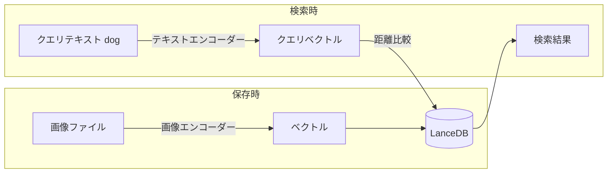
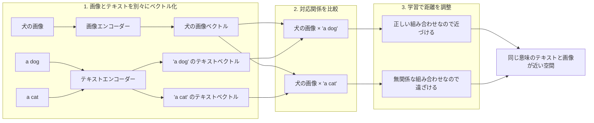

# LanceDB と OpenCLIP でテキストから画像を検索してみた

こんにちは 人材育成室 育成メンバーチームで 研修中の はすと です。

前回は LanceDB を使ってテキストのベクトル検索の基礎を触りました。テキストを数値に変換して検索する仕組みがわかったところで、画像の方も同じように仕組みが気になったので、今回は LanceDB と OpenCLIP を使ってテキストから画像を検索する仕組みを試してみます。

## CLIP と OpenCLIP とは

CLIP（Contrastive Language-Image Pre-Training）は OpenAI が開発したモデルで、テキストエンコーダーと画像エンコーダーの2つを持ちます。両者が同じベクトル空間に出力するよう学習されているため、テキストと画像を直接比較できます。

OpenCLIP はその OSS 再実装版で、LAION という大規模データセット（OpenAI の学習データより規模が大きい）で学習されており、画像検索の精度が元の CLIP より高いとされています。LanceDB は OpenCLIP との統合を公式にサポートしており、`get_registry().get("open-clip")` 一行で呼び出せます。

## LanceDB とマルチモーダルの関係

テキストエンコーダーと画像エンコーダーは用途が分かれています。



LanceDB 自体はベクトルの保存と検索を担うだけです。保存時は画像エンコーダー、検索時はテキストエンコーダーと使い分けますが、両者が同じ空間に出力するため比較が成立します。スキーマの `label` はどちらのエンコーダーも通らず、ただのメタデータです。

## セットアップ

```bash
pip install lancedb open-clip-torch Pillow pandas requests
```

:::details セットアップでインストールしているパッケージ
- `open-clip-torch`  
  OpenCLIP の実装です。画像とテキストを同じベクトル空間に埋め込むモデルを提供します。  
  このプロジェクトでは LanceDB から `open-clip` を呼び出しており、画像保存時には画像をベクトル化し、検索時にはテキストクエリや画像クエリを同じ空間のベクトルに変換するために使われます。

- `Pillow`  
  Python で画像を扱うための標準的なライブラリです。  
  このプロジェクトでは `from PIL import Image` として読み込み、`Image.open(...)` で画像ファイルを開いて、画像そのものを検索クエリとして `table.search(...)` に渡すために使っています。

- `pandas`  
  表形式データを扱うためのライブラリです。  
  このプロジェクトでは、画像のラベルとファイルパスを `DataFrame` にまとめて `table.add(...)` に渡すために使っています。

- `requests`  
  Python で HTTP リクエストを送るためのライブラリです。  
  今回の掲載コードでは直接は使っていませんが、画像を URL から取得する、外部 API からデータを取る、といった前処理を追加する場合によく使われます。
:::

## 実際に動かしてみた

### データの準備と保存

cat・dog・horse の画像をローカルに用意して LanceDB に保存します。

```python
from pathlib import Path

import lancedb
import pandas as pd
from lancedb.embeddings import get_registry
from lancedb.pydantic import LanceModel, Vector
from PIL import Image

IMAGE_DIR = Path("sample-images")

# LanceDB の埋め込みモデル登録簿から OpenCLIP を取得して初期化
# デフォルトは ViT-B-32（512次元）
func = get_registry().get("open-clip").create()

class Images(LanceModel):
    label: str
    image_uri: str = func.SourceField()          # ベクトル変換の入力元
    vector: Vector(func.ndims()) = func.VectorField()  # type: ignore[valid-type]

db = lancedb.connect("sample-lancedb-multimodal")
table = db.create_table("animals", schema=Images, mode="overwrite")

labels = ["cat", "cat", "dog", "dog", "horse", "horse"]
uris = [str(IMAGE_DIR / f) for f in [
    "cat_1.jpg", "cat_2.jpg",
    "dog_1.jpg", "dog_2.jpg",
    "horse_1.jpg", "horse_2.jpg",
]]

# add() 時に image_uri の画像を OpenCLIP で自動ベクトル化して保存
table.add(pd.DataFrame({"label": labels, "image_uri": uris}))
```

`func.SourceField()` を指定した `image_uri` フィールドが埋め込み元として扱われ、OpenCLIP が自動でベクトルに変換して保存します。

実際のユースケースでは手書きのラベルは不要で、商品名・ファイル名・URL など既存のメタデータをそのまま入れるのが自然です。

```python
# ECサイトなら商品データをそのまま入れる
{ "product_id": "SKU-001", "name": "白いTシャツ", "price": 2980, "image_uri": "..." }

# 画像→画像の類似検索だけなら image_uri だけでも十分
{ "image_uri": "..." }
```

また「画像にテキスト説明を持たせたいが手書きはしたくない」場合は、画像キャプション生成モデルで自動生成する方法もあります。キャプションを保存しておくとテキスト検索の精度が上がる利点もあります。

代表的なモデルとして以下の2つがあります。

- LLaVA（Large Language-and-Vision Assistant）：視覚エンコーダと LLM を組み合わせたマルチモーダルモデル。画像の説明・Visual QA・OCR などに対応。Ollama で `ollama pull llava` と叩くだけでローカル実行できます
- BLIP-2（Bootstrapping Language-Image Pre-training v2）：凍結した画像エンコーダと LLM を Q-Former と呼ぶ軽量ブリッジで繋いだモデル。画像キャプション生成と Visual QA が主な用途で、HuggingFace から利用できます

### テキストで画像を検索する

ここでは、テキストをクエリとして `table.search(...)` に渡すと、OpenCLIP のテキストエンコーダーでベクトル化され、保存済みの画像ベクトルと比較されることを確認します。

まずは `dog` `cat` `horse` のような直接的な単語を入力し、検索結果の 1 位にどの画像ラベルが返るかを見ます。

```python
for query in ["dog", "cat", "horse"]:
    results = table.search(query).limit(6).to_list()
    top = results[0]
    print(
        f"入力クエリ: {query!r:10} → 1位の画像ラベル: {top['label']} "
        f"(距離: {top['_distance']:.4f})"
    )
```

`table.search(query)` の `query` には文字列をそのまま渡せます。内部ではこの文字列がテキストベクトルに変換され、DB に保存済みの画像ベクトルとの距離が近い順に並びます。ここでは `results[0]` だけを取り出して、最も近い画像が何だったかを表示しています。

実行結果です。左が入力したテキスト、右が検索結果の 1 位だった画像ラベル、括弧内がその距離です。

```
入力クエリ: 'dog'      → 1位の画像ラベル: dog (距離: 1.4740)
入力クエリ: 'cat'      → 1位の画像ラベル: cat (距離: 1.4347)
入力クエリ: 'horse'    → 1位の画像ラベル: horse (距離: 1.4731)
```

いずれも、入力した単語と同じ種類の画像が 1 位になりました。まずは、単純な単語クエリならテキストから対応する画像を引けることが確認できました。

続いて、間接的・比喩的なクエリを試します。今度は「どの画像が返ったか」だけでなく、こちらが期待していたラベルと一致したかも一緒に見ます。

```python
queries = [
    ("man's best friend",    "dog"),   # 犬の慣用表現
    ("loyal companion",      "dog"),   # 忠実な仲間
    ("barking animal",       "dog"),   # 吠える動物
    ("feline creature",      "cat"),   # ネコ科の生き物
    ("farm animal with mane","horse"), # たてがみのある家畜
    ("purring pet",          "cat"),   # ゴロゴロ鳴くペット
]

for query, expected in queries:
    result = table.search(query).limit(1).to_list()[0]
    mark = "✓" if result["label"] == expected else "✗"
    print(
        f"{mark} 入力: {query!r:30} → 1位: {result['label']} "
        f"(距離: {result['_distance']:.4f})  [期待: {expected}]"
    )
```

実行結果です。入力した表現に対して、1 位に返った画像ラベルが期待どおりかを見ています。

```
✓ 入力: "man's best friend"            → 1位: dog (距離: 1.5389)  [期待: dog]
✓ 入力: 'loyal companion'              → 1位: dog (距離: 1.5486)  [期待: dog]
✓ 入力: 'barking animal'               → 1位: dog (距離: 1.6157)  [期待: dog]
✓ 入力: 'feline creature'              → 1位: cat (距離: 1.4679)  [期待: cat]
✗ 入力: 'farm animal with mane'        → 1位: cat (距離: 1.6486)  [期待: horse]
✓ 入力: 'purring pet'                  → 1位: cat (距離: 1.4665)  [期待: cat]
```

5/6 が正解でした。`"farm animal with mane"` だけ外れています。これはモデルの限界か表現の問題か、後述のモデルサイズ比較で確認します。

### 距離スコアで「近さ」を確認する

テキストクエリと各画像の距離を全件表示して、ベクトル空間上の位置関係を確認します。

```python
for query in ["dog", "cat", "horse"]:
    results = table.search(query).limit(6).to_list()
    print(f"\nクエリ: '{query}'")
    for r in results:
        print(f"  {r['label']}: {r['_distance']:.4f}")
```

実行結果：

```
クエリ: 'dog'
  dog: 1.4740
  dog: 1.5131
  cat: 1.5637
  cat: 1.5687
  horse: 1.6197
  horse: 1.6550

クエリ: 'cat'
  cat: 1.4347
  cat: 1.4495
  dog: 1.6168
  dog: 1.6347
  horse: 1.6560
  horse: 1.7051

クエリ: 'horse'
  horse: 1.4731
  horse: 1.5661
  cat: 1.6501
  cat: 1.6569
  dog: 1.6912
  dog: 1.7389
```

どのクエリでも同じラベルの画像が上位2件に来ており、ラベルをまたいで明確に距離が開いています。

### 画像で画像を検索する

今度は保存済みの犬の画像をクエリにして、似た画像を探してみます。

```python
query_image = Image.open(IMAGE_DIR / "dog_1.jpg")
results = table.search(query_image).limit(3).to_list()

print("クエリ: dog_1.jpg（犬の画像）")
for r in results:
    print(f"  {r['label']}: {r['_distance']:.4f}")
```

実行結果：

```
クエリ: dog_1.jpg（犬の画像）
  dog: 0.0000
  cat: 0.9202
  cat: 1.1078
```

1位の距離が `0.0000` なのは自分自身（`dog_1.jpg`）がヒットしているためです。画像をクエリにしても同じ `table.search()` で動き、LanceDB の検索ロジックはテキストのときと変わっていません。

### モデルサイズで精度はどう変わるか

デフォルトの `ViT-B-32`（512次元）と `ViT-L-14`（768次元）で間接クエリの正解率を比べます。

```python
for model_name, pretrained in [
    ("ViT-B-32", "laion2b_s34b_b79k"),
    ("ViT-L-14", "laion2b_s32b_b82k"),
]:
    func = get_registry().get("open-clip").create(
        name=model_name, pretrained=pretrained
    )
    # モデルが変わるとベクトルの空間が別物になるためテーブルを作り直す
    ...
```

実行結果：

```
モデル: ViT-B-32
✓ "man's best friend"            → dog (1.5389)  [期待: dog]
✓ 'loyal companion'              → dog (1.5486)  [期待: dog]
✓ 'barking animal'               → dog (1.6157)  [期待: dog]
✓ 'feline creature'              → cat (1.4679)  [期待: cat]
✗ 'farm animal with mane'        → cat (1.6486)  [期待: horse]
✓ 'purring pet'                  → cat (1.4665)  [期待: cat]
正解: 5/6

モデル: ViT-L-14
✓ "man's best friend"            → dog (1.5088)  [期待: dog]
✓ 'loyal companion'              → dog (1.5806)  [期待: dog]
✓ 'barking animal'               → dog (1.6212)  [期待: dog]
✓ 'feline creature'              → cat (1.5574)  [期待: cat]
✓ 'farm animal with mane'        → horse (1.7316)  [期待: horse]
✓ 'purring pet'                  → cat (1.5174)  [期待: cat]
正解: 6/6
```

`ViT-B-32` で外れていた `"farm animal with mane"` が `ViT-L-14` では正解になりました。大きいモデルほど言葉の細かいニュアンスを捉えられています。

### 保存されたデータを確認する

前回と同様に、`.lance` ファイルの中身を API で確認します。

```python
rows = table.search().limit(6).to_list()
for r in rows:
    vec = list(r["vector"])
    print(f"label: {r['label']}, vector: [{vec[0]:.4f}, {vec[1]:.4f}, {vec[2]:.4f}, ...] ({len(vec)}次元)")
```

実行結果：

```
label: cat, vector: [0.0266, 0.0204, -0.0307, ...] (512次元)
label: cat, vector: [0.0063, 0.0649, 0.0201, ...] (512次元)
label: dog, vector: [-0.0088, 0.0555, -0.0616, ...] (512次元)
label: dog, vector: [-0.0209, 0.1589, -0.0550, ...] (512次元)
label: horse, vector: [-0.0041, 0.2073, 0.0140, ...] (512次元)
label: horse, vector: [-0.0172, 0.2046, -0.1036, ...] (512次元)
```

テキストのときと同じく512次元のベクトルが保存されています。各次元の数値自体に意味はなく、ベクトル間の距離だけが重要なのも変わりません。

## 日本語クエリは使えるのか

デフォルトの `ViT-B-32` は英語 subset で学習されたモデルで、モデルカードでも英語以外での利用は想定外とされています。そのため、日本語クエリでそのまま高い精度を期待するのは難しそうです。

ただし OpenCLIP には多言語対応モデルも用意されています。`XLM-Roberta` をテキストエンコーダーとして使ったモデル（`xlm-roberta-base-ViT-B-32`）のモデルカードには、preliminary multilingual evaluation として Japanese ImageNet-1k で 37%（英語版 B/32 は 1%）という数値が載っています。

```python
# 多言語モデルに切り替える場合
func = get_registry().get("open-clip").create(
    name="xlm-roberta-base-ViT-B-32",
    pretrained="laion5b_s13b_b90k"
)
```

このように、モデルを変えるだけで日本語対応できますが、データを全て再ベクトル化し直す必要がある点は前回記事で触れた制約と同じです。

## なぜテキストと画像が同じ空間で比較できるのか

CLIP は大量の「画像とキャプション（テキスト）のペア」を使って学習しています。学習時のタスクは「この画像に対応するキャプションはどれか」という照合で、テキストエンコーダーと画像エンコーダーの2つが同時に学習されます。

流れを単純化すると、次のような学習を大量のペアで何度も繰り返しています。



ポイントは、単に「犬の画像に dog というラベルを紐づける」だけではなく、犬の画像は `a dog` に近く、`a cat` からは遠いという相対関係まで一緒に学習していることです。

この処理を大量データで繰り返すことで、「dog」と犬の画像、「cat」と猫の画像のような対応だけでなく、似た意味の表現どうしも近くなるようにベクトル空間が整っていきます。

「man's best friend」と犬の画像が近い位置に来るのも、このような対応関係を大量データから統計的に学習した結果です。

## まとめ

今回試してみて一番面白かったのは、LanceDB 側の保存・検索の流れ自体は前回のテキスト検索とほとんど変わらないのに、埋め込みモデルを OpenCLIP に替えるだけで「テキストで画像を探す」「画像で画像を探す」という振る舞いが自然に成立したことです。ベクトル DB の役割と、埋め込みモデルの役割がきれいに分かれているのを実感できました。

また、`dog` のような直接的な単語だけでなく、`man's best friend` のような表現でも犬の画像が返ってきたのを見て、「テキストと画像が同じ空間に入る」とはこういうことかと実感できました。一方で、モデルサイズや学習データの違いで結果が変わることも見えたので、マルチモーダル検索は DB だけで完結する話ではなく、どの埋め込みモデルを選ぶかも重要だと感じました。

次回は ImageBind を使って、画像だけでなく動画や音声まで同じ発想で扱えるのかを試してみたいと思います。

私と同じように「マルチモーダル検索の仕組みが気になっている」という方の参考になれば嬉しいです。

## 参考

- [OpenCLIP - LanceDB 公式ドキュメント](https://docs.lancedb.com/integrations/embedding/openclip)
- [GitHub - mlfoundations/open_clip](https://github.com/mlfoundations/open_clip)
- [Hugging Face - CLIP ViT-B/32 xlm roberta base - LAION-5B](https://huggingface.co/laion/CLIP-ViT-B-32-xlm-roberta-base-laion5B-s13B-b90k)
- [Hugging Face - CLIP ViT-B/32 - LAION-2B](https://huggingface.co/laion/CLIP-ViT-B-32-laion2B-s34B-b79K)
- [Learning Transferable Visual Models From Natural Language Supervision（CLIP 論文）](https://arxiv.org/abs/2103.00020)
- [LLaVA 公式サイト](https://llava-vl.github.io/)
- [BLIP-2 - Salesforce / HuggingFace](https://huggingface.co/Salesforce/blip2-opt-2.7b)
- [BLIP-2 論文](https://arxiv.org/pdf/2301.12597)
